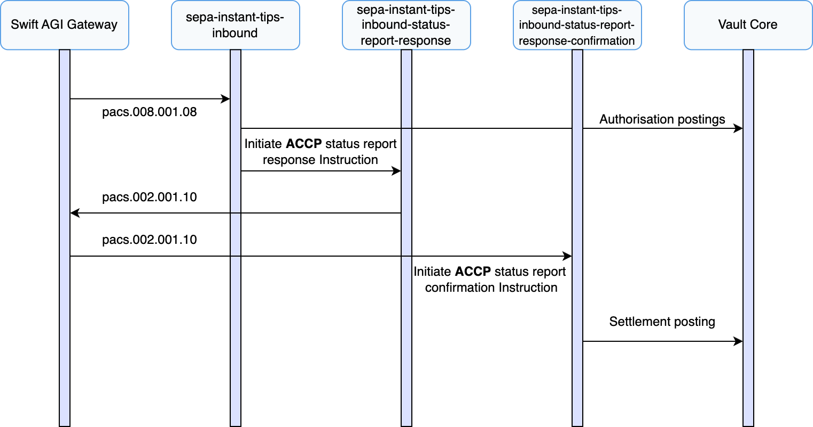
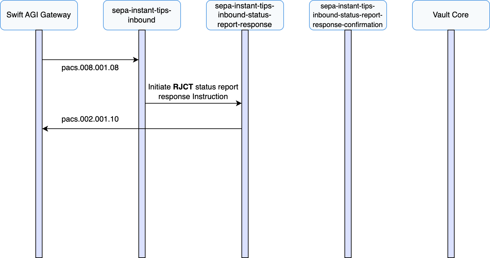

# Inbound Payment Journeys

## Receiving an Inbound Payment

This section describes the processes involved when Vault Payments receives inbound SEPA Instant (TIPS) payments, specifically focusing on handling incoming interbank credit transfer (pacs.008). It covers the overall architecture and implementation within Vault Payments, including key validation checks (such as creditor reachability), posting settlements to Vault Core using double-entry bookkeeping, generating payment status reports (pacs.002) in response, and processing relevant confirmations from TIPS. The flow described outlines the journey from the moment an inbound payment arrives, through validation and response handling, to the final crediting of the creditor’s account.

This scenario assumes that the creditor agent BIC specified in the incoming message belongs to the financial institution using Vault Payments.

1.  Vault Payments receives a FIToFICustomerCreditTransfer (pacs.008) instruction via the Swift AGI gateway, initiating the `sepa-instant-tips-inbound` flow.
    
2.  The incoming instruction undergoes validation, including structural ISO20022 checks and verifying the reachability of the specified creditor account within Vault Payments and the connected Vault Core instance.
    
3.  The `sepa-instant-tips-inbound` flow initiates a FIToFIPaymentStatusReport (pacs.002) response instruction via the `sepa-instant-tips-inbound-status-report-response` flow, communicating Vault Payments’ acceptance or rejection back to TIPS.
    
4.  This FIToFIPaymentStatusReport (pacs.002) response is submitted back to TIPS through the Swift AGI gateway.
    
5.  Vault Payments receives a FIToFIPaymentStatusReport (pacs.002) confirmation from TIPS via the Swift AGI gateway, triggering the `sepa-instant-tips-inbound-status-report-confirmation` flow.
    
6.  Finally, the `sepa-instant-tips-inbound-status-report-confirmation` flow carries out the necessary settlement postings within Vault Core, reflecting the final transaction status provided by TIPS.
    
7.  The Payment status is set to `SETTLED`.
    

## Inbound Payment Rejected by Vault Payments

This section describes a scenario where Vault Payments receives a FIToFICustomerCreditTransfer (pacs.008) but determines that it cannot be accepted - for example, due to an invalid creditor IBAN, a blocked or restricted account, or a structural validation failure. As a result, the payment is rejected before an acceptance response is sent to TIPS.

1.  A FIToFICustomerCreditTransfer (pacs.008) is received via the Swift AGI gateway and initiates the `sepa-instant-tips-inbound` flow.
    
2.  The flow performs validations and fails due to, for example, structural issues or the creditor account being unavailable or restricted from receiving funds.
    
3.  Vault Payments initiates a FIToFIPaymentStatusReport (pacs.002) response with a `RJCT` transaction status, attaching the appropriate transaction status reason code (e.g., `AC06`) via the `sepa-instant-tips-instant-status-report-response` flow.
    
4.  The rejection is sent to TIPS via Swift AGI.
    
5.  No postings are made to Vault Core - the transaction is rejected and never settled.
    
6.  The Payment status is set to `REJECTED`.
    

## Inbound Payment Timed Out by TIPS After Initial Acceptance

This section describes a scenario where Vault Payments accepts the FIToFICustomerCreditTransfer (pacs.008) and submits a positive FIToFIPaymentStatusReport (pacs.002), but TIPS responds with a rejection - for example, if the beneficiary-side PSP did not respond in time.

1.  A FIToFICustomerCreditTransfer (pacs.008) is received via the Swift AGI gateway and initiates the `sepa-instant-tips-inbound` flow.
    
2.  The flow performs validations and submits an acceptance response (pacs.002), status `ACCP` via the `sepa-instant-tips-inbound-status-report-response` flow.
    
3.  TIPS later returns a FIToFIPaymentStatusReport (pacs.002) confirmation with a `RJCT` transaction status via the Swift AGI gateway.
    
4.  The `sepa-instant-tips-inbound-status-report-confirmation` flow is initiated with the failed status.
    
5.  Vault Payments does not post the credit to the creditor’s account, and any pre-processing authorisation postings are reversed if applicable.
    
6.  The Payment is set to `REJECTED` and recorded with the timeout status code received from TIPS.