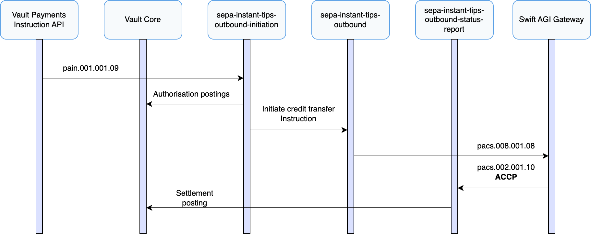
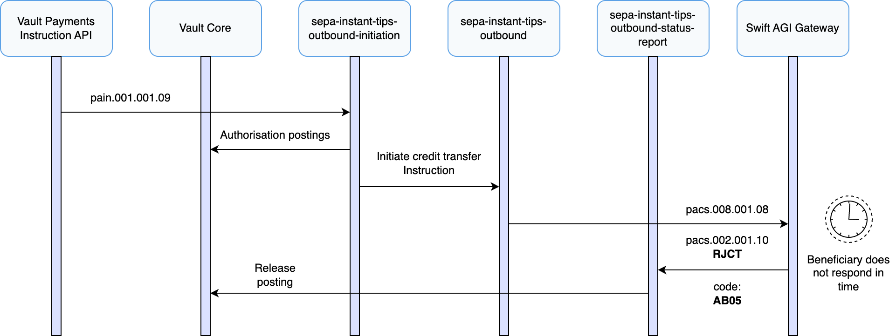
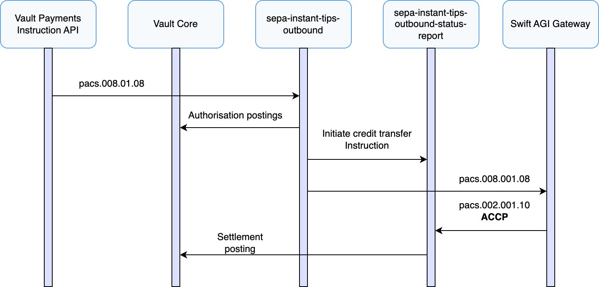
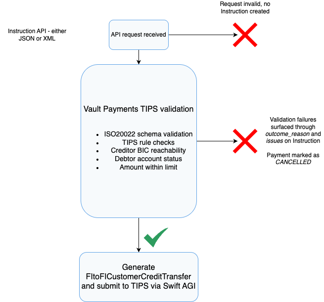

# Outbound Payment Journeys

## Sending an Outbound Payment

This section describes the processes involved when Vault Payments sends outbound SEPA Instant (TIPS) payments, specifically focusing on initiating interbank credit transfer (pacs.008). It covers the overall architecture and implementation within Vault Payments, including support for customer-initiated instructions (pain.001), internal validations (such as debtor account status and scheme rules), reservation of funds through authorisation postings using double-entry bookkeeping, and the generation and submission of interbank instructions to TIPS. It also includes the handling of payment status reports (pacs.002) received in response from TIPS and the associated confirmation processing.

This scenario assumes that the debtor agent BIC used in the outbound message belongs to the financial institution using Vault Payments.

1.  Vault Payments receives a CustomerCreditTransferInitiation (pain.001) via an API request, initiating the `sepa-instant-tips-outbound-initiation` flow.
    
2.  The flow uses the TIPS validation library available in the Flows SDK to validate that the initiation is compliant with the TIPS specification.
    
3.  A lookup is made against the TIPS directory using the Vault Payments Membership Directory capability to confirm that the specified creditor agent BIC is reachable.
    
4.  The debtor account is validated to ensure it has a valid status for initiating the outbound payment.
    
5.  Funds are reserved by issuing authorisation postings to the connected Vault Core instance.
    
6.  The `sepa-instant-tips-outbound-initiation` flow initiates a FIToFICustomerCreditTransfer (pacs.008) instruction, constructed from the original CustomerCreditTransferInitiation (pain.001), via the `sepa-instant-tips-outbound` flow.
    
7.  The `sepa-instant-tips-outbound` flow uses the TIPS validation library (via the Flows SDK) to validate the FIToFICustomerCreditTransfer (pacs.008) against the TIPS specification.
    
8.  Since account status checks, creditor reachability validation, and fund reservation were already performed in the preceding `sepa-instant-tips-outbound-initiation` flow, they are not repeated in the `sepa-instant-tips-outbound` flow.
    
9.  The FIToFICustomerCreditTransfer (pacs.008) is submitted to TIPS through the Swift AGI gateway.
    
10.  Vault Payments receives a FIToFIPaymentStatusReport (pacs.002) confirmation from TIPS via the Swift AGI gateway, initiating the `sepa-instant-tips-outbound-status-report` flow.
     
11.  The `sepa-instant-tips-outbound-status-report` flow carries out the necessary settlement postings within Vault Core, reflecting the final transaction status provided by TIPS.
     
12.  The Payment status is set to `SETTLED`.
     

## Outbound Payment Rejected by Beneficiary

This section describes a scenario where Vault Payments receives a CustomerCreditTransferInitiation (pain.001) that passes all validation checks. A FIToFICustomerCreditTransfer (pacs.008) is constructed and submitted to TIPS via the Swift AGI gateway, but the payment is ultimately rejected by the beneficiary side (e.g., due to account restrictions or validation failures at the receiving PSP).

1.  Vault Payments receives a CustomerCreditTransferInitiation (pain.001) via an API request, initiating the `sepa-instant-tips-outbound-initiation` flow.
    
2.  The flow uses the TIPS validation library available in the Flows SDK to validate that the initiation is compliant with the TIPS specification.
    
3.  A lookup is made against the TIPS directory using the Vault Payments Membership Directory capability to confirm that the specified creditor agent BIC is reachable.
    
4.  The debtor account is validated to ensure it has a valid status for initiating the outbound payment.
    
5.  Funds are reserved by issuing authorisation postings to the connected Vault Core instance.
    
6.  The `sepa-instant-tips-outbound-initiation` flow initiates a FIToFICustomerCreditTransfer (pacs.008) instruction, constructed from the original CustomerCreditTransferInitiation (pain.001), via the `sepa-instant-tips-outbound` flow.
    
7.  The `sepa-instant-tips-outbound` flow uses the TIPS validation library (via the Flows SDK) to validate the FIToFICustomerCreditTransfer against the TIPS specification.
    
8.  Since account status checks, creditor reachability validation, and fund reservation were already performed in the preceding `sepa-instant-tips-outbound-initiation` flow, they are not repeated in the `sepa-instant-tips-outbound` flow.
    
9.  The FIToFICustomerCreditTransfer (pacs.008) is submitted to TIPS through the Swift AGI gateway.
    
10.  Vault Payments receives a FIToFIPaymentStatusReport (pacs.002) with `RJCT` status from TIPS via the Swift AGI gateway, initiating the `sepa-instant-tips-outbound-status-report` flow.
     
11.  The `sepa-instant-tips-outbound-status-report` flow carries out the necessary release postings within Vault Core to undo the reservation of funds, reflecting the final transaction status provided by TIPS.
     
12.  The Payment status is set to `REJECTED`.
     

## Outbound Payment Timed Out by TIPS

This section describes a scenario where Vault Payments receives a CustomerCreditTransferInitiation (pain.001), validates and reserves funds successfully, and submits a FIToFICustomerCreditTransfer (pacs.008) to TIPS - but the beneficiary PSP fails to respond within the required scheme window. TIPS subsequently returns a FIToFIPaymentStatusReport (pacs.002) with a rejection status due to timeout.

1.  Vault Payments receives a CustomerCreditTransferInitiation (pain.001) via an API request, initiating the `sepa-instant-tips-outbound-initiation` flow.
    
2.  The flow uses the TIPS validation library available in the Flows SDK to validate that the initiation is compliant with the TIPS specification.
    
3.  A lookup is made against the TIPS directory using the Vault Payments Membership Directory capability to confirm that the specified creditor agent BIC is reachable.
    
4.  The debtor account is validated to ensure it has a valid status for initiating the outbound payment.
    
5.  Funds are reserved by issuing authorisation postings to the connected Vault Core instance.
    
6.  The `sepa-instant-tips-outbound-initiation` flow initiates a FIToFICustomerCreditTransfer (pacs.008) instruction, constructed from the original CustomerCreditTransferInitiation (pain.001), via the `sepa-instant-tips-outbound` flow.
    
7.  The `sepa-instant-tips-outbound` flow uses the TIPS validation library (via the Flows SDK) to validate the credit transfer against the TIPS specification.
    
8.  Since account status checks, creditor reachability validation, and fund reservation were already performed in the preceding `sepa-instant-tips-outbound-initiation` flow, they are not repeated in the `sepa-instant-tips-outbound` flow.
    
9.  The FIToFICustomerCreditTransfer (pacs.008) is submitted to TIPS through the Swift AGI gateway.
    
10.  The beneficiary PSP fails to respond to TIPS within the required 20-second window (scheduled to be reduced to a 5-second window from October 5th 2025).
     
11.  TIPS returns a FIToFIPaymentStatusReport (pacs.002) with `RJCT` status and a code of `AB05` to Vault Payments via the Swift AGI gateway, triggering the `sepa-instant-tips-outbound-status-report` flow.
     
12.  The `sepa-instant-tips-outbound-status-report` flow carries out the necessary release postings within Vault Core to undo the reservation of funds, reflecting the final transaction status provided by TIPS.
     
13.  The Payment status is set to `REJECTED`.
     

## Outbound Payment without Credit Transfer Initiation

This section describes a scenario where users wish to submit an outbound payment to Vault Payments by initiating a FIToFICustomerCreditTransfer (pacs.008) directly, bypassing the CustomerCreditTransferInitiation (pain.001) flow. The same `sepa-instant-tips-outbound` flow is used; however, the flow detects that it has been initiated without a preceding credit transfer initiation and executes additional checks that would normally take place in the initiation flow - such as debtor account validation and reservation of funds.

1.  Vault Payments receives a FIToFICustomerCreditTransfer (pacs.008) via an API request, initiating the `sepa-instant-tips-outbound` flow.
    
2.  The flow uses the TIPS validation library available in the Flows SDK to validate that the instruction is compliant with the TIPS specification.
    
3.  The flow detects that the preceding customer credit transfer initiation flow did not execute, and branches to ensure that required pre-processing steps are performed.
    
4.  A lookup is made against the TIPS directory using the Vault Payments Membership Directory capability to confirm that the specified creditor agent BIC is reachable.
    
5.  The debtor account is validated to ensure it has a valid status for initiating the outbound payment.
    
6.  Funds are reserved by issuing authorisation postings to the connected Vault Core instance.
    
7.  The FIToFICustomerCreditTransfer (pacs.008) is submitted to TIPS through the Swift AGI gateway.
    
8.  Vault Payments receives a FIToFIPaymentStatusReport (pacs.002) with `ACCP` status from TIPS via the Swift AGI gateway, triggering the `sepa-instant-tips-outbound-status-report` flow.
    
9.  The `sepa-instant-tips-outbound-status-report` flow carries out the necessary settlement postings within Vault Core, reflecting the final transaction status provided by TIPS.
    
10.  The Payment status is set to `SETTLED`.
     

## Outbound Payment Validation Failures

This section describes the possible validation failures that can occur when Vault Payments processes an outbound SEPA Instant (TIPS) payment. These validations take place before a FIToFICustomerCreditTransfer (pacs.008) is submitted to TIPS. If a failure occurs, the payment is rejected early and not forwarded to the scheme.

Validation logic is shared across both the `sepa-instant-tips-outbound-initiation` and `sepa-instant-tips-outbound` flows, depending on whether the payment was initiated from a CustomerCreditTransferInitiation (pain.001) or directly via a FIToFICustomerCreditTransfer (pacs.008).

1.  Vault Payments receives a CustomerCreditTransferInitiation or FIToFICustomerCreditTransfer via an API request.
    
2.  The payment is validated against TIPS scheme rules using the Flows SDK validation library.
    
3.  A lookup is made against the TIPS directory using the Vault Payments Membership Directory capability to check creditor agent BIC reachability.
    
4.  The debtor account is validated to ensure it exists, is active, and is allowed to send outbound SEPA Instant payments.
    
5.  If any validation fails, Vault Payments does not generate or submit a FIToFICustomerCreditTransfer to TIPS.
    
6.  The outcome of the Instruction is set to `REJECTED` status and the reason captured in the Instruction.
    

The table below summarises the most common validation failures that are handled by the outbound flows in the SEPA Instant TIPS configuration pack and their descriptions:

 
| Failure Type | Description |
| --- | --- |
| 
Invalid or malformed ISO 20022 payload

 | 

The submitted JSON or XML payload could not be parsed or deserialised. Vault Payments will reject the API request before a flow is initiated, and no Instruction is created.

 |
| 

ISO 20022 structural validation failed

 | 

The message fails schema validation (e.g. missing required fields, incorrect formats) and is not compliant with ISO 20022 message definitions. The Flows SDK validation library deems the Instruction to be invalid.

 |
| 

TIPS scheme rule validation failed

 | 

The message contains fields or combinations of fields that are not valid under the TIPS SEPA Instant specification, as enforced by the Flows SDK validation library.

 |
| 

Invalid or unreachable creditor agent BIC

 | 

The specified BIC does not exist in the TIPS Membership Directory or is not marked as reachable for SEPA Instant transactions.

 |
| 

Invalid or missing debtor account

 | 

The debtor account does not exist, is blocked, or cannot be used to send SEPA Instant outbound payments (e.g. restrictions exist on the account).

 |
| 

Payment amount exceeds scheme limit

 | 

The instructed amount exceeds the value of the `sepa-instant-tips-scheme-transaction-limit` parameter.

 |
| 

Invalid creditor IBAN format

 | 

The IBAN format is not valid and fails structural checks.

 |

With the exception of a malformed API request where an Instruction may not be created, Vault Payments adopts the principle that validation failures are surfaced as part of the Instruction resource and are observable in the Payments API, Streaming API, and Vault Payments App.

If a validation error occurs during the processing of an outbound payment, the Payment status is set to `CANCELLED` and diagnostic information is attached to the Instruction through the `outcome_reason` and `issues` fields.

## Outbound Target Execution Time and Timeout Handling

As of the EPC’s SEPA Instant Credit Transfer Scheme Rulebook 2025 Version 1.0, the target maximum execution time for a SEPA Instant payment is 5 seconds.

In SEPA Instant TIPS payments, the originator PSP is responsible for setting a timestamp on the payment. This timestamp is used by all parties involved to enforce execution time controls. Within 7 seconds of this timestamp, the originator PSP must receive either:

1.  A positive confirmation that funds have been made available to the beneficiary (positive pacs.002), or
    
2.  A rejection of the payment (negative pacs.002).
    

The beneficiary PSP may only make funds available to the beneficiary once it has received certainty from the CSM (in this case, TIPS) that the payment is complete. This confirmation is conveyed via the FIToFIPaymentStatusReport (pacs.002) confirmation message.

In addition to the 5-second target, the scheme enforces a hard timeout deadline of 7 seconds. The originator PSP must receive a positive or negative confirmation message within 7 seconds of the payment timestamp. If TIPS does not receive a response from the beneficiary PSP within this period, it automatically generates a negative (`RJCT`) pacs.002 confirmation message. This message must reach the originator PSP within 2 additional seconds (i.e. by the 9th second after the original timestamp).

During this time, the originator PSP must maintain settlement certainty - meaning it must honour the reserved funds - until a final confirmation is received.

From a Vault Payments implementation perspective, once a FIToFICustomerCreditTransfer (pacs.008) instruction has been submitted to TIPS, users must wait for a FIToFIPaymentStatusReport (pacs.002) confirmation before cancelling the payment or reversing the reserved funds. In this configuration pack, the process is handled automatically upon receipt of the status report via the `sepa-instant-tips-outbound-status-report` flow.

Vault Payments includes an optional TIPS **sweeper feature** which can be enabled (disabled by default). This feature continuously monitors submitted outbound payments that are still awaiting a FIToFIPaymentStatusReport (pacs.002) response. If a response is not received within the expected window, the sweeper automatically submits a FIToFIPaymentStatusRequest - the scheme-specified method for querying the status of a payment after the timeout deadline has passed. Vault Payments and the `sepa-instant-tips-outbound-status-report` flow will still process instructions that arrive after 5 seconds and will respect the transaction status set by TIPS on the confirmation message.

The table below details where the payment timestamp is located and how it is set in the relevant ISO 20022 payloads used during outbound TIPS payment processing.

   
| Payload | ISO 20022 Message Type | Path | Usage |
| --- | --- | --- | --- |
| 
FIToFICustomerCreditTransfer

 | 

pacs.008.001.08

 | 

`fi_to_fi_customer_credit_transfer.message_v08.credit_transfer_transaction_information[0].acceptance_date_time`

 | 

The `insertion_timestamp` from Vault Core authorisation postings used to reserve funds is used as the value.

 |
| 

FIToFIPaymentStatusReport

 | 

pacs.002.001.10

 | 

`fi_to_fi_payment_status_report.message_v10.transaction_information_and_status[0].acceptance_date_time`

 | 

Returned by TIPS in the final response.

 |

The Vault Payments SEPA Instant TIPS implementation satisfies the TIPS requirements that `acceptance_date_time` must be expressed as a UTC value and must include at least seconds.