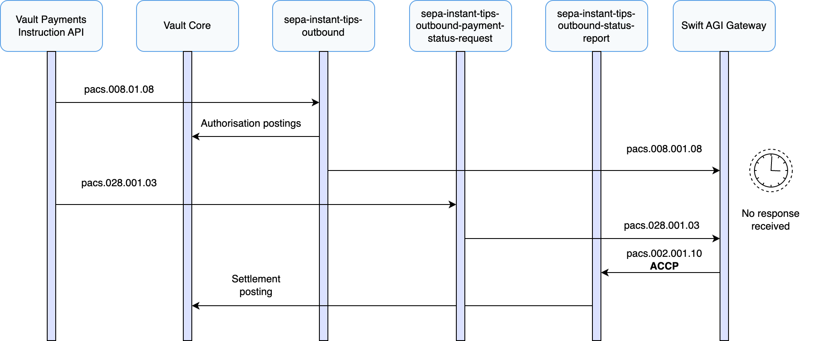

# Outbound Payment Status Request Journeys

## Outbound Payment Status Requests

This section covers the use of the ISO 20022 FIToFIPaymentStatusRequest (pacs.028) message to actively query the status of outbound SEPA Instant TIPS payments initiated from Vault Payments.

Under the SEPA Instant Credit Transfer scheme, originator PSPs are responsible for ensuring that initiated payments are finalised within strict timeframes. If a confirmation is not received - for example, due to transient network issues, message loss, or processing delays - the scheme allows the originator PSP to submit a pacs.028 to determine the outcome of the original instruction.

Using pacs.028 helps avoid the risk of duplicate payment submission, supports scheme-compliant observability, and ensures alignment between Vault Payments and the status recorded in TIPS. It is the recommended mechanism defined by the TIPS specification for investigating unsettled or delayed payments.

Vault Payments supports the SEPA Instant TIPS payment status request process in two ways:

-   Via a dedicated flow: `sepa-instant-tips-outbound-payment-status-request`, which can be triggered manually or programmatically.
    
-   Via the optional **TIPS sweeper service**, which continuously polls for outbound Payments missing a FIToFIPaymentStatusReport (pacs.002) and automatically initiates a pacs.028 where appropriate.
    

The following pages describe how to use the status request flow, how the TIPS sweeper operates, and the configuration options available.

## Initiating a Manual Outbound Status Request

This section describes how to use the `sepa-instant-tips-outbound-payment-status-request` flow in Vault Payments to submit a FIToFIPaymentStatusRequest (pacs.028) for a previously submitted SEPA Instant TIPS outbound payment.

A pacs.028 can be used when the original Payment is in a status of `AUTHORISED`, after a FIToFICustomerCreditTransfer (pacs.008) has been submitted to TIPS and no corresponding FIToFIPaymentStatusReport (pacs.002) confirmation has been received.

To initiate a status request:

-   Call the [Initiate Instruction](/vault-payments/latest/EN/api/payments_api#_payments_v1_instructions_InitiateInstruction) API with a flow ID of `sepa-instant-tips-outbound-payment-status-request`.
    
-   Provide the `correlation_id` value from the pacs.008 Instruction in the `correlation_id` field of the request payload.
    

The flow performs the following steps:

1.  Verifies that the referenced Payment exists and is in a valid state for a status request. Specifically, the Payment must include a submitted pacs.008 Instruction and must not include a received pacs.002.
    
2.  Ensures that the request is initiated no earlier than 9 seconds after the timestamp of the original pacs.008, in accordance with SEPA Instant scheme guidance. See [Outbound Target Execution Time and Timeout Handling](/vault-payments/latest/EN/configuration_library/europe/sepa_instant_tips/outbound_payment_journeys#outbound_target_execution_time_and_timeout_handling) for details on how timestamps are handled in Vault Payments.
    
3.  Enforces a minimum interval of 7 seconds between successive pacs.028 Instructions for the same Payment to prevent redundant or excessive querying.
    
4.  Constructs a new pacs.028 using data from the original pacs.008. This logic is encapsulated within the flow to simplify calling applications and operator workflows.
    
5.  Submits the pacs.028 to TIPS via the Swift AGI gateway.
    

Vault Payments expects a subsequent pacs.002 to be returned by TIPS, either in response to the original credit transfer or the newly submitted status request. This pacs.002 is processed via the `sepa-instant-tips-outbound-status-report` flow to complete the outbound Payment lifecycle.

## TIPS Sweeper Service

Vault Payments includes an optional TIPS sweeper service that automates detection of outbound SEPA Instant TIPS payments missing a FIToFIPaymentStatusReport (pacs.002) confirmation and initiates a FIToFIPaymentStatusRequest (pacs.028) accordingly.

The sweeper operates independently of the main payment processing flows and periodically queries Vault Payments for outbound Payments that meet all of the following conditions:

-   A FIToFICustomerCreditTransfer (pacs.008) has been submitted
    
-   No pacs.002 has been received
    
-   The Payment is in the `AUTHORISED` state
    
-   The time since submission exceeds the configured threshold
    
-   The maximum number of pacs.028 requests has not been exceeded
    

For each matching Payment, the sweeper submits a pacs.028 via the `sepa-instant-tips-outbound-payment-status-request` flow.

This aligns with SEPA Instant scheme rules and TIPS guidance, which recommend submitting a pacs.028 no earlier than 9 seconds after the outbound payment if no confirmation has been received.

#### Default Parameters

  
| Parameter | Description | Default Value |
| --- | --- | --- |
| 
Sweep interval

 | 

Frequency at which the sweeper polls for eligible Payments.

 | 

10 seconds

 |
| 

Sweep threshold

 | 

Minimum time after the original pacs.008 `acceptance_date_time` before a Payment becomes eligible for a status request.

 | 

10 seconds – provides a buffer above the 9-second scheme threshold to avoid race conditions

 |
| 

Max status requests

 | 

Maximum number of pacs.028 Instructions that may be submitted per Payment.

 | 

1

 |
| 

Max payment age

 | 

Maximum age of a Payment (since creation) to be considered for status checking.

 | 

336h (14 days)

 |
| 

Flow

 | 

The ID of the Instruction Flow used by the sweeper to initiate pacs.028 Instructions.

 | 

sepa-instant-tips-outbound-payment-status-request

 |

#### Architecture Notes

-   The sweeper uses the [Search Payments](/vault-payments/latest/EN/api/payments_api#_payments_v1_payments_SearchPaymentsResponse_SearchPayments) endpoint and does not interact with the main processing path.
    
-   It operates on Payments that remain in the `AUTHORISED` state, as set by the `sepa-instant-tips-outbound` flow once the pacs.008 is submitted.
    
-   Construction of the pacs.028 is handled entirely by the flow, allowing the sweeper to remain agnostic to client-specific flow modifications.
    

The sweeper is disabled by default and can be enabled and configured per client environment. This configuration is managed by Thought Machine. To enable the service, please contact your Account Director or Client Success Manager.