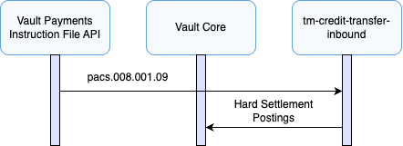
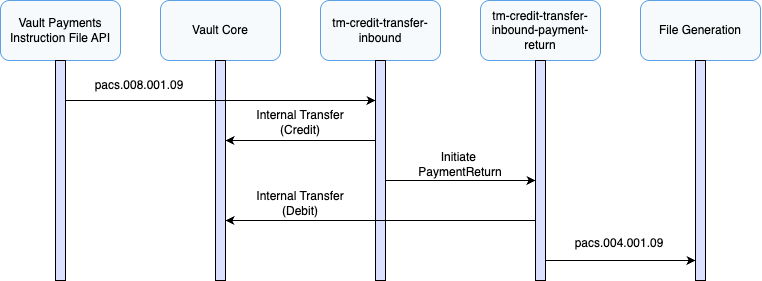
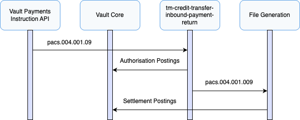

# Inbound Payment Journeys

This section describes the processes involved when Vault Payments receives an inbound payment via TM Credit Transfer.

TM Credit Transfer supports the creation of inbound payments via FIToFICustomerCreditTransfer (pacs.008) files or individual Instructions.

TM Credit Transfer supports the creation of PaymentReturns (pacs.004) via Template or individual Instructions.

## Receiving Inbound Payments

Inbound Payments via TM Credit Transfer are modelled using FIToFICustomerCreditTransfer (pacs.008) messages. In addition, a CustomerPaymentStatusReport (pain.002) file is generated as part of processing.

This scenario assumes a successful inbound payment to a creditor that belongs to the financial institution using Vault Payments.

FIToFICustomerCreditTransfer (pacs.008)

1.  A FIToFICustomerCreditTransfer (pacs.008) is submitted to Vault Payments via upload of an Instruction File representing a pacs.008 ISO 20022 message. This file is split into Instructions initiating an `tm-credit-transfer-inbound` flow for each, this is defined in the `tm-credit-transfer-received-files` File Specification. Instructions can also be initiated individually via API request.
    
2.  The flow validates the Instruction against ISO 20022 rules with some additional scheme rules.
    
3.  Routing checks are made, matching the creditor account via identification details, ensuring a valid account exists and no restrictions are in place.
    
4.  Hard settlement postings are issued to the connected Vault Core instance using the account details, the Payment status is set to `SETTLED`.
    

## Automatic Returns

As TM Credit Transfer is an ACH-style scheme, it does not support the rejection of inbound credit transfers. If funds cannot be applied to the creditor’s account for any reason, a PaymentReturn (pacs.004) must be generated and sent back to the originating scheme.

This scenario assumes a unsuccessful inbound payment to a creditor that belongs to the financial institution using Vault Payments but is unable to accept funds due to restrictions.

FIToFICustomerCreditTransfer (pacs.008)

1.  A FIToFICustomerCreditTransfer (pacs.008) is submitted to Vault Payments via upload of an Instruction File representing a pacs.008 ISO 20022 message. This file is split into Instructions initiating an `tm-credit-transfer-inbound` flow for each, this is defined in the `tm-credit-transfer-received-files` File Specification. Instructions can also be initiated individually via API request.
    
2.  The flow validates the Instruction against ISO 20022 rules with some additional scheme rules.
    
3.  Routing checks are performed, matching the creditor account via identification details, ensuring a valid account exists and no restrictions are in place.
    
4.  Hard settlement postings are issued to the connected Vault Core instance using the account details, however the postings are REJECTED due to restrictions on the account.
    
5.  Internal transfer postings are issued to the connected Vault Core internal accounts, this tracks fund movements according to scheme rules.
    
6.  A PaymentReturn (pacs.004) is initiated using the `tm-credit-transfer-inbound-payment-return` flow.
    

PaymentReturn (pacs.004)

1.  The flow validates the Instruction against ISO 20022 rules with some additional scheme rules.
    
2.  Internal transfer postings are issued to the connected Vault Core internal accounts, in the reverse direction to original postings, this tracks fund movements according to scheme rules. The Payment status is set to `RETURNED`.
    
3.  A pacs.004 File is generated and made available for submission.
    

chat\_bubble

The scenario described uses account restrictions as the reason for failure. However, the automatic return process is identical for other failure reasons, such as:

-   The creditor account is not found in Vault Payments.
    
-   The creditor account details are invalid or do not match.
    
-   The creditor account is closed.
    

## Manual Returns

If funds need to be returned after it has been applied a PaymentReturn (pacs.004) can be manually created and sent back to the originating scheme.

chat\_bubble

A Manual Payment Initiation Template is provided to allow for returns via UI.

PaymentReturn (pacs.004)

1.  A PaymentReturn (pacs.004) is created via API request (or Manual Payment Initiation UI), initiating an `tm-credit-transfer-inbound-payment-return` flow.
    
2.  The flow validates the Instruction against ISO 20022 rules with some additional scheme rules.
    
3.  Funds are reserved by issuing authorisation postings to the connected Vault Core instance using the account details matched in the original Instruction, the Payment status is set to `RETURNED`.
    
4.  A pacs.004 File is generated and made available for submission.
    
5.  Settlement postings are issued to the connected Vault Core instance using the account details matched in the original Instruction.
    

## File Support

TM Credit Transfer supports Instruction Files containing FIToFICustomerCreditTransfer (pacs.008), via the `tm-credit-transfer-received-files` File Specification, in addition to individual Instruction initiation API requests.

All generated PaymentReturn (pacs.004) files are grouped into the same files and batches.

chat\_bubble

PaymentReturns can be automatically generated and manually initiated and do not have to correspond to the original batch. Due to this there is no additional benefit to grouping Instructions by any fields on the Instructions and so the file and batch grouping was chosen to be static.

## Correlation ID

TM Credit Transfer messages use the `UETR` value to correlate Instructions to a payment. This field is mandatory and checked during validation.

## Scheme Field Requirements

The table below contains the additional field requirements in addition to standard ISO 20022 requirements.

 
| Instruction | Additional Requirement |
| --- | --- |
| 
FIToFICustomerCreditTransfer

 | 

`message_v08.credit_transfer_transaction_information[0].payment_identification.uetr`

 |
| 

`message_v08.credit_transfer_transaction_information[0].payment_identification.transaction_identification`

 |
| 

`message_v08.credit_transfer_transaction_information[0].debtor_account`

 |
| 

`message_v08.credit_transfer_transaction_information[0].creditor_account`

 |
| 

PaymentReturn

 | 

`message_v09.transaction_information[0].original_uetr`

 |

## Payment Attributes

The table below provides a mapping between a Payment and the Instruction fields.

 
| Payment Attribute | Value / Field |
| --- | --- |
| 
`scheme`

 | 

`TM CREDIT TRANSFER`

 |
| 

`payment_system`

 | 

`TM CREDIT TRANSFER`

 |
| 

`type`

 | 

`PAYMENT_TYPE_CREDIT_TRANSFER`

 |
| 

`direction`

 | 

`PAYMENT_DIRECTION_INBOUND`

 |
| 

`payment_parties.payer`

 | 

`fi_to_fi_customer_credit_transfer.message_v08.credit_transfer_transaction_information[0].creditor.name`

 |
| 

`payment_parties.payee`

 | 

`fi_to_fi_customer_credit_transfer.message_v08.credit_transfer_transaction_information[0].debtor.name`

 |
| 

`credit_transfer_payment_data.credit_transfer_amount.interbank_settlement_amount.amount`

 | 

`fi_to_fi_customer_credit_transfer.message_v08.credit_transfer_transaction_information[0].interbank_settlement_amount.amount`

 |
| 

`credit_transfer_payment_data.credit_transfer_amount.interbank_settlement_amount.currency`

 | 

`fi_to_fi_customer_credit_transfer.message_v08.credit_transfer_transaction_information[0].interbank_settlement_amount.currency`

 |
| 

`credit_transfer_payment_data.credit_transfer_amount.returned_amount.amount`

 | 

`payment_return.message_v09.transaction_information[0].returned_interbank_settlement_amount.amount`

 |
| 

`credit_transfer_payment_data.credit_transfer_amount.returned_amount.currency`

 | 

`payment_return.message_v09.transaction_information[0].returned_interbank_settlement_amount.currency`

 |