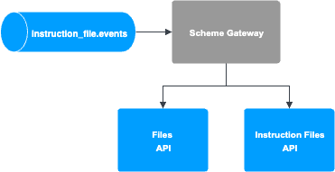

# Scheme Overview

TM Credit Transfer is modelled on modern ISO 20022 compliant credit transfer payment schemes such as SEPA Credit Transfers.

## Integration

### Scheme Gateway

TM Credit Transfer is a file based payment scheme and uses the Files API and Instruction Files API. To integrate with file based payment schemes a Scheme Gateway would be required to upload files to Vault Payments and the scheme.

1.  Inbound Payments: The Scheme Gateway would upload files via the Files API and create the relevant Instruction File.
    
2.  Outbound Payments: The Scheme Gateway would consume Instruction Files events with status `AWAITING_SUBMISSION`, retrieve the relevant Files and upload them to the scheme. The Instruction File would then be updated to `COMPLETED`.
    

## Scheme Information

### Message Version

The table below contains the ISO 20022 message versions.

 
| Message | Version |
| --- | --- |
| 
CustomerCreditTransferInitiation

 | 

pain.001.001.09

 |
| 

CustomerPaymentStatusReport

 | 

pain.002.001.10

 |
| 

FIToFIPaymentStatusReport

 | 

pacs.002.001.10

 |
| 

PaymentReturn

 | 

pacs.004.001.09

 |
| 

FIToFICustomerCreditTransfer

 | 

pacs.008.001.08

 |

### Validation

TM Credit Transfer has additional field requirements in addition to standard ISO 20022 validation, see journeys for message specific details.

An Outbound Scheme Transaction limit is enforced on Outbound Payments, this limit can be set via the parameter `tm-credit-transfer-scheme-transaction-limit`.

### Correlation ID

TM Credit Transfer messages use the `UETR` value as the `correlation_id` for Instructions ensuring they are matched and associated with the same payment. This is a globally unique identifier in the UUID format that is shared across Instructions corresponding to the same payment. This field is mandatory and checked during validation.

chat\_bubble

Correlation ID is used to match related Instructions. It is important to use a value that is unique to all Instructions being processed for a particular payment.

`UETR` has been used in this example scheme as it is a simple and reliable value. In real world schemes it is important to pick an appropriate value (or concatenation of multiple values).

### Account Resolution

TM Credit Transfer supports both IBAN and other types of identification for resolving the creditor or debtor account. In order to work correctly, a Payment Instrument must match the identifier exactly. For example, if an IBAN is used, only the `instrument_identifier` field on the Payment Instrument should be set. If a different type of identification is used, the Payment Instrument `instrument_identifier` and `bank_identifier` fields should match both the identification and issuer information.

### Currency

TM Credit Transfer is not currency specific and supports all currencies with an ISO currency code.

### File Processing

TM Credit Transfer supports processing of the following files:

-   CustomerCreditTransferInitiation (pain.001) - Outbound Payments
    
-   FIToFIPaymentStatusReport (pacs.002) - Outbound Payments
    
-   FIToFICustomerCreditTransfer (pacs.008) - Inbound Payments
    

TM Credit Transfer supports generation of the following files:

-   FIToFICustomerCreditTransfer (pacs.008) - Outbound Payments
    
-   PaymentReturn (pacs.004) - Returns for Inbound Payments
    
-   CustomerPaymentStatusReport (pain.002) - Outbound Payments
    

### Processing Schedule

TM Credit Transfer has a number of simple scheme rules around cut offs and schedules.

All Instructions that are submitted via a file must be submitted within 24 hours of creation. Instruction Files are generated daily using the provided calendar at 18:00 UTC.

chat\_bubble

A simple calendar has been used in this example scheme however different schemes follow different calendars and scheduling rules. More complex scheme rules can be modelled with by using more complex Calendars and Business Day Definition resources.