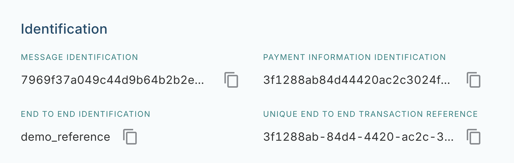
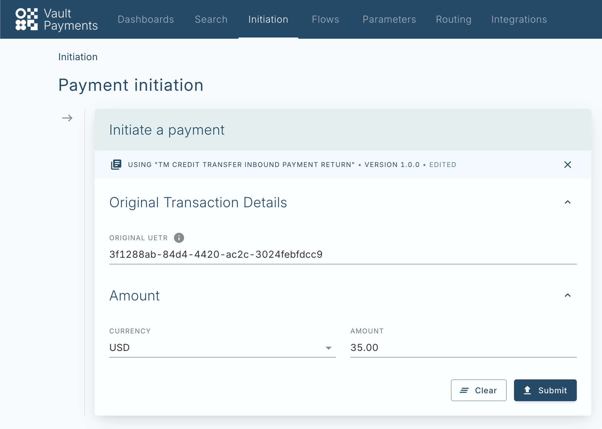
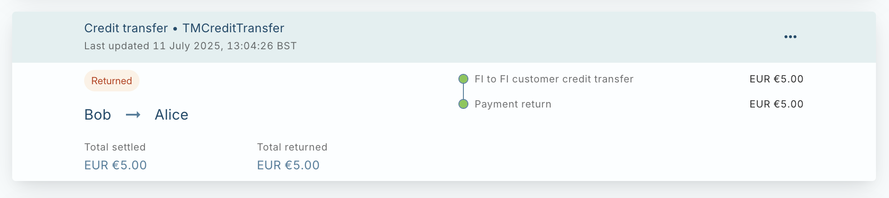

# Return Inbound Credit Transfers

This tutorial covers how to create a manual return of an Inbound Credit Transfer in the TM Credit Transfer Configuration Pack.

This tutorial will use a Payment created in the [Inbound Credit Transfers](/vault-payments/latest/EN/configuration_library/example/tm_credit_transfer/tutorials/process_inbound_credit_transfers) tutorial.

## Gathering Information required for a PaymentReturn

TM Credit Transfer uses the `UETR` value to correlate instructions that belong to the same Payment in the scheme. To create a PaymentReturn we need this value from the inbound FIToFICustomerCreditTransfer (pacs.008) we wish to return.

-   Find a previously created Payment in Payment Search
    
-   Copy the `UETR` value.
    

## Create Instruction via Manual Initiation

A Template is provided in the configuration pack for initiating PaymentReturns for TM Credit Transfers. In Payment Initiation this template can be used to create a PaymentReturn.

Populate the copied `UETR` and the Amount and Currency that should be returned.

When submitted, this will initiate an instruction with predefined values such as the flow `tm-credit-transfer-inbound-payment-return` and will populate the relevant fields with those passed in the form.

## View Returned Payment

Upon returning to the original Payment page the new PaymentReturn instruction can be found and the Payment status will be `RETURNED`.

A pacs.004 File will later be generated according to the Instruction File Specification on a schedule or when enough instructions have been queued.