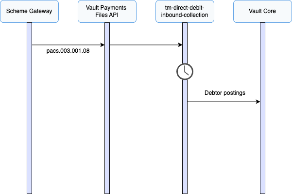

# Inbound Collection Journeys

This section describes the processes involved when Vault Payments receives an inbound collection via TM Direct Debit.

TM Direct Debit supports the creation of inbound collections via FIToFICustomerDirectDebit (pacs.003) files or individual Instructions.

## Receiving an Inbound Collection

This section describes the process involved when Vault Payments receives an inbound direct debit collection via TM Direct Debit. This scenario consists receiving and processing a direct debit collection on behalf of a debtor that belongs to the financial institution using Vault Payments.

FIToFICustomerDirectDebit (pacs.003)

1.  A FIToFICustomerDirectDebit (pacs.003) is submitted to Vault Payments via upload of an Instruction File representing a pacs.003 ISO 20022 message. This file is split into Instructions initiating a `tm-direct-debit-inbound-collection` flow for each. Instructions can also be initiated individually via API request.
    
2.  The flow validates the Instruction against ISO 20022 rules with some additional scheme rules.
    
3.  The Mandate is matched using the Scheme Creditor ID and Scheme Mandate ID present on the ISO 20022 payload. If a Mandate is not found, or the Mandate found is not active, the collection cannot take place and the Payment status is set to `CANCELLED`.
    
4.  Debtor postings are scheduled for the Collection Date.
    
5.  On the scheduled date the required debtor postings are issued to the connected Vault Core representing the Collection Amount. The TM Direct Debit Postings Calendar defines the period during the day when postings are to be made.
    
6.  The Payment status is set to `SETTLED`.
    

## File Support

TM Direct Debit supports Instruction Files containing FIToFICustomerDirectDebit (pacs.003) messages in addition to individual Instruction initiation API requests.

## Scheme Attributes

The table below provides a mapping between TM Direct Debit scheme attributes and data elements on the FIToFICustomerDirectDebit (pacs.003) XML document or Instruction payload.

  
| Attribute | XML Path | JSON Path |
| --- | --- | --- |
| 
Scheme Creditor ID

 | 

`/Document/FIToFICstmrDrctDbt/DrctDbtTxInf/DrctDbtTx/CdtrSchmeId/Id/PrvtId/Othr/Id`

 | 

`fi_to_fi_customer_direct_debit.message_v08.direct_debit_transaction_information[0].direct_debit_transaction.creditor_scheme_identification.identification.private_identification.other[0].identification`

 |
| 

Scheme Mandate ID

 | 

`/Document/FIToFICstmrDrctDbt/DrctDbtTxInf/DrctDbtTx/MndtRltdInf/MndtId`

 | 

`fi_to_fi_customer_direct_debit.message_v08.direct_debit_transaction_information[0].direct_debit_transaction.mandate_related_information.mandate_identification`

 |
| 

Collection/Settlement Date

 | 

`/Document/FIToFICstmrDrctDbt/DrctDbtTxInf/IntrBkSttlmDt`

 | 

`fi_to_fi_customer_direct_debit.message_v08.direct_debit_transaction_information[0].interbank_settlement_date`

 |
| 

Collection Amount

 | 

`/Document/FIToFICstmrDrctDbt/DrctDbtTxInf/IntrBkSttlmAmt`

 | 

`fi_to_fi_customer_direct_debit.message_v08.direct_debit_transaction_information[0].interbank_settlement_amount`

 |

## Scheme Field Requirements

The table below contains the additional field requirements in addition to standard ISO 20022 requirements.

  
| Instruction | XML Path | JSON Path |
| --- | --- | --- |
| 
FIToFICustomerDirectDebit

 | 

`/Document/FIToFICstmrDrctDbt/DrctDbtTxInf/DrctDbtTx/CdtrSchmeId/Id/PrvtId/Othr/Id`

 | 

`message_v08.direct_debit_transaction_information[0].direct_debit_transaction.creditor_scheme_identification.identification.private_identification.other[0].identification`

 |
| 

`/Document/FIToFICstmrDrctDbt/DrctDbtTxInf/DrctDbtTx/MndtRltdInf/MndtId`

 | 

`message_v08.direct_debit_transaction_information[0].direct_debit_transaction.mandate_related_information.mandate_identification`

 |

## Payment Attributes

The table below provides a mapping between a Payment and the Instruction fields.

 
| Payment Attribute | Value / Field |
| --- | --- |
| 
`scheme`

 | 

`TM DIRECT DEBIT`

 |
| 

`payment_system`

 | 

`TM DIRECT DEBIT`

 |
| 

`type`

 | 

`PAYMENT_TYPE_DIRECT_DEBIT`

 |
| 

`direction`

 | 

`PAYMENT_DIRECTION_INBOUND`

 |
| 

`payment_parties.payer`

 | 

`fi_to_fi_customer_direct_debit.message_v08.direct_debit_transaction_information[0].debtor.name`

 |
| 

`payment_parties.payee`

 | 

`fi_to_fi_customer_credit_transfer.message_v08.credit_transfer_transaction_information[0].creditor.name`

 |
| 

`direct_debit_payment_data.direct_debit_amount.interbank_settlement_amount.amount`

 | 

`fi_to_fi_customer_direct_debit.message_v08.direct_debit_transaction_information[0].interbank_settlement_amount.amount`

 |
| 

`direct_debit_payment_data.direct_debit_amount.interbank_settlement_amount.currency`

 | 

`fi_to_fi_customer_direct_debit.message_v08.direct_debit_transaction_information[0].interbank_settlement_amount.currency`

 |