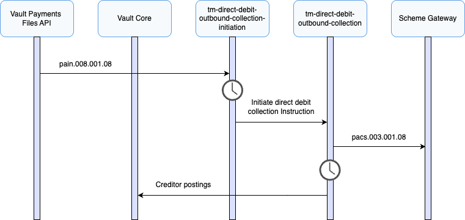

# Outbound Collection Journeys

This section describes the processes involved when Vault Payments sends an outbound collection via TM Direct Debit.

TM Direct Debit supports the creation of outbound collections via CustomerDirectDebitInitiation (pain.008) files or individual Instructions.

## Sending an Outbound Collection

This section describes the process involved when Vault Payments sends an outbound direct debit collection via TM Direct Debit. This scenario consists of sending and processing a direct debit collection on behalf of a creditor that belongs to the financial institution using Vault Payments.

chat\_bubble

A Manual Payment Initiation Template is provided to allow for initiation of individual collections via the Vault Payments App.

CustomerDirectDebitInitiation (pain.008)

1.  A CustomerDirectDebitInitiation (pain.008) is submitted to Vault Payments via upload of an Instruction File representing a pain.008 ISO 20022 message. This file is split into Instructions initiating a `tm-direct-debit-outbound-collection-initiation` flow for each.
    
2.  The flow validates the Instruction against ISO 20022 rules with some additional scheme rules.
    
3.  The Mandate is matched using the Scheme Creditor ID and Scheme Mandate ID present on the ISO 20022 payload. If a Mandate is not found, or the Mandate found is not active, the collection can not take place, the Payment status is set to `CANCELLED`.
    
4.  If the currency of the collection is 'EUR' a lookup is made against the TIPS directory via Membership Directories to confirm that the specified debtor agent BIC is reachable.
    
5.  The date for submitting the collection to the scheme is determined from the Requested Collection Date on the instruction and the TM Direct Debit Scheme Calendar which defines the processing days for the scheme. Vault Payments aims to submit the collection to the scheme on D-1, one scheme processing day before the Collection/Settlement date. If the submission date is in the future, the instruction is paused until that time.
    
6.  A FIToFICustomerDirectDebit (pacs.003) is initiated using the `tm-direct-debit-outbound-collection` flow.
    

FIToFICustomerDirectDebit (pacs.003)

1.  The flow validates the Instruction against ISO 20022 rules with some additional scheme rules. Since account status checks and debtor reachability validation were already performed in the preceding `tm-direct-debit-outbound-collection-initiation` flow, they are not repeated in the `tm-direct-debit-outbound-collection` flow.
    
2.  A pacs.003 File is generated and made available for submission to the scheme on the current scheme processing day. The TM Direct Debit Collections Batching Calendar defines a daily cutoff period, after which time the file is closed and sent to the scheme.
    
3.  Creditor postings are scheduled for the Collection Date.
    
4.  On the Collection Date, the required creditor postings are issued to the connected Vault Core representing the Collection Amount. The TM Direct Debit Postings Calendar defines the period during the day when postings are to be made.
    
5.  The Payment status is set to `SETTLED`.
    

## Correlation ID

The `UETR` value on the CustomerDirectDebitInitiation (pain.008) is used as the `correlation_id` for Instructions ensuring they are matched and associated with the same payment. This is a globally unique identifier in the UUID format that is shared across Instructions corresponding to the same payment. If this field is not set on the initial CustomerDirectDebitInitiation (pain.008), a unique ID is automatically generated.

chat\_bubble

Correlation ID is used to match related Instructions. It is important to use a value that is unique to all Instructions being processed for a particular payment.

`UETR` has been used in this example scheme as it is a simple and reliable value. In real world schemes it is important to pick an appropriate value (or concatenation of multiple values).

## File Support

TM Direct Debit supports Instruction Files containing CustomerDirectDebitInitiation (pain.008) messages in addition to individual Instruction initiation API requests.

## Scheme Attributes

The table below provides a mapping between TM Direct Debit scheme attributes and data elements on the CustomerDirectDebitInitiation (pain.008) and FIToFICustomerDirectDebit (pacs.003) XML documents or Instruction payloads.

  
| Attribute | XML Path | JSON Path |
| --- | --- | --- |
| 
Requested Collection Date

 | 

`/Document/CstmrDrctDbtInitn/PmtInf/ReqdColltnDt`

 | 

`customer_direct_debit_initiation.message_v08.payment_information[0].requested_collection_date`

 |
| 

Scheme Creditor ID

 | 

`/Document/CstmrDrctDbtInitn/PmtInf/CdtrSchmeId/Id/PrvtId/Othr/Id`

 | 

`customer_direct_debit_initiation.message_v08.payment_information[0].creditor_scheme_identification.identification.private_identification.other[0].identification`

 |
| 

Scheme Mandate ID

 | 

`/Document/CstmrDrctDbtInitn/PmtInf/DrctDbtTxInf/DrctDbtTx/MndtRltdInf/MndtId`

 | 

`customer_direct_debit_initiation.message_v08.payment_information[0].direct_debit_transaction_information[0].direct_debit_transaction.mandate_related_information.mandate_identification`

 |
| 

Collection/Settlement Date

 | 

`/Document/FIToFICstmrDrctDbt/DrctDbtTxInf/IntrBkSttlmDt`

 | 

`fi_to_fi_customer_direct_debit.message_v08.direct_debit_transaction_information[0].interbank_settlement_date`

 |
| 

Collection Amount

 | 

`/Document/FIToFICstmrDrctDbt/DrctDbtTxInf/IntrBkSttlmAmt`

 | 

`fi_to_fi_customer_direct_debit.message_v08.direct_debit_transaction_information[0].interbank_settlement_amount`

 |

## Scheme Field Requirements

The table below contains the additional field requirements in addition to standard ISO 20022 requirements.

  
| Instruction | XML Path | JSON Path |
| --- | --- | --- |
| 
CustomerDirectDebitInitiation

 | 

`/Document/CstmrDrctDbtInitn/PmtInf/CdtrSchmeId/Id/PrvtId/Othr/Id`

 | 

`customer_direct_debit_initiation.message_v08.payment_information[0].creditor_scheme_identification.identification.private_identification.other`

 |
| 

`/Document/CstmrDrctDbtInitn/PmtInf/DrctDbtTxInf/DrctDbtTx/MndtRltdInf/MndtId`

 | 

`customer_direct_debit_initiation.message_v08.payment_information[0].direct_debit_transaction_information[0].direct_debit_transaction.mandate_related_information.mandate_identification`

 |

## Payment Attributes

The table below provides a mapping between a Payment and the Instruction fields.

 
| Payment Attribute | Value / Field |
| --- | --- |
| 
`scheme`

 | 

`TM DIRECT DEBIT`

 |
| 

`payment_system`

 | 

`TM DIRECT DEBIT`

 |
| 

`type`

 | 

`PAYMENT_TYPE_DIRECT_DEBIT`

 |
| 

`direction`

 | 

`PAYMENT_DIRECTION_OUTBOUND`

 |
| 

`payment_parties.payer`

 | 

`customer_direct_debit_initiation.message_v08.payment_information[0].direct_debit_transaction_information[0].debtor.name`

 |
| 

`payment_parties.payee`

 | 

`customer_direct_debit_initiation.message_v08.payment_information[0].creditor.name`

 |
| 

`direct_debit_payment_data.direct_debit_amount.instructed_amount.amount`

 | 

`customer_direct_debit_initiation.message_v08.payment_information[0].direct_debit_transaction_information[0].instructed_amount.amount`

 |
| 

`direct_debit_payment_data.direct_debit_amount.instructed_amount.currency`

 | 

`customer_direct_debit_initiation.message_v08.payment_information[0].direct_debit_transaction_information[0].instructed_amount.currency`

 |
| 

`direct_debit_payment_data.direct_debit_amount.interbank_settlement_amount.amount`

 | 

`fi_to_fi_customer_direct_debit.message_v08.direct_debit_transaction_information[0].interbank_settlement_amount.amount`

 |
| 

`direct_debit_payment_data.direct_debit_amount.interbank_settlement_amount.currency`

 | 

`fi_to_fi_customer_direct_debit.message_v08.direct_debit_transaction_information[0].interbank_settlement_amount.currency`

 |