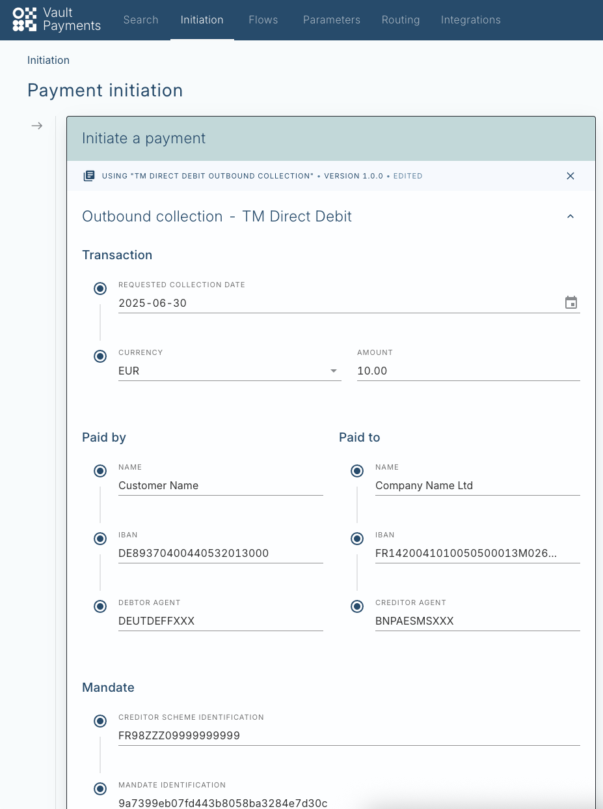
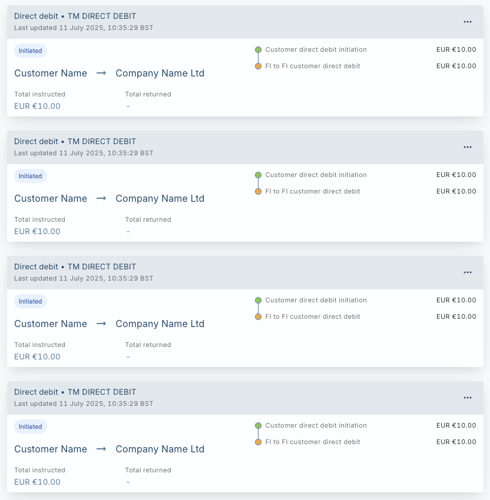
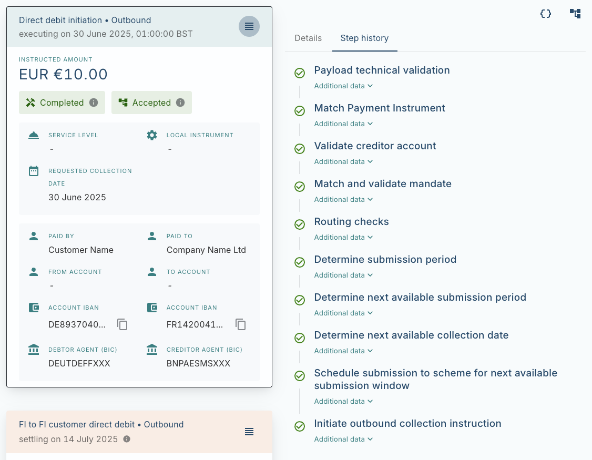
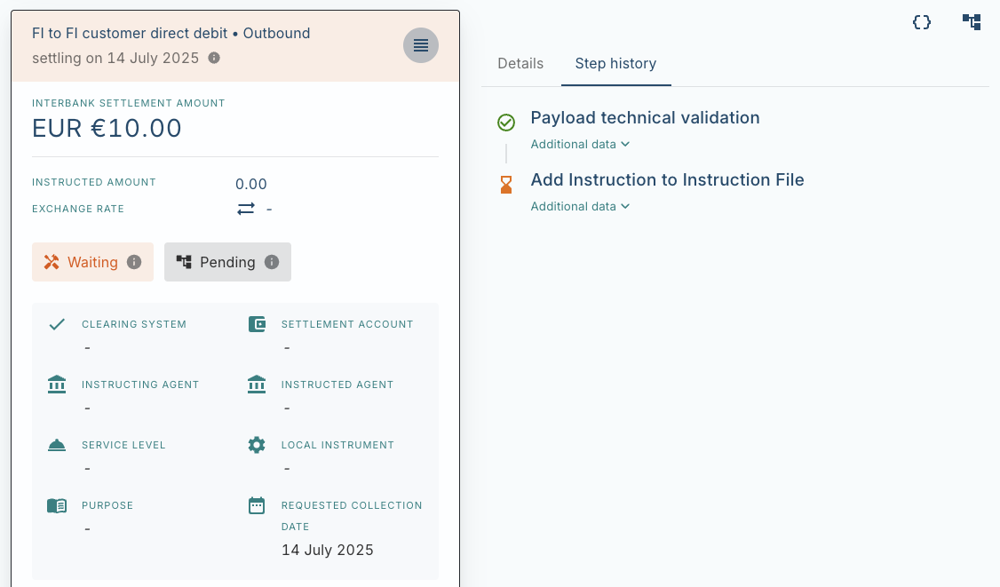
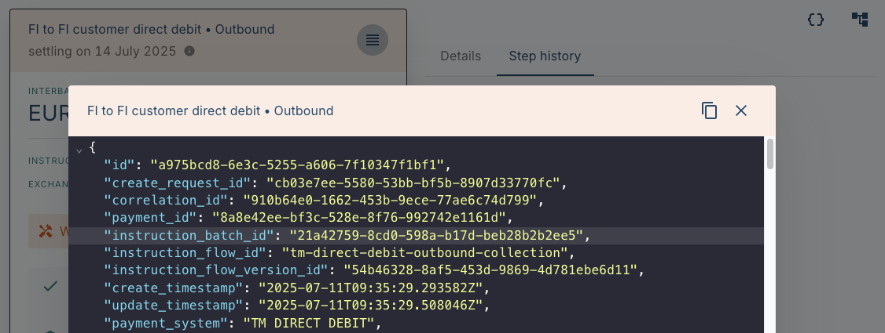
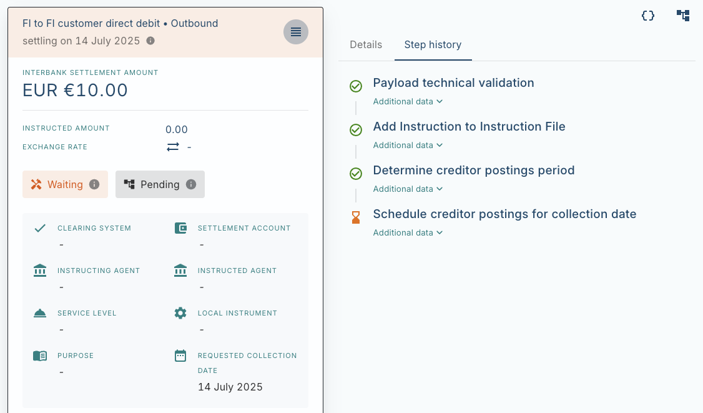

# Send an Outbound Collection

This tutorial covers how to orchestrate an outbound direct debit collection using TM Direct Debit. In this example, a company (the creditor) sends a direct debit collection to collect €100 from a customer (the debtor). The tutorial will include submitting a batch file and using the Vault Payments app to view the status of the collection.

In order to complete this tutorial, an active direct debit mandate must already exist for the debtor. To do this you can follow the [issue a mandate](/vault-payments/latest/EN/configuration_library/example/tm_direct_debit/tutorials/issue_a_mandate) tutorial first.

## Upload a Batch File to the Files API

We first create an XML batch file containing a CustomerDirectDebitInitiation (pain.008) with four collection initiations. We have prepared an example file which you can download [here](/vault-payments/latest/EN/resources/example_pain008.xml).

Alternatively, you can use a Manual Initiation Template to submit the four collections individually using the Vault Payments App by skipping ahead to [this](/vault-payments/latest/EN/configuration_library/example/tm_direct_debit/tutorials/send_an_outbound_collection#submit_collections_via_manual_initiation_alternative_approach) step.

chat\_bubble

The Correlation ID is generated from the `UETR` on the CustomerDirectDebitInitiation (pain.008). This field (`/Document/CstmrDrctDbtInitn/PmtInf/DrctDbtTxInf/PmtId/UETR`) must be set to a new unique value each time a new File is uploaded.

Upload the file to the Files API using the following command, replacing the `file` attribute with the path to your file.

You should receive a positive response acknowledging successful upload of the file which should look something like this:

Note down the ID under the `id` field. This is the ID of the File resource that has been created and will be used in the next section.

## Initiate Instruction File Processing

Once the batch file has been uploaded to the Files API we need to initiate processing of the file. This is done by initiating the Instruction File using the [/api/v1/instruction-files:initiate POST endpoint](/vault-payments/latest/EN/api/payments_api#instruction-files). The example request below can be used, replacing the value of `file_id` with the `id` from the previous section.

You should see a response confirming that the Instruction File has been successfully initiated:

Once initiated, Vault Payments splits the Instruction File into a set of Instructions (in this example, only one). Each is processed using the `tm-direct-debit-outbound-collection-initiation` flow according to the process outline in the [outbound collection journeys](/vault-payments/latest/EN/configuration_library/example/tm_direct_debit/outbound_collection_journeys) section.

## Submit Collections via Manual Initiation (alternative approach)

You can use a Payment Initiation Template to submit the four collection initiations instead of uploading a batch file outlined in the steps above.

A Template is provided in the configuration pack for initiating a CustomerDirectDebitInitiation (pain.008). You can find it on the sandbox [here](https://sandbox.payments.tmachine.io/payments/initiate?initiationTemplate=tm-direct-debit-outbound-collection-template).

Set the 'Requested collection date' field to a date in the past for the purposes of this tutorial (30 June 2025, for example). Set the 'Creditor scheme identification' and 'Mandate identification' fields to `FR98ZZZ09999999999` and `9a7399eb07fd443b8058ba3284e7d30c` respectively, or different values if you have created a mandate with different identifiers to those used in the [mandate issuance tutorial](/vault-payments/latest/EN/configuration_library/example/tm_direct_debit/tutorials/issue_a_mandate).

Submit the template exactly four times to create four collection initiations.

## Tracking the Status of the Collections

Once Instruction File processing has been initiated, four new Payments will be created corresponding to the outbound collections contained in the batch file. You can view them on the Vault Payments App. Filter for the Payment by putting 'TM DIRECT DEBIT' into the 'SCHEME' filter text box in the 'Search by property' pane, or by clicking [here](https://sandbox.payments.tmachine.io/payments/search/results?filterMode=property#scheme=TM+DIRECT+DEBIT).

You should see four cards representing the four outbound collections, each containing two Instructions: a 'Customer direct debit initiation' representing the CustomerDirectDebitInitiation (pain.008) that you previously uploaded as a file; and an 'FI to FI customer direct debit' representing the FIToFICustomerDirectDebit (pacs.003) to be sent to the scheme.

The status of the Payment is displayed as 'Initiated', indicating that processing has started but not completed. Clicking on the Payment brings up the Payment detail view, showing both Instructions in detail.

The 'Direct debit initiation' Instruction has completed processing. For the purposes of this tutorial, we have set the Requested Collection Date to a date in the past (30 June 2025). The flow automatically calculates the date to submit the 'FI to FI customer direct debit' to the scheme using a Calendar to submit one business day beforehand (D-1). Because the Requested Collection Date is in the past, the flow finds the next available business day. In this example, as the initiation was processed on Friday 11 July (a business day), it will be submitted on the same day. The subsequent collection date is then calculated by finding the next business day after the submission date, which is Monday 14 July.

The updated Collection Date is visible on the 'FI to FI customer direct debit' Instruction which has been created immediately in order to facilitate same-day submission to the scheme. The Instruction is currently paused, having reached an Instruction File Step where the Instruction has been added to an outbound Instruction File containing FIToFICustomerDirectDebit (pacs.003) to be sent to the scheme.

## Submit the Collections to the Scheme

Once the Instruction File reaches its capacity or a Calendar event is triggered, the file’s `processing_status` is updated from `PROCESSING_STATUS_COLLECTING` to `PROCESSING_STATUS_AWAITING_SUBMISSION` indicating that the file is ready to be submitted to the scheme. More information on this process can be found [here](/vault-payments/latest/EN/using_vault_payments/instruction_batch_processing#outbound_instruction_file_processing).

In production, a scheme gateway would be responsible for sending this file to the scheme and updating its status to `PROCESSING_STATUS_COMPLETED` once submission is complete. In this tutorial we will do this manually using the Payments API.

On the Payment detail view, click the `{}` icon on the 'FI to FI customer direct debit' to show the JSON representation of the Instruction. Note down the value of the `instruction_batch_id` field. This is the ID of the Instruction Batch that the Instruction has been added to.

Get the Instruction Batch from the Payments API using the command below and substituting the ID with the value you have just noted down.

You should receive a response similar to that shown below. The Instruction Batch is in status `PROCESSING_STATUS_AWAITING_SUBMISSION` as it has reached capacity and is ready to be submitted to the scheme within an Instruction File. Note down the ID of the Instruction File containing the batch under the field `instruction_file_id`.

We can now retrieve the Instruction File using the command below with the `instruction_file_id` found above.

The expected output is shown below:

We can see that the Instruction File contains four Instructions and two Instruction Batches (each Instruction Batch contains two Instructions). These correspond to the limits that we configured in the [Instruction File Specification](/vault-payments/latest/EN/using_vault_payments/instruction_batch_processing#instruction_file_specification) and confirm that the file has reached capacity and can be sent to the scheme.

You can view the contents of the file by getting the File from the Payments API:

The response contains a signed URL which allows you to download and view the file.

Now we have 'submitted' the file to the scheme, we can update the Instruction File’s `processing_status` to `PROCESSING_STATUS_COMPLETED`:

Now that file submission is complete, the Instruction can progress to the next step: scheduling creditor postings for the Collection Date.

## Schedule Creditor Postings

Returning to the same Payment that we viewed earlier, we can see that the 'FI to FI customer direct debit' Instruction is now paused until the Collection Date when creditor postings will be instructed.

Vault Payments has scheduled postings for this date (in this example, Monday 14 July). You can either wait until this date to view the status of the postings or use the development-only [Resume](/vault-payments/latest/EN/api/payments_api#sandbox_instructions) endpoint to immediately resume the Instruction, without having to wait for the target period to begin. You will need to include the Instruction `id` in the request:

Once resumed, you can view the status of the creditor postings on the Payment detail page of the Vault Payments App. The processing of the collection is now complete and the Payment’s status is marked at 'Settled'.