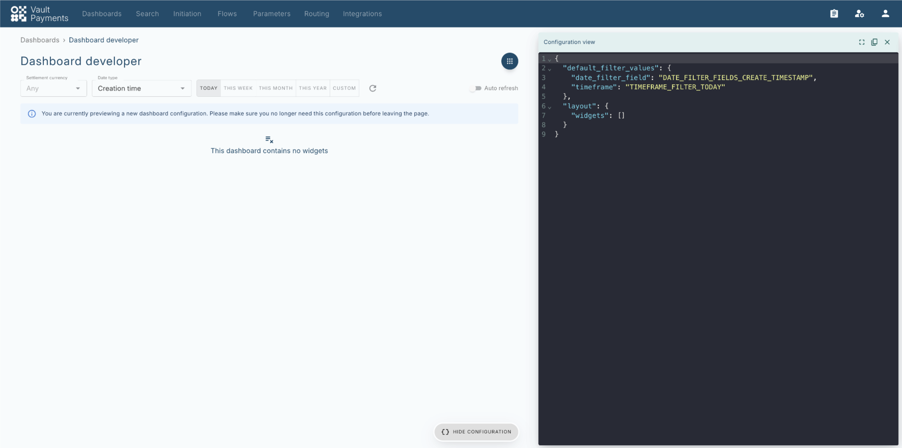
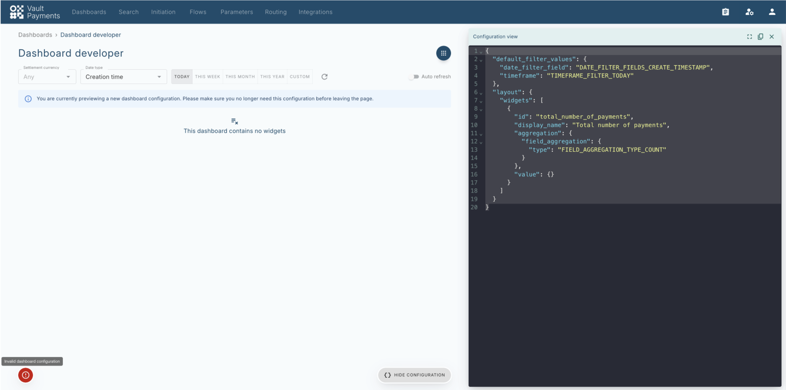
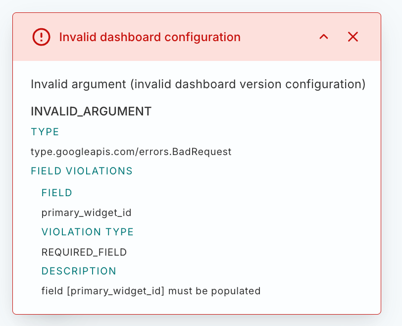
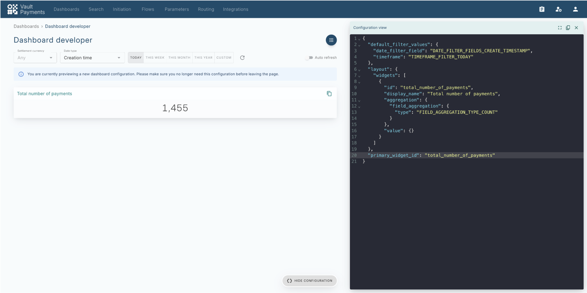
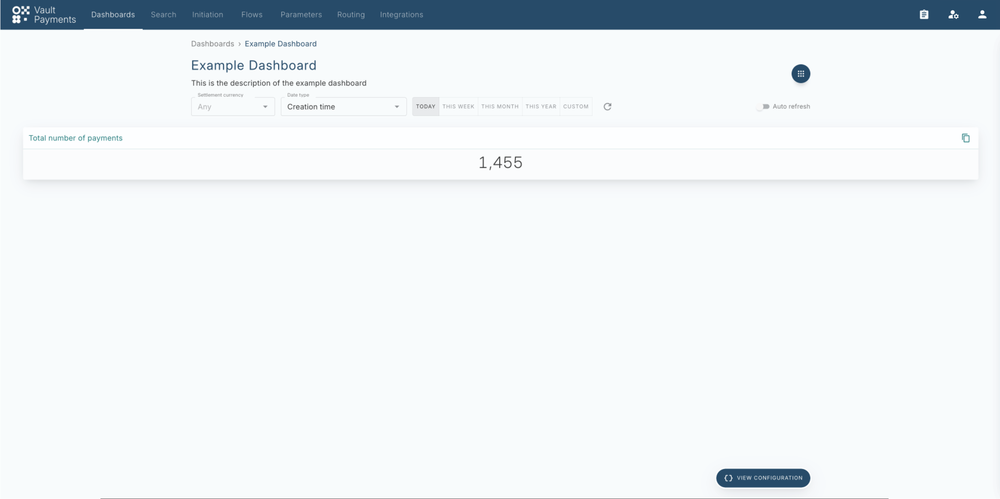
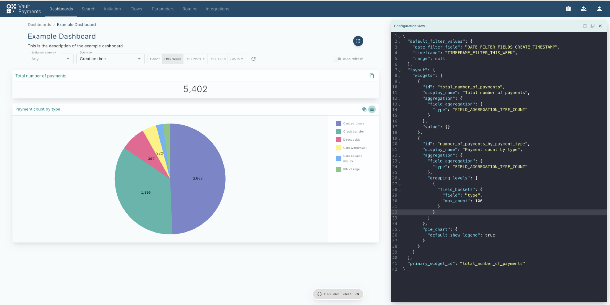
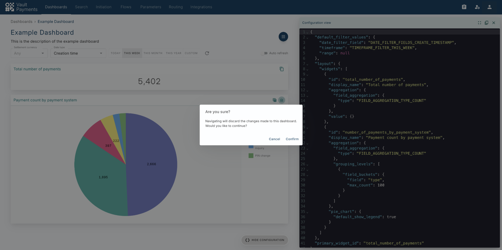

# Creating new Dashboards

In this tutorial we will show how to create new `Dashboards` and `Dashboard Versions`, using the Dashboards API and the Dashboard 'Developer view' of the Vault Payments app.

## Creating a Dashboard

To begin setting up a new Dashboard, such that it may start being used in the application, a `Dashboard` resource must be created.

Once this request has completed successfully, you can navigate to the Vault Payments App to find it at [https://sandbox.payments.tmachine.io/payments/dashboards/example-dashboard](https://sandbox.payments.tmachine.io/payments/dashboards/example-dashboard) .

The page will be quite empty though, as there is no Version for this new Dashboard.

## Building a Payments Dashboard configuration

To start building the new Dashboard configuration, you can navigate to the Dashboard Developer screen at [https://sandbox.payments.tmachine.io/payments/dashboarddeveloper?showConfig=true](https://sandbox.payments.tmachine.io/payments/dashboarddeveloper?showConfig=true) .

This view can be used to validate new Payments Dashboards configurations and preview what the Dashboard you are creating will look like once persisted.

You can add a new widget to the layout. To add a simple widget showing the total number of Payments processed you can add:

The code panel will now contain:

The page will still not show any widgets. That’s because there was an error while validating the configuration:

The red icon can be clicked to view the full details of the error:

Every Dashboard needs to have a primary widget. This widget is used Now that you have added a widget to the layout, you can set it as the primary widget as well:

This will now compile successfully and you will be able to preview the new Dashboard:

Changes made in the UI configuration editor are not persisted though, so if you want this Dashboard to be available for longer than your current session, you will need to save it using the API.

## Creating a Dashboard version

To now persist this configuration, you can create a Dashboard Version for the `example-dashboard` created earlier.

This can be done by calling the Dashboard Version Create endpoint, placing the configuration you have built using the Dashboard developer in the `payments_dashboard` field:

Once done, you will be able to navigate to the Example Dashboard again at [https://sandbox.payments.tmachine.io/payments/dashboards/example-dashboard](https://sandbox.payments.tmachine.io/payments/dashboards/example-dashboard) to view the new version of the Dashboard:

You will now be able to view this Dashboard whenever you need it.

## Editing a Dashboard

You can view the configuration of any of the Dashboards in the application by clicking the 'View Configuration' button at the bottom right of the page. This will open a configuration editor in place, showing you the full payments\_dashboard configuration, to edit or copy.

You could, for example edit this Dashboard you have created by adding a pie-chart containing a breakdown of Payments by type:

Your preview will now look like this:

To learn about the options for configuring widgets, view the [Widget](/vault-payments/latest/EN/using_vault_payments/dashboards#widget) documentation.

You may also wish to change the default filters, such that each time the Dashboard is viewed, the data of all Payments created this year will be shown instead of just today’s:

If you wish to leave the page, you will get an alert notifying you that the changes made will be lost:

To save the changes, you can create a new version of the Example Dashboard:

chat\_bubble

Note that the new version will need to have a higher semantic version (1.1.0 in this example) than the one previously created.

The latest version of the `Dashboard` will always be used when viewing a Dashboard, so now you will be able to see the Payment type breakdown everytime you load this Dashboard.