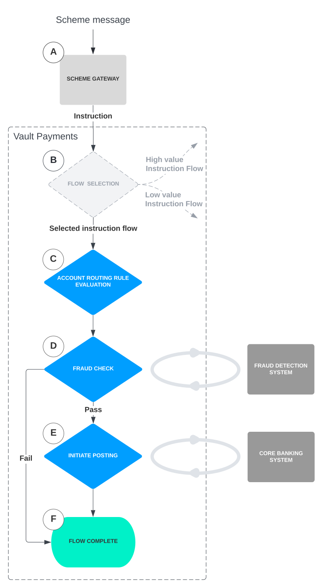
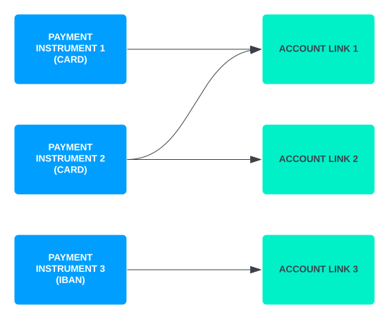
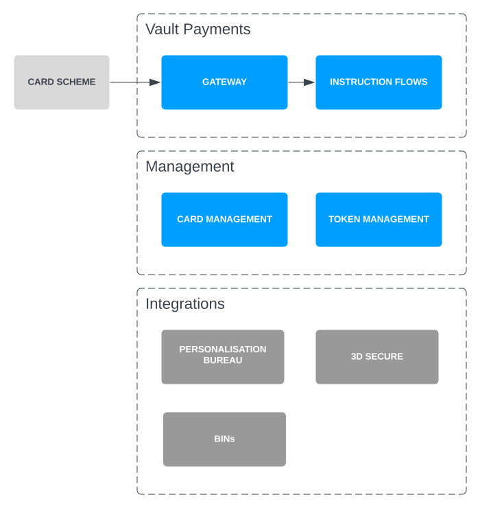

# Vault Payments overview

> **Our vision is to build a universal payment processing platform that enables  
> our clients to process any payment type, from any system, anywhere in the world.**

Vault Payments has been designed to operate with any Payment scheme and is built as a completely modular and configurable platform.

Following a similar set of principles to Vault Core, Vault Payments defines Payments and their behaviour in a configuration layer as a set of generic resources, rather than strictly defining specific schemes or Payment types within the platform. These generic resources can be configured to express your specific products, processes and requirements, enabling adaptability and rapid development of new functionality as you expand your Payments capabilities.

## Key benefits

-   Simplify and standardise payment processing across rails
    
-   Reduce cost of ownership: single licence, fewer integrations, less staff training
    
-   Interoperability between different payment rails
    
-   Clients can change their own configuration whenever they need without reliance on vendors.
    

## What makes Vault Payments different?

-   Unlike other platforms, Vault Payments was not built with one specific payment system in mind and extended later.
    
-   Vault Payments was built from the ground up looking at divergent payment schemes: instant, file base, cards and high value.
    
-   The requirements of the different schemes were systematically decomposed into generic building blocks making the platform universal and easy to extend.
    

## The journey of a Payment

This section outlines how a Payment is processed within Vault Payments, and introduces you to the key concepts required to understand and configure the system. For this scenario, an inbound Payment originates from a Scheme via a Scheme Gateway, as shown in the diagram below (A). The Scheme Gateway then forwards this Payment to Vault Payments for processing via an API call.

### Scheme level configuration

An *[Instruction](/vault-payments/latest/EN/using_vault_payments/instructions_and_flows#instructions)* is the basic building block of a Payment within Vault Payments, modelled after the widely used ISO20022 specification. An Instruction is a resource representing a request for, or provision of, information relating to a financial operation. Examples of financial operations represented by an Instruction resource are card authorisation or clearing messages.

The modular, customisable nature of Vault Payments means that the operations and their order can vary between Instructions. To determine which operations will be performed on an initiated Instruction (and in which order) it is assigned to an *[Instruction Flow](/vault-payments/latest/EN/using_vault_payments/instructions_and_flows#instruction_flows)* (B).

chat\_bubble

Sandbox environments come preloaded with a number of flows, details of which can be found *[here](/vault-payments/latest/EN/introduction_to_vault_payments/sandbox_quick_start#provided_resources)*

An Instruction Flow is made up of highly configurable *[Steps](/vault-payments/latest/EN/using_vault_payments/instructions_and_flows/steps)* (indicated in blue in the above diagram), which are individual operations performed on an Instruction, such as performing a fraud check (D) and making a posting to an account if the check passes (E). Steps connect together to create the full processing path, which can be dynamically routed based on any fields in the Instruction; for example, to only perform the fraud check if the Instruction amount is more than £100.

Steps in a Flow can also change the values of the data on the Instruction resource itself, which later Steps can then use to make decisions. The above diagram shows a simple example Instruction Flow containing Pass/Fail business logic.

### Customer level configuration

To supplement scheme level configuration, behaviours can be expressed at a more granular level; for example blocking a card or applying an account restriction. These are applied to the following resources:

A *[Payment Instrument](/vault-payments/latest/EN/using_vault_payments/routing#payment_instruments)* is Vault Payments' generic mechanism to represent any identifier that can receive and initiate Instructions. It is the external identification provided with a Payment Instruction, such as the tokenised PAN for a card, International Bank Account Number (IBAN), or sort code and account number for receiving credit transfers. A Payment Instrument dictates how an Instruction is routed within Vault Payments and allows you to customise the behaviours of different Payments. An Instruction is matched to a Payment Instrument via its routing information.

An *[Account Link](/vault-payments/latest/EN/using_vault_payments/routing#account_links)* contains the information for Vault Payments to direct an Instruction to a particular account in a core banking system (or similar system of record), where postings will be made on behalf of the Instruction.

Payment Instruments and Account Links have a many-to-many relationship; for example a card can be backed by multiple core banking accounts, or one account can be fronted by multiple cards:

Payment Instruments and Account links can model a variety of account compositions for customers, with their individual behaviours defined by *[Rules](/vault-payments/latest/EN/using_vault_payments/rules)*.

Rules are resources containing logic that can be used to select the appropriate account to make postings to, apply restrictions, or update the Instruction. They can be applied to Payment Instruments to influence the processing of a given Instruction.

Rules are written in Python and are dynamically evaluated at run time.

When Rules are applied to a Payment Instrument, either directly or using a Rule Set, a [Rules Step](/vault-payments/latest/EN/using_vault_payments/instructions_and_flows/steps#rules_step) (C) is required within the Instruction Flow in order for these Rules to be run. This type of Step can be placed at any point in an Instruction Flow, although it must be placed before any Postings are made because an Account is required. When an Instruction Flow executes a Step which leads to no further Steps, it is deemed to have finished (F).

## Cards overview

Vault Payments will enable a high level of configurability for cards by:

-   Handling validation and decryption of card scheme messages via the cards gateway
    
-   Defining the logic for processing card Payments using [Instruction Flows](/vault-payments/latest/EN/using_vault_payments/instructions_and_flows#instruction_flows)
    
-   Enabling card issuing, lifecycle management and connections to core banking system accounts via the APIs
    
-   Supporting integrations for physical card issuing, 3D Secure and other services
    

Vault Payments is certified by PCI DSS to handle Payment card data. Certain details of cards issued by Vault Payments (such as the PAN and security code) must be stored and transported in encrypted form at all times. Most operations on a card do not require direct access to its sensitive details, and the card’s identifier is used to indirectly reference the sensitive data.

When access to sensitive data is required, Vault Payments provides dedicated APIs to retrieve encrypted card details. For details on how to handle encrypted data, see [Encrypting sensitive data](/vault-payments/latest/EN/using_vault_payments/vault_payments_api#encrypting_sensitive_data).

chat\_bubble

For ease of use in the Sandbox, Vault Payments will also provide test APIs that can be used to retrieve unencrypted card details. These APIs will not be available in Production.

The Vault Payments Sandbox includes [a tool for simulating card transactions](/vault-payments/latest/EN/cards/concepts#card_simulator) and [two preconfigured card instruction flows](/vault-payments/latest/EN/cards/concepts#card_instruction_flows) to allow you to test our processing capabilities.

For explanations of the resources that support card processing, see the [Cards section](/vault-payments/latest/EN/cards).