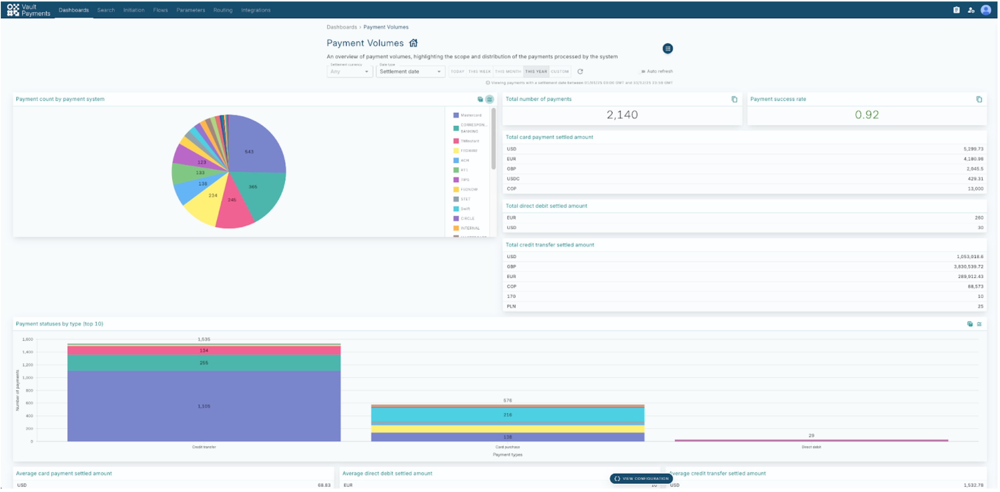
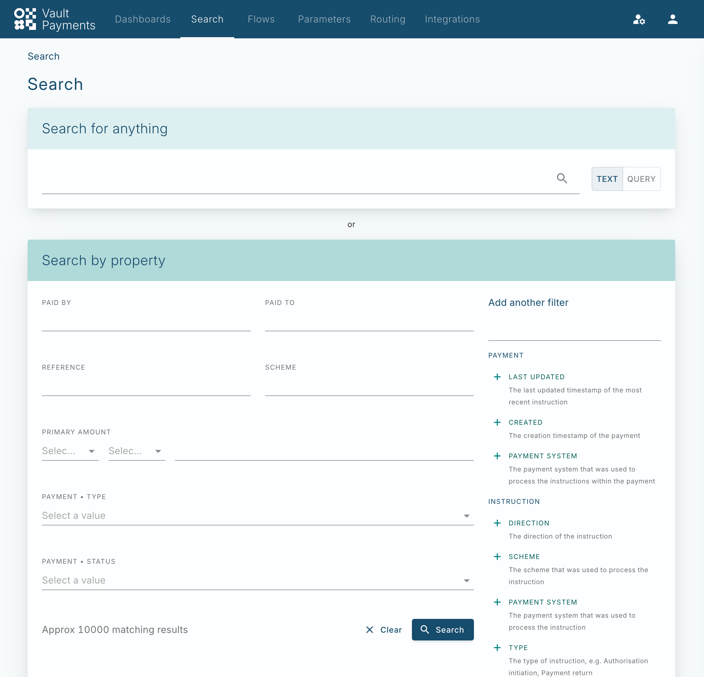
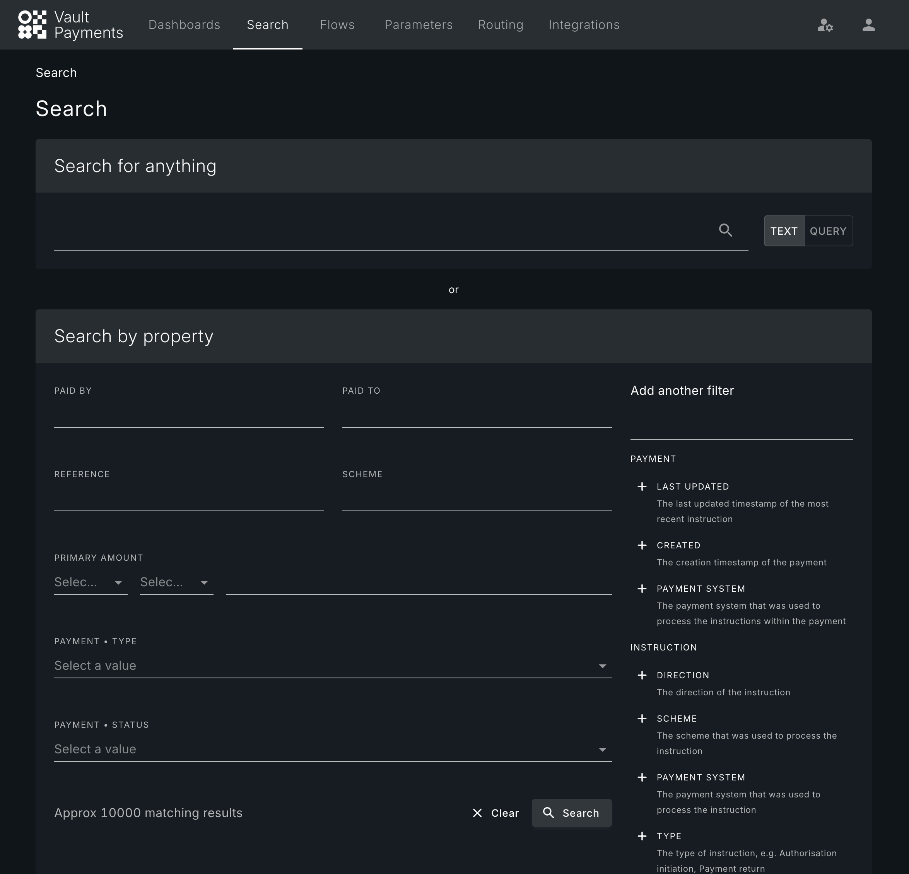
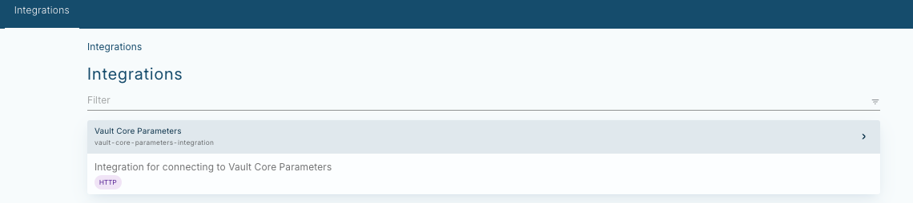
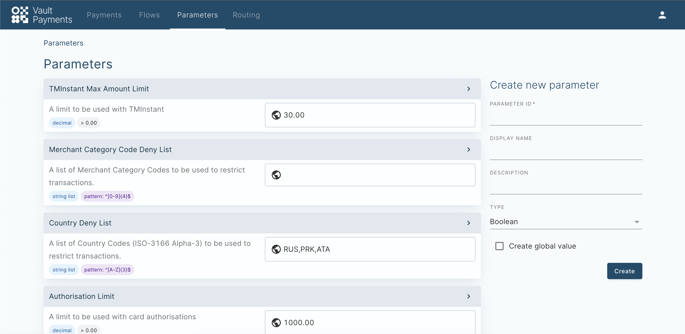
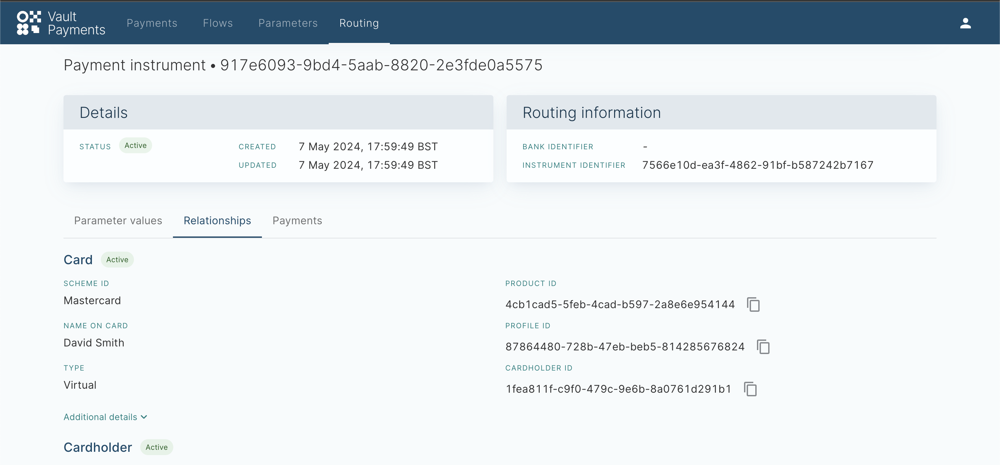
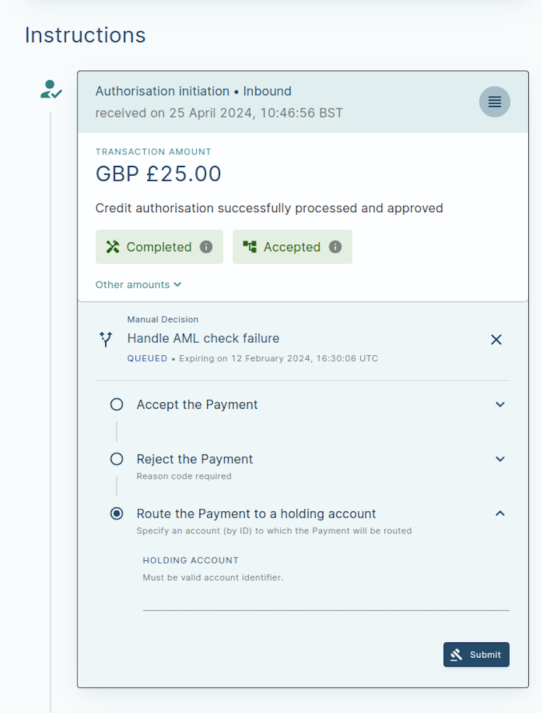
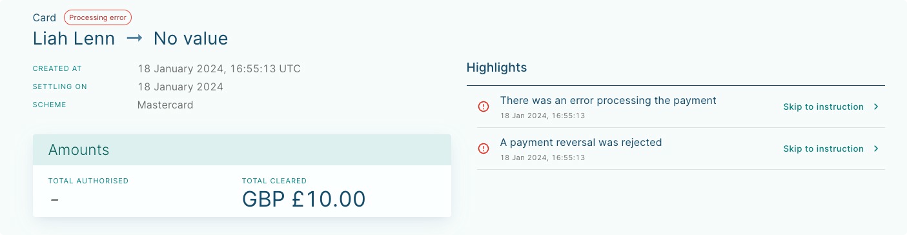

# Product updates

## January 2026

### Platform Capabilities

#### BIC Derivation from IBAN

We have introduced automated BIC derivation from IBAN in Vault Payments. Clients can now add automated BIC payment and achieve higher straight-through-processing rates, reduce manual intervention, minimise payment failures, and meet the EPC’s instant payment requirements.

#### Instruction Interruption

The interruption capability in Instruction Flows allows a new instruction to be prioritized and processed ahead of a previously matched instruction that is currently awaiting asynchronous resolution.

This feature is designed for schemes like Fedwire and ACH where certain messages, such as status requests or cancellations, must be handled while a previous instruction is still pending. When an interruption occurs, the original instruction is moved to a new SUSPENDED status until the interrupting instruction completes.

#### Logging of Instruction Flows

Logging of instruction flows is a feature that is designed to provide a human-readable audit trail of a payment’s life cycle.

The primary purpose is to help payment operators who may not have the technical skills to read code to understand exactly why a payment is in its current state. Each logged event consists of the following meta data:

-   Date and Time: When the event occurred.
    
-   Description: A clear explanation of the event.
    
-   Origin: Identifying which specific step, rule, or user action triggered the log.
    

* * *

## October 2025 Product Update

### Platform Capabilities

#### Visa DPS integration

Vault Payment now offers end to end connectivity and interoperability with the Visa DPS service. The integration covers both issuing and processing journeys, allowing clients to quickly deploy and run Visa issued card programmes.

#### Tasks and approvals UI (4 eye)

The new Tasks and Approvals feature in the Vault Payments App offers a controlled way to manage manual activities, such as initiating payments or reviewing decisions. Clients can define custom approval rules, specifying the required number of sign-offs and allowed roles, ensuring proper oversight. These actions appear in Task Queues, providing operations teams with a simple, transparent way to review, approve, and complete work.

#### Attribute Based Access Controls

Vault Payments now introduces Attribute-Based Access Control (ABAC), providing granular access management for your operational staff. This enhancement moves beyond Role-Based Access Control to allow for fine-grained permissions on resources such as Tasks, Manual Decisions, Instructions, and Payments. Access can now be configured based on specific attributes of the payment, including Payment Status, Payment System, and Payment Type, enabling your bank to enforce precise operational boundaries.

#### IBAN validation

The Flows SDK library was extended to include IBAN validation for SEPA countries, covering both country-specific length checks and standard modulus-97 validation. This functionality will be available for clients to embed in their own flows, and also incorporated into existing SEPA/TIPS flows to provide clear examples of usage.

#### User management and import

The new User Management service is now available in Vault Payments, supporting Just-in-Time (JIT) provisioning for organizations using various Identity Providers. This change establishes a system-native user resource, which is necessary for effective user experience, configuration fetching, and is a prerequisite for implementing Tasks and four-eyes check.

#### Record flow decisions (audit trail)

An event log is introduced to provide clear visibility into the lifecycle of each payment, capturing key actions such as applied rules, validation outcomes, user decisions, conversions, retries, and other non-failure events. Each event includes a timestamp, description, and origin (step, rule, or user) and is presented as a simplified list in the UI. This capability augments the existing step-based view to make lifecycle analysis more accessible for payment operators.

#### Card order enhancements

Improvements for physical Card Manufacturing process including, streaming out events related to card manufacturing, the ability to cancel a card order once generated and Improved alerting for card order errors.

#### Metrics API

To support reliable payment processing and client-owned configuration, key processing metrics will be exposed via a programmatic interface, enabling clients to monitor their own processing journeys and set up alerts and insights specific to their configuration and integrations. This improves observability, reduces reliance on manual notifications, and provides a scalable alternative to current ad-hoc processes, benefiting both clients and the platform as usage grows.

#### Aggregation API

The Aggregation API is now available in Vault Payments. This API is the underlying technology for the existing dashboards and also allows users to request custom payments aggregations externally from Vault Payments.

#### Dashboards API

Users can build their own bespoke dashboards using the new Dashboards API to view aggregated payment metrics.

#### SDK Version Update

New Release of the Instruction Flows SDK 1.13.0 is available for download [here](/vault-payments/latest/EN/api/flows/sdk_download/).

### Vault Payments App

#### Dashboard for aggregated metrics

Enables users to view aggregated payment information: number of payments in various statuses, accumulated manual tasks to perform, etc.

* * *

## August 2025

### Platform Capabilities

#### Payment initiation templates

Up until now payment initiation was available via preset templates which were available with the platform. With this change, clients can amend existing templates and create new templates. This allows clients to tailor the payment initiation process to their specific needs.

#### Files and Report management API

The ability to upload files to Vault Payments for storage and further processing. Use cases for file uploading are CSM reports, CSM membership directories, payment files from CSM or clients and more.

#### New message types

The following new message types are now available for use in flows:

-   Request to pay request (pain.013) and response (pain.014)
    
-   Bank to bank credit transfer (pacs.009)
    
-   Debit / credit notifications (camt.054)
    

#### Cycles in flows

Flow definitions now support the ability for a flow to return to previous steps for retries. Clients can specify the conditions for retrying steps and set a limit on the number of execution 'cycles' to prevent infinite loops.

#### SDK Version Update

New Release of the Instruction Flows SDK 1.12.0 is available for download s

### Configuration Library

#### TIPS - Outbound

Vault Payments now offers complete support for the TIPS rail across all use cases. This is achieved with a new configuration pack that enables Vault Payments to handle outbound TIPS payment journeys.

* * *

## July 2025

### Platform Capabilities

#### File Based Payment Processing

So far Vault Payments has primarily focused on instant and card payments. We have now provided the ability to process file based payments. Vault Payments can now read payment files, split them into separate Instructions and process them. This process is managed via two new resources - [InstructionFile](/vault-payments/latest/EN/api/payments_api#instruction_files) and [InstructionBatch](/vault-payments/latest/EN/api/payments_api#instruction_batches). Users can upload their payment files via the existing Files API and then they can call the new Initiate endpoint on the InstructionFiles API to start processing.

Vault Payments also now supports payment file creation. Multiple instructions can be grouped into a single file. The new [InstructionFileStep](/vault-payments/latest/EN/api/flows/flows_api#InstructionFileStep) and new [InstructionFileSpecification](/vault-payments/latest/EN/api/payments_api#instructionfilespecification) resource have been added to provide flow writers with the capabilities needed to manage file and batch creation in Vault Payments. The new flow step determines the file and batch an instruction should go into and then waits until the file is submitted for the flow to resume.

This functionality is now available in Beta. Note that breaking changes may be introduced.

### Configuration Library

#### Example Configuration Packs

The Configuration Library has been expanded with the introduction of Example packs. These provide a collection of pre-built configuration resources that are particularly useful for getting hands-on experience with Vault Payments, understanding how Vault Payments processes different scheme families and experimenting with the platform’s flexible configuration options.

Example Configuration Packs launches with packs for TM Credit Transfer and TM Direct Debit.

#### TM Credit Transfer and TM Direct Debit

Vault Payments has support for two new example payment schemes: TM Credit Transfer, an ACH-style credit transfer scheme, and TM Direct Debit, a direct debit scheme with support for direct debit collection and mandate management journeys. The schemes support both batch and single-file processing.

### Vault Payments App

Users can now pick between using a light or dark theme while navigating the Vault Payments App.

Light Theme

Dark Theme

The default theme is the original light theme but a theme toggle has been introduced in the top right corner user menu. This new toggle can be used to switch to light or dark mode, or track the default system settings.

* * *

## March 2025

### Platform Capabilities

#### New Step: Asynchronous HTTP Request

Vault Payments provides the ability to call out directly from any flow to any external service. Until now, this capability has been limited to synchronous calls, enabling clients to integrate with real-time services for risk assessment, liquidity checks, and other decisions that must happen instantly within the payment flow - particularly for cards and instant payments. However, there are use cases where the decision process involves manual handling or extended processing within an external system. In these scenarios, Vault Payments needs to hand over the decision to the external service and be able to pause and wait for a response, potentially for an undefined duration, before resuming the flow. To support this, we’ve added asynchronous HTTP request capability to Instruction Flows.

The new [HTTPAsyncStep](/vault-payments/latest/EN/using_vault_payments/instructions_and_flows/steps#http_async_step) allows flows to call external services and wait for an asynchronous response before continuing. Additionally, a new Integration type [http\_async](/vault-payments/latest/EN/using_vault_payments/integrations#http_async) has been added which must be used with this new step.

#### Integration Updates

We have made a number of other smaller but important changes to the Integration capability of Vault Payments:

-   It is now allowed to include a datetime object in the json field in the [HTTPRequest](/vault-payments/latest/EN/api/flows/flows_api/http#HTTPRequest). When Vault Payments makes a request the object is converted into a string representing timestamp in the ISO 8601 format.
    
-   Vault Payments will now truncate HTTP responses over a 2kb in the Instruction step history for performance reasons. Note that the full response is still usable in the relevant resolve functions. size and is\_truncated fields have been added to the [HTTPResponse](/vault-payments/latest/EN/api/flows/flows_api/http#HTTPResponse) message in the Instruction step history to indicate this happening.
    
-   Integration healthcheck requests will now attach relevant auth tokens. Consequently, receiving a 401 Unauthorized response during an HTTP healthcheck will be considered a failure.
    
-   Many integrations are used across multiple flows. Up until now, the retry policy for an integration was defined for each step of each flow separately. We have now added the ability to define a [RetryPolicy](/vault-payments/latest/EN/using_vault_payments/integrations#integration_retries) at the Integration-level, making them hierarchical and reducing the need for duplication in each flow.
    
-   When a HTTP step calls out to an external service and the requested data item was not found (e.g. IBAN), the service would respond with code 404 which up until now be handed as a technical error. We have now added the ability to define a StatusCodePolicy for HTTP and HTTP Async Integrations, allowing a flow writer to treat such errors as part of the business logic and define outcomes accordingly.
    
-   To further support the previous use case, we have added the HTTP Response to the `on_error_func` for HTTP and HTTPAsync Steps, allowing the flow writer to determine the exact issue and handle the error accordingly.
    

#### New Endpoint: Ping

We added a new public [Ping](/vault-payments/latest/EN/using_vault_payments/vault_payments_api#ping_api_endpoint) endpoint for basic network reachability checks.

#### Payments API Improvements

List and Get endpoints now have a 'fields\_to\_include' field with the option to include the Active Version for a resource. This field has been added to the following resources:

-   Card
    
-   Core
    
-   InstructionFlow
    
-   Instruction
    
-   Integrations
    
-   Rules
    
-   RuleSets
    

#### Documentation Update

The documentation for the streamed Kafka [Events](/vault-payments/latest/EN/api/streaming_api) has been updated and includes the specification for all the Configuration and Routing resources.

#### New SDK Release

New Release of the Instruction Flows SDK 1.9.0 is available for download [here](/vault-payments/latest/EN/api/flows/sdk_download/).

### Vault Payments Apps

#### Advanced Search in the UI

Users of the Vault Payments App can now use the full flexibility of the [Search Query Language](/vault-payments/latest/EN/api/search_query_language) directly in the UI. This enables users to search for Payments within Vault Payments App with the same level of granularity as they would be able to via the API.

We have also added a new UI filter for Payment Scheme and Instruction Payment System as well as refined the existing filters to match the new Payment and Instruction fields.

#### Manual Payment Initiation

Manual Payment Initiation is a capability that allows bank operators to create new payment instructions from scratch using Vault Payments UI. This functionality makes it easier for non-technical users to execute payment instructions for the number of purposes, including but not limited to: \* Moving funds between internal accounts; \* Adjustments between customer and internal accounts, such as compensations and refunds; \* Initiating payments on behalf of customers; \* Bank-initiated payments for liquidity movements and treasury adjustments.

A manual payment can be created using one of the pre-defined templates, such as Simple Credit Transfers, Credit Transfers - RT1 / TIPS, Credit Transfers - USA, International Credit Transfer, etc.

The manually initiated instruction can be created for a specific Payment System (RT1, TIPS, STET, etc.) or can be deferred to the logic defined by the respective Instruction Flow.

* * *

## December 2024

### Platform Capabilities

#### Mandates API Beta Release

Mandate resource represents an authorisation that a customer gives to a service provider or financial institution, allowing it to collect payments directly from their bank account on a recurring or one-time basis. In this release, Vault Payments provides a Mandates API which allows users to retrieve existing [Mandates](/vault-payments/latest/EN/api/payments_api#mandates).

#### Integration Healthchecks

External Integrations allows Vault Payments to interact with an external system (e.g. AML, sanctions, FX) and use the data retrieved from an external source in the Instruction Flow. With the introduction of Healthchecks, Vault Payments will, by default, healthcheck `HTTP` and `SchemeSubmission` Integrations before they are moved to a `READY` status. The Healthcheck of these Integrations can be customised by providing the URL to be used in the Healthcheck and the method of the Healthcheck. The Healthcheck can also be disabled.

#### Configuration Layer Utility (CLU)

Vault Payments support has been added to the Configuration Layer Utility (CLU). CLU is a tool that eases the process of creating and maintaining configuration resources within Vault Payments and Vault Core. It provides a convenient command-line interface which sits between the user and the Vault APIs. Instead of constructing and executing HTTP(s) requests to the API directly, a user can instead specify a collection of resources which can then be applied using CLU.

A list of the supported Vault Payments resources which can be provisioned using CLU can be found [here](/vault-payments/latest/EN/using_vault_payments/clu).

#### Deprecation of Account Link Selection Rules

We deprecated the `account_link_selection_rules` field, in favour of the `account_links` field in Payment Instruments. This is to align the naming of the fields with the new flow step types.

### Vault Payments Apps

#### Vault Payments App Search via Payments API

Vault Payments App has been updated to use the new [Search Payments API](/vault-payments/latest/EN/api/payments_api#_payments_v1_payments_SearchPaymentsResponse_SearchPayments).

#### Vault Tokens Service for Vault Payments App

[Vault Tokens](/vault-payments/latest/EN/using_vault_payments/vault_tokens) allow our clients to integrate with the Vault Payments API without bringing their own authentication solution that is compliant with Vault Payments authentication requirements. Users can now log in to Vault Payments App using Vault Tokens.

#### New Filtering Options in Vault Payments App Search

Vault Payments App users can now search for the Instructions that require manual decisions using a single-select filter in the Search UI. We also introduced filtering of Instructions by Instruction Batch Id.

### SDK Release

We have released SDK 1.6 which adds support for [payload validation](/vault-payments/latest/EN/using_vault_payments/instructions_and_flows#payload_validation) according to ISO20022 rules. This version also supports generations of pseudo-random [identifiers](/vault-payments/latest/EN/api/flows/flows_api/identifiers) in the Instruction Flows (for example UUID).

New payload [Bank to Bank Customer Debit Credit Notification](/vault-payments/latest/EN/api/flows/flows_api/payloads/banktocustomerdebitcreditnotification) representing ISO20022 `camt.054.001` message has been also introduced in this update.

All the aforementioned features are available for download [here](/vault-payments/latest/EN/api/flows/sdk_download).

* * *

## October 2024

### Platform Capabilities

#### Membership Directory Service

Vault Payments can now process membership directory files. You will be able to upload the membership directory file using the Vault Payments file API and create membership directory version resources referencing the uploaded file. These resources can then be queried during flow execution to dynamically impact the way payments are processed and sent to routable Financial Institutions. More documentation on the Membership Directory Service here: [Membership Directory](/vault-payments/latest/EN/using_vault_payments/membership_directories/), [Membership Directory API Reference](/vault-payments/latest/EN/api/payments_api#Membership_Directories), [Membership Directory Step](/vault-payments/latest/EN/using_vault_payments/instructions_and_flows#membership_directory_step).

#### Instruction Retry, Update and Repair endpoints

We have made tools available to deal with Instructions that have entered an error state. You can now retry transient processing errors after initial retries have been exhausted, modify and rewind instructions before attempting to resume processing, or mark Instructions as cancelled. You can find documentation for these endpoints in the [Instructions API reference](/vault-payments/latest/EN/api/payments_api#Instructions).

#### Payments Search Endpoint

You will now be able to use the Payments search endpoint. This will allow you to query Vault Payments using specific field values present in Instructions and Payments. This will give you a wide range of options when trying to generate reports on payments processing. You can read more about Payments search here: ([Search Query Language](/vault-payments/latest/EN/api/search_query_language/) , [Payments endpoint API reference](/vault-payments/latest/EN/api/payments_api#Payment))

### Vault Payments Apps

#### Integrations Dashboard

We have rolled out a [new application](https://sandbox.payments.tmachine.io/integrations) to check the status of the Vault Payments Integrations resources. You will be able to view the status and details of integrations and integration versions.

#### New ISO messages available in Vault Payments App

We now support the following ISO20022 payloads in the Vault Payments UI: FIToFIPaymentStatusRequest (pacs.028), FIToFIPaymentCancellationRequest (camt.056), ResolutionOfInvestigation (camt.029), PaymentReturn (pacs.004) messages in the Vault Payments UI.

### Account-to-Account Capabilities

#### SWIFT Alliance Gateway Integration

Vault Payments now supports integration to SWIFT AGI instances via the REST connector interface in order to process SEPA Instant payments through TIPS. This connector supports both receiving messages from a SWIFT AGI instance and the submission of Vault Payments originated Instructions to the SWIFT network.

To make testing process smoother, we have also added a SWIFT AGI simulator, available in the Sandbox environment. This allows you to test your integration confidently before going live. For more details on how to get started, you can access the full documentation on the SWIFT AGI connector here: ([SWIFT AGI Simulator API reference](/vault-payments/latest/EN/api/payments_api#Simulator_SWIFT_AGI), [SWIFT AGI Integration Type](/vault-payments/latest/EN/using_vault_payments/integrations#integration_type)).

#### TIPS Sweeper

We support the automatic initialisation of FIToFIPaymentStatusRequest (pacs.028)messages for incomplete TIPS payments originating from Vault Payments. Please speak with Thought Machine to enable this.

### SDK Release

We have released SDK 1.5 which adds support for all the aforementioned features. Available for download link:/vault-payments/latest/EN/resources/instruction\_flows/flows\_api-1.5.0-py3-none-any.whl

* * *

## July 2024

### Platform Capabilities

#### Opaque Token Support for Authorisation

Vault Payment now supports opaque access tokens in addition to JWT for authorisation. Opaque tokens are validated using a Token Introspection endpoint. The requirements to support opaque tokens can be found [here](/vault-payments/latest/EN/using_vault_payments/vault_payments_api#opaque_tokens). With this rollout, Vault Payments now provides comprehensive OAuth 2.0 authorisation support and provides clients flexibility to decide the best mode of authorisation for them.

#### Engine Retry Improvements

Vault Payments now exposes [retry configuration](/vault-payments/latest/EN/using_vault_payments/integrations#retries) to steps in flows via the new [RetryPolicy](/vault-payments/latest/EN/api/flows/flows_api/retry#RetryPolicy) class. This can be used via a new optional `retry_policy` field available on all steps which use Integrations. Pairing this with the optional `on_error` function gives flow writers great flexibility in configuring how Vault Payments communicates with, and reacts to, Integrations.

### Account-to-Account Capabilities

#### XML Payload Support

Vault Payments can now process and send ISO20022 XML payloads. The instruction endpoint accepts XML payloads, please see the documentation on initiate endpoint for more information [here](/vault-payments/latest/EN/api/payments_api#Instruction). To improve the developer’s experience when connecting Vault Payments to ISO20022 native scheme gateways, flow writers can also make use of the Flows SDK to submit Vault Payments instructions to external integrations in XML format (previously only JSON was supported). The new SchemeSubmissionStep and an Integration of type SCHEME\_SUBMISSION (with content\_type set to XML) must be used. See Scheme Submission Step for more information [here](/vault-payments/latest/EN/using_vault_payments/instructions_and_flows#scheme_submission_step).

### Payment Events Streaming

Vault Payment now streams Payment events. A PaymentEvent is guaranteed to be emitted when the Payment reaches its final state. This will allow you to keep track of the activity on your payments and maintain an updated view of the payments in your system. You can read more about it [here](/vault-payments/latest/EN/api/streaming_api#payment_events).

### OpenAPI

Vault Payments now provides an OpenAPI specification (3.0.3) available for download for all Vault Payments and Vault Payments Sandbox APIs. OpenAPI promotes interoperability and automates the generation of code, reducing the time to use Vault Payments' APIs.

The OpenAPI specification can be downloaded from [Payments API reference documentation](/vault-payments/latest/EN/api/payments_api/). This will be kept up-to-date with the latest changes to the APIs.

* * *

## May 2024

### Platform Capabilities

#### Parameters

A new Parameter Management capability has been added to Vault Payments. Parameters provide a simple way to configure the behaviour of Instruction Flows and Rules without making changes to the underlying Python code, allowing you to make changes to payment processing easily.

Parameters can be created and referenced in both Instruction Flows and Rules. Parameter Values can then be assigned Globally, affecting all usages of the Parameter, or at a Payment Instrument level, allowing per Instrument overrides for customer or product-specific behaviours. This enables Flow writers to parameterise certain aspects of the business logic and reuse it across different flows to reduce maintenance burden and react more quickly to changes in regulation or internal policies.

An example of when you would use a Global Parameter could be a Country Parameter for sanctioned countries, where the Rule is applied across all Instruction Flows. An example of a Payment Instrument level Parameter could be when a parent would like to limit their child’s account on the maximum value of a transaction. You can find a step-by-step tutorial in [this link](/vault-payments/latest/EN/introduction_to_vault_payments/tutorials#create_a_rule_to_block_payments).

In addition to the new APIs, Parameters have been added across the UI, providing a way to view Parameters and their Global Values, view Flows alongside the Parameters used, and view Payment Instrument level Parameters. Parameters and their values can also be changed from the UI, allowing non-technical users with the right permissions to tweak Parameter Values without having to update the Python code of the Instruction Flows. The UI also provides a streamlined view of Parameter Value history without having to rely on API calls.

### Routing UI

A Routing UI has been introduced to search and view Routing resources. From the UI, users can search for a Payment Instrument and search all related Payments, view related resources (including Payment Instruments Details, Account Links, Cards, and Cardholders).

The UI is also integrated with Parameter Management, allowing users to view and create new Payment Instrument level Values directly.

### Manual Decisioning

Vault Payments now provides first-class support for [manual decisioning and intervention within Instruction processing](/vault-payments/latest/EN/using_vault_payments/manual_decisions). This is surfaced via the `ManualDecisionStep` in Flows and the new Manual Decision API.

Flow writers can dynamically create decisions and custom input constraints within this new step, which can be acted upon via the Manual Decision API or Investigation & Repair UI. Instructions will be paused until either a decision is made or a configurable deadline is reached. Flows can then dynamically react to the provided decision and any accompanying inputs to inform further Instruction processing.

### Streaming

Vault Payments now provides a [Kafka interface](/vault-payments/latest/EN/using_vault_payments/kafka_streaming) and public event streams for key resources including Instructions and Payments. These event streams can be consumed to receive an updated view of the system and resources for long-term storage.

### Warehousing

Vault Payments can enable instructions to be warehoused and processed based on scheduled action. This is done by calculating a Calendar period you wish to target using a [PeriodCalculationStep](/vault-payments/latest/EN/using_vault_payments/instructions_and_flows#period_calculation_step), and then pausing the instruction via a [Schedule Instruction Step](/vault-payments/latest/EN/using_vault_payments/instructions_and_flows#schedule_instruction_step). This can be used when you require an Instruction Flow to pause an Instruction until a Calendar period begins.

### SDK Release

We have released SDK 1.2 which adds support for all the aforementioned features. Available for download [here](/vault-payments/latest/EN/api/flows/sdk_download/).

* * *

## March 2024

In this product update, we are covering the release of Vault Payment’s ability to process On-us Payments, rolling out Flows SDK 1.0.0 and 2 new endpoints.

### Account to Account Payments

#### Credit Transfer On-us Processing

Vault Payment can now facilitate On-us processing. On-us payment processing allows users to process credit transfers, where both the debtor account and creditor account are customers of the client, without instructions needing to be submitted to an external payment system, hence potentially reducing charges paid to external payment systems. You can read more about our support for On-us instant payments [here](/vault-payments/latest/EN/account_to_account/tmonus_a2a/).

### Platform Capabilities

#### Release of flows\_api SDK 1.0.0

We are excited to announce the release of the Python Software Development Kit (SDK) for the flows API. This empowers flow writers to develop and test instruction flows with ease and speed. You can download the Python SDK [here](/vault-payments/latest/EN/resources/instruction_flows/flows_api-1.0.0-py3-none-any.whl).

The SDK is distributed as a standard Python wheel package and can be installed using the below command: `python3 -m pip install flows_api-1.0.0-py3-none-any.whl`

SDK provides all the types the platform depends on, this includes:

-   the Instruction resource - all ISO20022 payloads currently supported by Vault Payments - objects used to construct Instruction Flows, including all Step types - unit testing and simulation framework
    

The provided simulation functionality resembles the actual processing in Vault Payments, shortening the testing and feedback cycle. However, we strongly recommend that flows should always be tested in a real environment.

Relevant flows\_api documentation is available [here](/vault-payments/latest/EN/api/flows/flows_api/).

#### New Instruction Endpoints

We have added two new endpoints for the Instruction resource. They are the: - /api/v1/instructions:batchGet GET, which allows you to retrieve multiple Instructions at once by their IDs. - /api/v1/instructions GET, which returns paginated Instructions based on the filter criteria provided.

* * *

## January 2024

In this product update, we cover the latest features in our Investigation and Repair App to support faster debugging of payments. We have also added more platform capabilities and rolled out new card capabilities.

### Vault Payment Apps

#### Investigation and Repair

We recognize the need to be able to quickly investigate errored payments. We have hence introduced the capabilities below:

-   Users can get updated on the status of the instruction and get informed on the issue in the Payment Highlights section to easily understand what went wrong with the payment.
    
-   View a list of instruction issues and processing errors in the payment details screen.
    
-   Easily navigate to the corresponding step in the instruction’s step history to see where an issue or processing error was encountered in the instruction flow.
    
-   If needed, instruction is also available in JSON for operators to dive further into the errors.
    

### Platform Capabilities

#### External integrations platform

Vault Payments have launched an HTTP Step that can be used when you require an Instruction Flow to make an HTTP call to a server outside of Vault Payments; for example, to call your existing fraud check provider, or a server that will provide data enrichment to your Instruction. We currently only support JSON.

We have also enabled users to make custom HTTP requests in flows using any information contained in the instructions via the HTTPRequest type. This greatly improves both the flexibility and ease of integration.

Lastly, we also support access to the HTTPResponse object, it will be available to the resolve function of the HTTP Step. You can view the [HTTP integration type](/vault-payments/latest/EN/using_vault_payments/integrations#http) to understand how this can be used.

#### File Management

Vault Payments now supports the capability for clients to retrieve internally generated files from cloud storage.

#### Supporting Versioned Payloads

Vault Payments is built to be a Universal Payments Engine. As such, we have built the capability to support payloads in various versions as different schemes may use different versions of the ISO 20022 resources. Furthermore, supporting versioned payloads future-proofs us for future ISO 20022 version updates.

### Card Capabilities

#### Recurring Payments

Vault Payment now supports recurring payments. This enables multiple use cases such as subscription-based services, instalments, and standing orders. Recurring payments can be traced back to the initial authorization for debugging and customer enquiries purposes.

#### Authorization Expiry

We have enabled card authorizations which are not cleared or released within their expiry period to be automatically released by Vault Payments, with no operator intervention required. This reduces the manual support burden for operators and helps to ensure a consistent experience for cardholders.

#### Mastercard issuer processing

We have also enhanced our card simulator In the sandbox. Users will be able to simulate card management and reversal messages. The provisioned payment flows can process the simulated card messages and demonstrate how ATM PIN changes, and reversed authorizations can be handled in Vault Payments.

* * *

## October 2023

In this product update we cover the latest features added to Vault Payments enabling Instant Payments, new use cases enhancing our cards offering and new payment simulation journeys.

### Payments simulation

#### TM Instant - Production-like A2A processing capabilities

Vault Payment’s TM Instant scheme demonstrates that Vault Payments is capable of modelling instant payment schemes generically through Payment Flows. In the sandbox, you are able to run an inbound and outbound credit transfer flow, as well as credit transfer recall flows through a simulator.

#### Mastercard issuer processing

Vault Payments has a native integration with the Mastercard network. In the sandbox you are able to simulate authorisation and presentment messages. The provided Payment flows processes the simulated card messages and demonstrate how restrictions, fee splitting, matching and posting coordination can be handled by Vault Payments.

### Platform Capabilities

#### External integrations platform

Vault Payments includes a robust platform to enable communication with external systems such as Fraud, AML, and FX engines. When an external integration step is invoked, the full instruction is sent as the payload for consumption. Responses received from the external system can then be actioned by the payments flow.

The following capabilities have been added in this release: \* Ability to add an external integration step within a flow; \* Ability to manage configuration associated with an integration via a new Integrations resource; \* Ability to send the instruction and receive a response from an external system synchronously through a HTTP/JSON API; \* Ability to authenticate with external services via OAuth 2.0 client credentials grant; \* Ability to set up egress and communicate with external integrations via AWS PrivateLink as well as over the public internet.

Future releases will include the ability to send custom requests and monitor the status of existing integrations.

#### Configuration management

Vault Payments enables building bespoke payment flows through its configuration layer. Python can be used by clients to define the instruction flows, steps, and rules to meet any processing requirements. Instruction flows define the sequence of operations that Vault Payments performs to process a payment; Steps dictate the operations performed within an instruction flow; Rules are resources containing logic which allows dynamic behaviours to be applied to payment instruments or account links. Additional information on rule management is provided in the section below

#### Rules & Rule management

Vault Payments now has richer Rule and Rule Management capabilities: Rules have been enhanced with parameters - providing a greater level of flexibility and customisation.

Rule Management has also been improved with the introduction of a new resources: 'RuleSets'. These allow for managing rules at scale on the platform. Users can now group multiple rules together into 'RuleSets' grouped around common themes such as Card Controls. These can then be attached to many Payment Instruments. This allows the behaviour of all associated Payment Instruments to be managed and changed from one place.

Example rule sets are deployed into the sandbox for each tenant. You can find out more in the [Rule Management section](/vault-payments/latest/EN/using_vault_payments/rules#rule_management).

#### User Access Management

Vault Payments provides the ability for the Identity Provider (IdP) administrator to assign roles to users to govern their user interaction with the Vault Payments Apps. The role’s scope is determined by their associated set of permissions. The ability to edit permissions per roles will be delivered in a future release.

#### Vault Payments Apps

Through the Vault Payments App, a user can: \* Search for payments based on payment and instruction attributes \* Navigate through search results using a graphical/tabular view \* Explore details of card payments, instant payments and fee collections. \* Visualise existing flows, enabling users to easily understand the behaviour of each flow.

#### Cards renewal and replacement

The Card Issuance API now offers a dedicated endpoint for replacing cards that have been damaged, lost, or stolen. Clients can now perform card replacement journeys with a variety of options to preserve the PAN, PIN, or cancel the source card.

Automated card expiry processing can also be enabled on a per-client basis, to orchestrate periodic reissuing/expiry of cards at the end of their lifecycle.