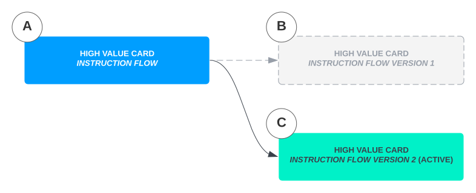

# Instructions and Instruction Flows

This section describes the Vault Payments models payments and handles message processing in a generic way.

## Overview

Vault Payments has been designed to operate with any Payment scheme and is built as a completely modular and configurable platform. Following a similar set of principles to Vault Core, Vault Payments defines Payments and their behaviour in a configuration layer as a set of generic resources, rather than strictly defining specific schemes or Payment types within the platform.

These generic resources can be configured to express your specific products, processes and requirements, enabling adaptability and rapid development of new functionality as you expand your Payments capabilities.

## Instructions

An `Instruction` is a resource representing a request for, or provision of, information relating to a financial operation. One or more `Instructions` can make up a Payment.

Our `Instruction` resources are modelled after the [ISO20022 specification](https://www.iso20022.org/iso-20022-message-definitions). Instructions are processed according to the logic defined in the [Instruction Flow](/vault-payments/latest/EN/using_vault_payments/instructions_and_flows#instruction_flows) resources. When [InitiateInstruction](/vault-payments/latest/EN/api/payments_api#_payments_v1_instructions_InitiateInstructionResponse_InitiateInstruction) or [ProcessInstruction](/vault-payments/latest/EN/api/payments_api#_payments_v1_instruction_Instruction_ProcessInstruction) endpoints are called the `instruction_flow_id` field needs to be populated and reference the ID of the `Instruction Flow` which will be used to process the given `Instruction`.

### Instruction payloads

Each `Instruction` contains a `Payload` that represents a message containing a particular set of fields for a specific purpose (as per the ISO20022 message definitions).

Vault Payments includes the following Instruction Payloads:

  
| Account to Account Payload | ISO 20022 Message | Description |
| --- | --- | --- |
| 
CREDIT\_TRANSFER\_INITIATION

 | 

pain.001

 | 

Message is sent by the initiating party to the forwarding agent or debtor agent. It is used to request movement of funds from the debtor account to a creditor.

 |
| 

FI\_TO\_FI\_PAYMENT\_STATUS\_REPORT

 | 

pacs.002

 | 

Message is sent by an instructed agent to the previous party in the payment chain. It is used to inform this party about the positive or negative status of an instruction.

 |
| 

PAYMENT\_RETURN

 | 

pacs.004

 | 

Message is sent by an agent to the previous agent in the payment chain to undo a payment previously settled.

 |
| 

FI\_TO\_FI\_CUSTOMER\_CREDIT\_TRANSFER

 | 

pacs.008

 | 

Message is sent by the debtor agent to the creditor agent, directly or through other agents and/or a payment clearing and settlement system. It is used to move funds from a debtor account to a creditor.

 |
| 

PAYMENT\_STATUS\_REQUEST

 | 

pacs.028

 | 

Message is sent by the debtor agent to the creditor agent, directly or through other agents and/or a payment clearing and settlement system. It is used to request a FIToFIPaymentStatusReport message containing information on the status of a previously sent instruction.

 |
| 

RESOLUTION\_OF\_INVESTIGATION

 | 

camt.029

 | 

Message is sent by a case assignee to a case creator/case assigner. This message is used to inform of the resolution of a case, and optionally provides details about.

 |
| 

FI\_TO\_FI\_PAYMENT\_CANCELLATION\_REQUEST

 | 

camt.056

 | 

Message is sent by a case creator/case assigner to a case assignee. This message is used to request the cancellation of an original payment instruction.

 |
| 

RECEIPT\_ACKNOWLEDGEMENT

 | 

admi.007

 | 

Message is sent by the transaction administrator to a member of the system and vice versa. It is sent to acknowledge the receipt of one or multiple messages sent previously.

 |

  
| Cards Payload | ISO 20022 Message | Description |
| --- | --- | --- |
| 
AUTHORISATION\_INITIATION

 | 

cain.001

 | 

Message sent by an acquirer or an agent to an issuer to request approval of a card transaction by the issuer or to inform the issuer about the completion of the authorisation.

 |
| 

FINANCIAL\_INITIATION

 | 

cain.003

 | 

Message is sent by an acquirer or an agent to an issuer to request the clearing of a pre-authorised transaction.

 |
| 

REVERSAL\_INITIATION

 | 

cain.006

 | 

Message is sent by an acquirer, an originator or an agent to an issuer to request or advise of the reversal of an authorisation by the issuer.

 |
| 

INQUIRY\_INITIATION

 | 

cain.016

 | 

Message sent by an acquirer or an agent to an issuer to request information related to the card.

 |
| 

CARD\_MANAGEMENT\_INITIATION

 | 

cain.023

 | 

Message sent by the acquirer to an issuer or agent to fulfil a request initiated by the cardholder at the point of service for an operation on the card account.

 |
| 

ADMINISTRATIVE\_INITIATION

 | 

caad.008

 | 

Message usually sent by any party (processor, clearing or settlement agent) to any party to inform anything that supports the business and technical infrastructure between parties.

 |

## Instruction matching

In Vault Payments, two or more Instructions are correlated, or "matched", if they share the same `correlation_id`. This could be the case, for example, for Authorisation and Presentment Instructions making up a single Card Payment.

This grouping has several implications for the Instructions that are part of it:

### Sequential processing

The platform guarantees that only one Instruction of the group is processed at any one time. Instructions are processed in the order they are received in. If an Instruction is received before the previous matched Instruction has reached a final processing status, it will temporarily be assigned `PROCESSING_STATUS_QUEUED`, and will automatically progress to `PROCESSING_STATUS_IN_PROGRESS` once the previous Instruction has finished processing.

### Interruption

For specific cases, when an Instruction needs to be processed promptly (for example, if it was a status request pacs.028 message) while another long-lasting correlated Instruction has not completed yet, it is possible to enable immediate processing of the Instruction instead of queueing it. This can be achieved by setting [processing\_mode](/vault-payments/latest/EN/api/flows/flows_api#ProcessingMode) field to `INTERRUPT` on a specific Instruction Flow Version which gets assigned to process given Instruction.

The interruption can only happen when the previous correlated Instruction is awaiting resolution to an asynchronous Step in the Flow (for example: Manual Decision resolution, Scheduling or asynchronous HTTP Integration response). Interruption will not be possible if the previous Instruction does not have any asynchronous steps, but in that case the previous Instruction is expected to complete imminently anyway.

Vault Payments will suspend the processing of the interrupted Instruction until the interrupting Instruction has fully completed the processing, so that two correlated Instructions are not actively processed in parallel. This means that even if the resolution to an asynchronous step for the interrupted Instruction has been received, the Instruction will not resume until the interrupting Instruction has completed processing. Interrupting Instruction will have access to all the previous correlated Instructions, including the interrupted one. Interrupted Instruction will not have access to the interrupting Instruction.

### Accessing data

During processing, a matched Instruction may access data from all previously processed Instructions with the same `correlation_id`. Since we process Instructions within a group sequentially, it is guaranteed that these Instructions have reached a final status. Previous Instructions are provided in the order they have been received and processed in.

They are available as the second parameter to the `resolve` function for [Steps](/vault-payments/latest/EN/using_vault_payments/instructions_and_flows/steps) and to the `rule` and the `account_link_selection` functions for [Rules](/vault-payments/latest/EN/using_vault_payments/rules).

For example, an Instruction Flow for a Financial Initiation (also known as Presentment) `Instruction` can route to a different step if there are any matched accepted Authorisation Initiations:

### Grouping into Payments

Instructions automatically inherit the `payment_id` from Instructions they were matched with. This means correlated Instructions are always part of the same Payment, though a Payment may consist of multiple separate groups of correlated Instructions with different `correlation_id`s.

If a `payment_id` is explicitly set on an Instruction when it is submitted for processing, but the Instruction is matched, the `payment_id` from the matched Instructions takes precedence. The chosen `payment_id` is returned in the response of the processing endpoint.

### Setting the `correlation_id`

The `correlation_id` field may be set on the Instruction before submitting it for processing, or can be determined by the Instruction Flow if it specifies a [`correlation_id_func`](/vault-payments/latest/EN/api/flows/flows_api#FlowVersion):

If the Instruction Flow specifies a `correlation_id_func` its value will take precedence over any `correlation_id` that may have already been set on the received Instruction. However, the function may choose to handle this case and pass through the received `correlation_id` if it wishes to give it precedence instead.

### Deriving Payments

In order to give flow writers full control, and the ability to support any global payment system, flow writers are able to set values such as type, direction, and amounts on a Payment in flow through context keys on the instruction.

### Context keys

Attributes of a Payment can be updated in a flow using the following special context keys. When used on an instruction, their values will be applied as an update to a payment:

Attributes that can be set only via the instruction with the earliest `create_timestamp` in the set:

Attributes that can be set via any Instruction:

Notes:

-   `payment_status` is deprecated and will be removed in future, currently both `__payment_status` and `payment_status` work. If both are set, the newer double underscore key will supersede the deprecated one.
    
-   Because it is possible to set direction on a Payment, the direction on an Instruction becomes unnecessary. Instruction direction is deprecated and will be removed in the future.
    
-   These context key overrides are applied to overwrite any hardcoded derivations of Payment from fields on an Instruction. Flows relying on hardcoded derivation of these fields will still work at present. Populating these fields using hardcoding is deprecated and will be removed in the future.
    

### Application of context keys

Because Payments are eventually consistent with Instructions, it is possible for multiple Instruction Flow steps to be processed before a Payment event is published. If the same field is updated multiple times within these steps, only the latest value will be reflected in that event.

Once a payment context key has been used to override a field on a Payment, the field value will remain overridden with that value until a subsequent instruction sets a new value via the payment context key. It is not necessary to set the key value for subsequent instructions where the value is unchanged.

When a context key has been set on an instruction, the key and value will be accessible to a subsequent instruction in matched\_instructions. This means that if one wanted to track the running total for amount authorised for example, one could have a succession of instructions like the following:

instruction1 (AuthorisationInitiation) - with transaction amount 10 GBP:

instruction2 (AuthorisationInitiation) authorisation adjustment with delta amount 5 GBP: - look in matched instructions for the current running total, add 5 for a new running total of 15

instruction3 (ReversalInitiation) with delta amount 3 GBP: - look in matched instructions for the current running total, subtract 3 for a new running total of 12

### Payment status

When an instruction is not matched to an existing Payment, the initial status of the new Payment is set as PAYMENT\_STATUS\_INITIATED. When an instruction reaches a negative terminal processing state in the Engine (PROCESSING\_STATUS\_CANCELLED or PROCESSING\_STATUS\_ERRORED) or has otherwise errored, the Payment’s status is updated accordingly to PAYMENT\_STATUS\_CANCELLED or PAYMENT\_STATUS\_ERRORED, with a reason provided.

Other than this initial state and these two negative terminal states, Payment status transitions are up to the flow writer to define. Payment status can currently be set in flow:

### Amounts

Payments have type-specific payment data. Relevant amount types for these are as follows:

-   Card: authorised\_amount, cleared\_amount
    
-   FeeCollection: fee\_amount, reconciliation\_amount
    
-   CreditTransfer: instructed\_amount, returned\_amount, interbank\_settlement\_amount
    
-   DirectDebit: instructed\_amount, returned\_amount, interbank\_settlement\_amount
    

Each is derived from the values set on the instruction payload, and are hardcoded to be filled in from specific fields in the payload.

Each amount and associated currency can now be set in flow via relevant context keys instead.

## Instruction Flows

`Instruction Flows` define the sequence of operations that Vault Payments will perform to process a Payment; they are a configuration resource that can be built and modified on demand.

When an [`Instruction`](/vault-payments/latest/EN/using_vault_payments/instructions_and_flows#instructions) is created within Vault Payments, it is assigned to an `Instruction Flow` and the operations defined within the flow are performed on behalf of the `Instruction`.

For example, a very simple `Instruction Flow` could define the following processing path for a `Card` `Instruction`:

1.  Resolve the account to be used for postings, and then check for any restrictions on either the card or account.
    
2.  Perform a fraud check to ensure the validity of the Instruction.
    
3.  Make postings to the account.
    

chat\_bubble

To see the Instruction Flows we provide in detail, see the **Configuration** > **View Flows** [area of the Vault Payments app](https://sandbox.payments.tmachine.io/configuration/instructionflows).

`Instruction Flows`:

-   Are a [versioned resource](#instruction_flow_versions) to enable you to change and track their behaviour
    
-   Are comprised of [Steps](/vault-payments/latest/EN/using_vault_payments/instructions_and_flows/steps), which define the individual operations performed while processing the `Instruction`
    

### Instruction Flow versions

[`Instruction Flows`](/vault-payments/latest/EN/api/payments_api#instructionflow) are a versioned resource made up of [`Instruction Flow Versions`](/vault-payments/latest/EN/api/payments_api#instructionflowversion).

An `Instruction Flow` resource can be thought of as the logical container of many `Instruction Flow Version`s. To change the behaviour of an `Instruction Flow`, create a new `Instruction Flow Version` containing that `Instruction Flow`'s ID. There can only be one active `Instruction Flow Version` for an `Instruction Flow`. The new version will be immediately active upon its successful creation.

chat\_bubble

List and Get Instruction Flow endpoints accept a `fields_to_include` property.

The Active Version of an Instruction Flow resource can be easily retrieved using `?fields_to_include=INCLUDE_FIELD_ACTIVE_VERSION` when retrieving the resource.

For example:

1.  An `Instruction Flow` (A) could represent a high value card authorisation flow
    
2.  The first `Instruction Flow Version` (B) could be created, referencing the `Instruction Flow` and defining the logic of the Instruction.
    
3.  A second `Instruction Flow Version` (C) could be added that contains different processing logic; for example an additional step in the authorisation flow. This new version would replace the first version (B).
    

### Representation in Python

`Instruction Flow Version`s are represented by Python code, which contains a variable of type `FlowVersion` from the [Vault Payments SDK](/vault-payments/latest/EN/api/flows/flows_api). Below is an example:

In the above code:

-   `flow_id` is the ID of the Instruction Flow parent resource
    
-   `id` is the ID of the specific Instruction Flow Version defined in this file
    
-   `version` is the [semantic version](https://semver.org) which this version should be identified with
    
-   `steps` is a list of [Steps](/vault-payments/latest/EN/using_vault_payments/instructions_and_flows/steps) which the flow version consists of
    
-   `first_step` is the first step of the flow (if not provided, first step from the `steps` list will be taken)
    

The assignment `flow = FlowVersion(…​)` is required in each flow version code and must occur exactly once.

We also need to specify the major version of the `flows_api` package we intend to use by declaring the global variable `flows_api_version`.