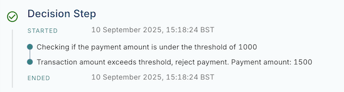

# Additional modules

The Flows API offers additional standard modules for common processes.

## Payload validation

Any processing specific validation should be performed in the Flow, flow writers can then decide how this should impact processing. Additionally `flows_api.payloads.validation` is provided which provides helpers to create bespoke payload validation. The provided library along with the `validate()` function validates against the ISO20022 specification rules of the relevant payload, message or data type.

## IBAN validation

The SDK supports International Bank Account Numbers (IBANs) validation to verify their length, country specific structure, and checksum.

## Logging

`log`s can be attached to an Instruction’s step history during processing by calling `log("Example message")` at any point within a step. These logs can be used to provide human-readable information about what has occurred within a Flow. They will appear in the display for steps, allowing payment operators or anyone viewing the payment to read and understand the processing of the Instruction.

Logs are particularly useful within conditional branches or steps where multiple different next steps could be taken, as they help to clarify why a payment may have taken a specific route through the Flow.

It is recommended to include no more than 5 logs per step with no more than 50 words per log. This ensures that only the most relevant information is displayed.

chat\_bubble

The SDK’s logging mechanism uses the Python `repr()` method by default to generate a string for logged objects. This means that when an object is logged, you will see its technical representation, typically including the class name (e.g., `<mandates.DatePeriod object>`).

The exact string may change and should not be relied on for any programmatic logic. In the future, support for pretty-printing may be added to selected types.

Below is an example of logs within a Flow:

In the code above, logs are stored within the `Instruction`'s history field. They are specifically nested within the `Step Event` record for each processed step. These messages will be displayed in the Vault Payments App under the step’s display name.

Below is an example of the Step History visible on the Vault Payments App.

chat\_bubble

Note: When running locally, the SDK outputs logs directly as INFO-level messages using Python’s standard logging module, instead of adding them to the step history.