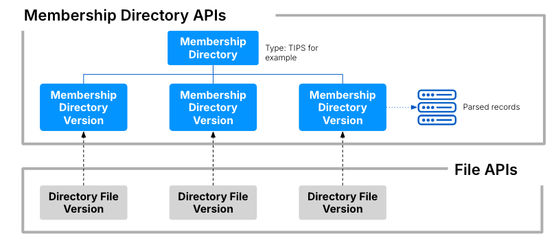

# Membership directories

The `Membership Directories API` provides a way to query payment scheme specific membership directories within the Vault Payments Platform, including within `Instruction Flows`. This provides a way to make scheme routability decisions based on each payment’s target destination. Additionally each directory contains information specific to its type.

Vault Payments supports the following directories:

-   TIPS
    
-   Fedwire
    
-   FedACH
    
-   BACS
    
-   FPS
    

An example directory type may be the one specified by [TIPS](https://www.ecb.europa.eu/paym/target/tips/html/index.en.html), which is a payment settlement system in the EU. Using this format, a payment processor submitting a payment towards TIPS should first check the target bank’s BIC against the records within the directory, to determine whether the payment is suitable to be submitted. This may be done in Vault Payments by interacting with the `Membership Directories API`.

`Membership Directories` are similar to other version based resources in Vault Payments, such as `Integrations`. A parent resource, which will be referenced by `Instruction Flow` logic, should be created first. Subsequently, when each versioned resource is created against the parent, the engine processing a membership directory query within a flow will ensure that directory records are resolved against the latest directory version.

## Uploading membership directories

To make use of a membership directory type (e.g. TIPS), a parent [Membership Directory](/vault-payments/latest/EN/api/payments_api#membershipdirectory) resource must first be created, referencing the desired file type.

An example call to create a `Membership Directory` with the TIPS type would be:

Once this parent resource is created, the Vault Payments `Membership Directory API` will be able to parse underlying [Membership Directory Version](/vault-payments/latest/EN/api/payments_api#membershipdirectoryversion) resources according to the business logic required by the file format.

Membership Directory files must first be uploaded via the [Files API](/vault-payments/latest/EN/api/payments_api#files) The returned `id` can then be used as the `file_id` when creating a `Membership Directory Version`,

Note that the `Membership Directory Version` will be returned with a `PENDING` status on the immediate creation response, however it should transition to the `READY` status shortly after. `Membership Directory Versions` may have one of the following statuses:

-   `PENDING` means Vault Payments is in the process of processing the referenced file into the new directory version.
    
-   `READY` means the `Membership Directory Version` is ready for use.
    
-   `ERRORED` means a persistent error has occurred during the file processing and a new `Membership Directory Version` must be created with a corrected file format. In this case the `Membership Directory Version` should have an `error` field exposed, detailing why the file parsing has failed. The previously active `Membership Directory Version` will continue to be used.
    

Since the provided sample file above is in the correct format, we would expect the associated `Membership Directory Version` to transition to `READY` status. There is an associated streaming topic that will also publish updates for these status transitions. From this point onward, the associated directory records under this version may be queried from instruction flows, or directly via the Payments API.

## Using membership directories

`Membership Directories` can be used within `Instruction Flows` and via API\`.

### Using with Instruction Flows

For more information on this, see [MembershipDirectoryStep](/vault-payments/latest/EN/using_vault_payments/instructions_and_flows/steps#membership_directory_step).

### Using via API

Once the `Membership Directory Version` is ready, you will be able to query its records using the [Search Membership Directory Records](/vault-payments/latest/EN/api/payments_api#membershipdirectoryrecord) endpoint.

For example, the following query uses a TIPS directory to check against 3 BICs of interest.

We would expect information to be returned only for the first requested BIC:

This is because the 2nd provided BIC has been filtered out during the file parsing stage, as the Vault Payments `Membership Directory Service` respects the business logic provided the TIPS format which state that records with a change type of `D` are marked as deleted. The 3rd provided BIC wouldn’t show up either, because it doesn’t exist as a record within the sample file at all. Note that the sample directory file contains two BICs, "ABCDEFGHXXX" and "FOOBARXXXXX", defined by the first 11 characters on each row, and also note that in the `Membership Directories API` level the notion of BIC has been translated to the more general field `member_id`, which will be compatible with other directory types, representing their distinct main identifier fields.

A typical `Membership Directory` check may involve simply checking that the target destination exists within the given directory records. Note that you may also get additional information based on the directory type from the record entry, for example when using TIPS you may make use of the "max\_ip\_amount" field to make further business decisions in relation to each instruction’s payment amount.

## Membership Directory types

Each Membership Directory type must be uploaded in the appropriate format.

### TIPS

Must be valid TIPS directory file format (XML).

chat\_bubble

TIPS file entries have an enforced length of 177 characters.

### FedACH

Must be valid Federal Reserve Board (FRB) EPayment Directory FedACH file format (JSON).

### Fedwire

Must be valid Federal Reserve Board (FRB) EPayment Directory Fedwire file format (JSON).

### BACS and FPS

Must be valid EISCD file format (XML). The same EISCD file can be reused for both BACS and FPS Membership Directories.