# Parameters

The `Parameters API` provides a way to configure the behaviour of `Instruction Flows` and `Rules` without making changes to the underlying Python code; for example, instead of hard coding the transaction limit within Instruction Flow code, you can use a Parameter to control this setting allowing for the value to be substituted for a different limit globally or for specific Payment Instruments even after the Flow or Rule has been created. Parameters are not tied to any specific Flow or Rule, they can be used by any (or non at all).

The `Parameters API` contains two resources:

-   `Parameter` - The name, type and constraints of a Parameter that can be used across `Instruction Flows` and `Rules`. Examples: Authorisation Limit, Banned Countries, Enable ATM Withdrawals.
    
-   `Parameter Value` - The value of a particular Parameter that is associated with a particular level/owner (Global or Payment Instrument). Multiple `Parameter Value`s with different owners can be associated with the same parent Parameter. Examples: Globally set banned countries "RUS,PRK'', User set transaction limit "50.00" set on a Payment Instrument.
    

When referenced from within Instruction Flows or Rules, any Parameter Value owned by a Payment Instrument will override a globally owned Parameter Value for the same Parameter. In the below example, a "scheme-transaction-limit" Parameter defines a decimal constraint, while a global ParameterValue has the value "100.00", the default for the Parameter. In addition, Payment Instruments A and B each owns a different ParameterValue for the same Parameter, these will override the global value when used with either of these Payment Instruments.



## [](#overview "Copy link to heading")Overview

`Parameters` resources define variables that can be referenced within `Instruction Flows` and `Rules` allowing for behaviour to be configured without making changes to the underlying code. Parameters can be used to allow values to be shared and kept consistent between multiple Instruction Flows and Rules as well provide a simple way to reconfigure product or user configuration via `Payment Instrument` values.

Examples:

-   Restricted Country Codes
    
-   Banned Merchant Category Codes
    
-   Authorisation Limit
    
-   Contactless Limit
    
-   Enable/Disable Behaviour Toggles
    

To make use of a `Parameter` create a `Parameter Value` with the Value for that particular Parameter for a particular level/owner. The Parameter resource defines its name and type, and enforces any constraints on its values while the ParameterValue resource defines the Value and its level/owner - Global or a specific Payment Instrument.

Below is an example of creating a Parameter for a scheme transaction limit:

### [](#parameter_types "Copy link to heading")Parameter types

`Parameter`s have a constraint which defines their type and their supported values.

   
| Parameter Constraint | Parameter Value | `flows_api` Python Type | Example Usage |
| --- | --- | --- | --- |
| 
Boolean

 | 

true/false

 | 

bool

 | 

Enable/Disable toggle

 |
| 

String

 | 

"GBP"

 | 

str

 | 

Currency Code

 |
| 

Decimal

 | 

"100.00"

 | 

decimal.decimal

 | 

Amount Limit

 |
| 

StringList

 | 

"USA,GBR"

 | 

list\[str\]

 | 

Country Codes

 |
| 

DateTime

 | 

"2024-03-26T00:00:00Z"

 | 

datetime.datetime

 | 

Cut off Date

 |
| 

JSON

 | 

```json
{
  "GBP": {
    "buy": "1.0",
    "mid": "1.5",
    "sell": "2.0"
  }
}
```


 | 

Union\[dict,list\]

 | 

FX Rates

 |

In addition to the type, constraints can include further restrictions to limit the allowed values such as the minimal value for a decimal or a length limit for a string. All ParameterValues created against a Parameter are validated against this constraint.

### [](#levels "Copy link to heading")Levels

Values are assigned to Parameters via a `Parameter Value` which can be applied at different levels.

  
| Parameter Value Level | API Field | Description |
| --- | --- | --- |
| 
Global

 | 

`"global": true`

 | 

Applies globally to all uses of the Parameter

 |
| 

Payment Instrument

 | 

`"payment_instrument_id": "…​"`

 | 

Applies when the Payment Instrument is used in processing. Overrides the Global Value.

 |

#### [](#global "Copy link to heading")Global

Global values are applied globally to all uses of the Parameter. Values of this level should be used to ensure consistency for all uses, for example to ensure that the scheme limits are the same between all Flows for a particular scheme.

To make use of a Parameter in an Instruction Flow or Rule it must have a Global value to ensure the resources can be evaluated correctly during processing.

#### [](#payment_instrument "Copy link to heading")Payment Instrument

Payment Instrument values are applied whenever a specific Payment Instrument has been matched, this can be done using the [Match Payment Instrument Step](/vault-payments/latest/EN/using_vault_payments/instructions_and_flows/steps#match_payment_instrument_step). They are visible to the Flow and all Rules associated with that Payment Instrument. They will override the equivalent Global value. Values of this level should be used for product behaviours (such as a premium card offering) or customer customisation (such as a limit settable via a customer app).

## [](#setting_parameter_values "Copy link to heading")Setting Parameter Values

To set a Value for a Parameter, create a `Parameter Value` via `POST /api/v1/parameter-values`. Global and Payment Instrument level values are created via the same endpoint.

### [](#global_values "Copy link to heading")Global values

Below is an example of setting a Value for a Parameter "scheme-transaction-limit" at the Global level:

The created resource will then be returned:

### [](#payment_instrument_values "Copy link to heading")Payment Instrument values

Below is an example of setting a Value for a Parameter "scheme-transaction-limit" at the Payment Instrument level, the specified Payment Instrument must exist:

The created resource will then be returned:

### [](#changing_parameter_values "Copy link to heading")Changing Parameter Values

You can change a Value by creating a new `Parameter Value` against the same Parameter and same level or owner. This new `Parameter Value` will then become the effective value and all processing will make use of this new value.

### [](#unsetting_payment_instrument_parameter_values "Copy link to heading")Unsetting Payment Instrument Parameter Values

If you have a currently effective `Parameter Value` owned by a Payment Instrument, you have the option to unset it so that future processing for that Payment Instrument uses the global Value instead. This can be done by updating its `effective_to_timestamp` to now.

The updated resource will be returned:

The `Parameter Value` now has an `effective_to_timestamp` that’s set to the current time, instead of `null`. From now on, any Instruction Flow or Rule that matches to this `Parameter Value`'s Payment Instrument will no longer override the currently effective global Value.

### [](#timeseries "Copy link to heading")Timeseries

`Parameter Values` represent a timeseries with each resource being the effective value for a Parameter and a level/owner at a particular point in time. The effective value at any point in time is given by the `effective_from_timestamp` and `effective_to_timestamp` fields of the resource.

The diagram below demonstrates a simple timeseries of values. A Global `Parameter Value` (A) is created and becomes effective. The Value is changed by creating another Global `Parameter Value` (B). When the new value (B) is created it immediately becomes effective (C). The original `Parameter Value`'s (A) `effective_to_timestamp` is updated to reflect it is no longer active.



### [](#viewing_parameter_values "Copy link to heading")Viewing Parameter Values

Parameter Values can be viewed via `GET /api/v1/parameter-values` using a variety of filters.

The `effective_timestamp_range` filters can be used to include only Parameter Values for a particular time range. These can be used to select the current Values by setting the filters to the current time.

-   To view the history of a particular Parameter we can filter by the parameter and its owner. `/api/v1/parameter-values?parameter_ids=scheme-transaction-limit&global=true&page_size=100`
    
-   To view all the currently effective `Parameter Value`s associated with an owner we can filter by the owner and the current time. `/api/v1/parameter-values?payment_instrument_ids=04c31562-c290-4548-8a16-ebbd16c23cce&effective_timestamp_range.from=<current-timestamp>&effective_timestamp_range.to=<current-timestamp>&page_size=100`
    

## [](#using_parameters "Copy link to heading")Using Parameters

`Parameters` can be used within `Instruction Flows` and `Rules`. The `Parameter Values` used during processing will include all relevant Global values and any Payment Instrument values after the Payment Instrument has been matched.

To use a Parameter within an Instruction Flow Version or Rule Version:

-   The Parameter must exist
    
-   The Constraint type must match
    
-   A Global ParameterValue must exist
    

These are validated when Instruction Flow Versions or Rule Versions are created.

### [](#expected_parameters "Copy link to heading")Expected Parameters

To make use of Parameters they must be included as Expected Parameters. This defines which Parameters will be available during the execution. Only Parameters included as an `ExpectedParameter` will be available.

An Expected Parameter definition includes:

-   Parameter `id`
    
-   A `constraint`
    
    -   The type is required however the specific constraint is optional
        
    -   If the specific constraint is included it must exactly match the constraint defined in the Parameter
        
    
-   An optional `description` of how the Parameter is used in the context of this Instruction Flow or Rule
    

When Instruction Flow Version and Rule Versions are created the Expected Parameters are extracted from the code and populated on the resource:

### [](#using_with_instruction_flows "Copy link to heading")Using with Instruction Flows

To use a Parameter in an Instruction Flow the Parameter needs to be specified as an `ExpectedParameter` in the `FlowVersion` constructor. Only Parameters included in this list will be available during processing and can be used throughout the Instruction Flow Version code.

Parameters can be accessed on step functions via the 3rd `params` argument. The `params` is a dictionary where the key is the Parameter ID and the value is the Parameter’s Value.

### [](#using_with_rules "Copy link to heading")Using with Rules

Parameters can be used in both Basic and Account Link selection [Rules](/vault-payments/latest/EN/using_vault_payments/rules). To use a Parameter in a Rule the Parameter needs to be specified as an `ExpectedParameter` and assigned to the `expected_parameters` variable. Only Parameters included in this list will be available during processing and can be used inside the Rule function.

Parameters can be accessed on the `rule` or `account_link_selection` functions via the 3rd argument `params`. The `params` is a dictionary where the key is the Parameter ID and the value is the Parameter’s Value.