# Routing

The `Routing API` refers to the Vault Payment capabilities that dynamically link Payments to Core Accounts.

The `Routing API` contains two resources:

-   `PaymentInstrument` - Vault Payments representation of any external identifier that can be used to send or receive payments. Examples: BBAN, IBAN, tokenised PAN for a card, email address.
    
-   `AccountLink` - A link to the account within a core banking system containing the information required for Vault Payments to direct an Instruction.
    

## Payment Instruments

A Payment Instrument represents any instrument that can receive and initiate instructions such as the tokenised PAN for a card, or sort code and account number. A Payment Instrument dictates where to route Instructions and Payments received from or sent to a scheme.

Below is an example of a Payment Instrument:

### Routing information

A Payment Instrument represents external identification in the `routing_information` field:

-   `bank_identifier`: Contains the value used to identify the institution to which the instrument belongs; for example a BIC, BIN, or UK Sort Code.
    
-   `instrument_identifier`: Contains the value used to identify the individual instrument within the institution; for example an Account Number, IBAN, Tokenised PAN or email address.
    

When an Instruction is processed in Vault Payments, values in the Instruction can be used to match to a Payment Instrument with corresponding routing information. When a matching Payment Instrument has been found, this Payment Instrument is used when processing the Instruction.

These values can be anything, as long as they match the corresponding fields on the `instruction` that is being processed.

Additionally, there are optional type fields which can be used to help identify the format of the identifiers:

-   `bank_identifier_type` (Optional): The scheme used to identify the financial institution (e.g. BIC, SORT\_CODE, ROUTING\_NUMBER).
    
-   `instrument_identifier_type` (Optional): The category of the account identifier (e.g. IBAN, CARD\_ID, ACCOUNT\_NUMBER).
    

chat\_bubble

Routing Information must be unique for an Active Payment Instrument, this is to ensure instructions can only be matched and processed by a single Payment Instrument. Routing Information can be reused if all other uses are inactive which can be achieved by updating the status of the relevant Payment Instrument.

### Parameter Values

[`ParameterValues`](/vault-payments/latest/EN/using_vault_payments/parameters) can be created for Payment Instruments.

Payment Instrument level Values for Expected Parameters will be accessible during Flow processing, overriding Global values.

To make use of Payment Instrument level Parameters Values the Payment Instrument must first be matched during processing. This can be done using the [Match Payment Instrument Step](/vault-payments/latest/EN/using_vault_payments/instructions_and_flows/steps#match_payment_instrument_step).

### Default Account Links

Payment Instruments can specify a default Account Link using the `default_account_link_id` field. This can be used to either:

-   A simple one-to-one mapping of `Payment Instrument` to `Account Link`. Each Payment Instrument is associated with a single Account.
    
-   A fallback `Account Link` which maybe used if other Account Links are not suitable.
    

error

We strongly advise that every `Payment Instrument` has a default `Account Link` specified.

### Multiple Account Links

Payment Instruments can be associated with multiple Account Links through the `account_links` field.

This can be used to either:

-   Dynamically select an Account Link based on the instruction. For example based on Currency.
    
-   Use multiple Account Links within the same flow. For example to split the amount across multiple Accounts.
    

### Rule based configuration

[`Rules and RuleSets`](/vault-payments/latest/EN/using_vault_payments/rules) can be applied to a Payment Instrument.

All applied Rules and RuleSets will be evaluated during the [Rules Step](/vault-payments/latest/EN/using_vault_payments/instructions_and_flows/steps#rules_step) during Flow processing. Restrictions set by Rules are accessible for use in flows in the `target_account.restrictions` field of the Instruction.

Payment Instrument level Values for Expected Parameters will be accessible during Rule evaluation, overriding Global values.

## Account Links

An Account Link contains the information required for Vault Payments to direct an Instruction to a core banking system account. An Account Link can be referenced by one or more Payment Instruments.

Below is an example of an Account Link:

To identify the core banking system account the Account Link uses the following fields:

-   `core_id`: The ID of the [Core](/vault-payments/latest/EN/using_vault_payments/cores) resource for the core banking system that postings will be routed to for a particular Instruction.
    
-   `core_account_id`: The identifier that the core banking system uses for the account where funds are to be posted.
    

The combination of these fields can be used to inform Vault Payments which core banking system to send postings to, and which account within the core banking system to target for these postings.

chat\_bubble

For the purpose of the Sandbox, the ID references the Vault Core system; use the `core_id` and `core_account_id` provided in your *Vault Payments Sandbox Onboarding Handbook*.

chat\_bubble

The Account Link resource should only be used to model customer accounts; therefore internal core bank accounts (such as unapplied accounts or wash accounts) should not be modelled as Account Links.

## Routing in Instruction Flows

To make use of Routing in Flows the Payment Instrument must first be matched during processing. This can be done using the [Match Payment Instrument Step](/vault-payments/latest/EN/using_vault_payments/instructions_and_flows/steps#match_payment_instrument_step).

A `MatchPaymentInstrumentQuery` can be constructed as part of the step using any field in the instruction to construct the query. This will then match to a Payment Instrument with the provided `instrument_identifier` and `bank_identifier` routing information. Alternatively if the ID is already known the `payment_instrument_id` can be provided to the query directly. Only Active Payment Instruments will be matched.

To make use of Account Links the [Account Link Step](/vault-payments/latest/EN/using_vault_payments/instructions_and_flows/steps#account_link_step) can be used to retrieve the associated Account Links and use them in the Flow.

### Target account

Information related to matched routing resource can be found in the `target_account` field of an Instruction.

The `target_account.payment_instrument_id` field will be populated if a Payment Instrument has been matched.

Account Link fields (`account_link_id`, `core_id`, `core_account_id` and `account_links`) should be populated during the Account Link step, these can then be used in later steps such as VaultCorePostingsStep.

Target Account

### Example flow code