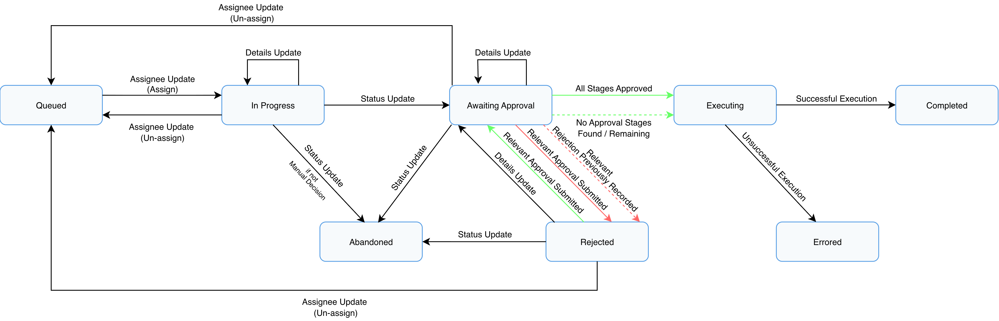
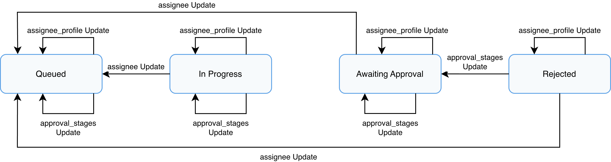

# Tasks

Vault Payments provides support for tracking actions which have been made or need to be made manually. This is provided via Tasks, which track the lifecycle of manual actions. For example, Vault Payments can be set up such that a Task is raised on the processing of an `Instruction` that requires a Manual Decision, raising awareness to users that a manual action needs to be made.

In addition to tracking actions, Tasks can be set up to use approval stages so that actions will only be executed following the approval of one or more other users. For example, a user may choose an option in a Manual Decision without fully knowing the consequences. The Task can be set up to require approvals from users with roles specific to the payment scheme related to the `Instruction`, ensuring that changes are reviewed before being committed.

Please contact Thought Machine to opt-in to and configure Tasks.

## Overview

Tasks are represented by the `Task` resource. `Task` resources can only be created by the system. The system will create a `Task` when a manual action is required. The types of `Task` that will be created are:

-   `TASK_TYPE_MANUAL_DECISION_SUBMISSION` which indicates that an `Instruction` has been processed with a `ManualDecisionStep`, and is waiting for a user to input a decision before it can continue processing.
    

When the system creates a `Task`, a user needs to assign themselves to be the `assignee` of the `Task` and propose an action, as per the type of `Task`.

## Lifecycle

Tasks have an associated lifecycle which determines when certain operations, and by which users, can be performed. This is reflected in the `Task` resource’s `status`:

 
| Task Status | Description |
| --- | --- |
| 
`QUEUED`

 | 

The Task is unassigned and waiting for an owner to claim it.

 |
| 

`IN_PROGRESS`

 | 

The Task is assigned and being prepared. Changes are still provisional.

 |
| 

`AWAITING_APPROVAL`

 | 

The Task is ready for review and requires validation before executed.

 |
| 

`REJECTED`

 | 

A reviewer has requested changes. The Task is sent back to the assignee for correction.

 |
| 

`EXECUTING`

 | 

The Task is being executed by the system.

 |
| 

`COMPLETED`

 | 

The Task executed successfully. No further action is required.

 |
| 

`ERRORED`

 | 

The Task failed during execution.

 |
| 

`DEADLINE_EXCEEDED`

 | 

The Task reached its expiration date before it could be executed.

 |
| 

`ABANDONED`

 | 

The Task was manually cancelled because it is no longer needed. (This is not available for all Task Types)

 |

To ensure accountability, all changes to a `Task`, whether it be from users or by the system, are recorded in the `activity_log`.

These are the possible `status` journeys for a `Task`:

## Assignee

The assignee is the user who is primarily responsible for a `Task`, ensuring it proposes a sensible action, and monitoring it once it is executed. When a user creates a `Task` they will be the assignee, but they can choose to unassign themselves and let another user become the assignee, hence the assignee is not necessarily the user who created the `Task` nor the user who proposed the action.

When a `Task` has no assignee, and it has not yet expired, a user can set themselves as the assignee by updating the `assignee` of the `Task`. Once they become the assignee, they have almost exclusive access to updating the `Task` as they are now responsible for it.

chat\_bubble

Users with access to the ManageTask endpoint can update select fields of a `Task`, even if they are not the assignee.

An assignee can update the following fields:

 
| Update Type | Description |
| --- | --- |
| 
`summary`

 | 

Used to describe the reasoning for their proposed action.

 |
| 

`assignee`

 | 

Used to unassign themselves.

 |
| 

`status`

 | 

Used to set a Task to `AWAITING_APPROVAL` if it is ready to be reviewed, or `ABANDONED` if it is no longer required.

 |
| 

`details`

 | 

Used to set or change the proposed action. This will reset all the reviews.

 |

chat\_bubble

When a `Task’s` `status` is updated to `AWAITING_APPROVAL`, a system transition may occur automatically. For example, the `Task` will be set to `REJECTED` if a prior relevant `review` was recorded as rejected, or to `EXECUTING` if no `approval_stages` are configured.

### Assignee profile

A `Task` can specify an assignee profile to suggest what kind of user would be best suited to assign themselves to the `Task`. Since these roles act as a suggestion, a user who does not match the profile can still assign themselves to the Task. It is also possible for a `Task` to specify an empty `assignee_profile`, meaning that there is no ideal user.

Suppose a `Task` has the following assignee profile, held in the `assignee_profile`:

The `assignee_profile` holds `roles`, which specifies the roles which an ideal assignee possesses. In this example, it suggests that a user with either the `finance` and/or `accounting` roles will have the best knowledge with which to ensure the `Task` proposes a sensible action.

The `Vault Payments App` makes use of the `assignee_profile` to show Tasks to those best placed to assign themselves to it. See: the [To do](/vault-payments/latest/EN/app/using_the_app#to_do) section in the "Using the app" page, for more information.

## Reviewer

A reviewer is a user who passes judgement on a `Task` by reviewing it. A user can submit a review with one of the following outcomes:

 
| Review Type | Description |
| --- | --- |
| 
`APPROVED`

 | 

The reviewer approves the Task.

 |
| 

`REJECTED`

 | 

The reviewer rejects the Task, suggesting either changes need to be made, or the Task is not needed at all.

 |
| 

`CLAIMED`

 | 

The reviewer has claimed the Task to review later.

 |
| 

`UNCLAIMED`

 | 

The reviewer no longer intends to review the Task later.

 |

Any user can review a `Task`, but their review only has an impact on the `Task` lifecycle if the user possesses a role which is part of the current stage in the approval stages. When the assignee of a `Task` updates the `details`, all the reviews are reset to `CLAIMED` and the current stage is returned to the first stage, ensuring that reviewers can pass judgement on the latest value. Reviewers who no longer want to review the `Task` can submit a review with an `UNCLAIMED` outcome if they no longer have the capacity to review it.

### Approval stages

approval\_stages specify which approvals affect the `Task`. A `Task` can have multiple stages, each stage can have multiple criteria, and each criterion can have multiple roles.

error

A user can only review a `Task` in single approval stage, therefore it is not recommended to overlap roles between stages to avoid situations where there are insufficient users with the necessary roles to approve a `Task`. In a pinch, ManageTask can be used to update the `approval_stages` and overcome this.

As an example, suppose a `Task` has the following approval stages, held in the `approval_stages`:

For the Task to be executed, it must meet the requirements of all three of these stages. As the criteria of earlier stages need to be met before the criteria of later stages are considered, stages provide the ability to sequentialise the approval process. This scenario goes through a successful approval process with the above approval stages.

**stage\_one**

1.  The Task moves to `AWAITING_APPROVAL`, entering the first stage of approval stages, **stage\_one**. This stage contains a single criterion, **stage\_one\_criterion\_one**.
    
2.  **Stage\_one\_criterion\_one** has a requirement of two user approvals with a role of `operations`.
    
3.  Once the requirement is met, the Task will proceed to the second stage, **stage\_two**.
    

chat\_bubble

Any approvals received beyond the specific count defined for a criterion will have no effect on the Task lifecycle. Once the required number of reviews is met, the criterion is satisfied.

In addition, any user without a relevant role assigned to a criterion can still technically "approve" a Task, but their action will have no effect on the Task’s progression or lifecycle.

**stage\_two**

1.  This stage contains two criteria:
    
    -   **stage\_two\_criterion\_one**
        
        -   Requires one user approval with a role of `analyst`.
            
        
    -   **stage\_two\_criterion\_two**
        
        -   Requires one user approval with a role of `manager`.
            
        
    
2.  Once the requirement is met, the Task will proceed to the third stage, **stage\_three**.
    

chat\_bubble

The approval process for stages with multiple criteria is parallelised. This means the order of approvals does not matter, as long as all criteria are met.

If you require distinct individuals to approve for different roles, those criteria must be placed in separate Stages. A user is restricted from approving the same Task in multiple stages.

**stage\_three**

1.  This stage contains a single criterion, but with multiple roles:
    
    -   **stage\_three\_criterion\_one**
        
        -   Requires one user approval with a role of `finance` or `accounting`.
            
        
    
2.  Once the requirement is met, the Task has met the requirements of all three stages, proceeding to execution.
    

chat\_bubble

By specifying multiple roles, the criterion is met if a user with any of these roles approves. This provides further flexibility in cases where there may be many different roles but with similar functions, where users with any one of these roles are suitable.

The Vault Payments App compares the roles in the current stage of a Task against the roles of users who have already reviewed the Task, and the roles of users who have not, to show the Task in the **To do** tab of those best suited to review them. See: the [To do](/vault-payments/latest/EN/app/using_the_app#to_do) section in the "Using the app" page, for more information.

For example:

-   When the Task is in **stage\_one**, then the Task will be shown to users with the `operations` role.
    
-   When the Task proceeds to **stage\_two**, then the Task will be shown to users with the `analyst` or `manager` roles, and will not be shown to users with the `operations` role (unless they have the relevant roles).
    
-   Additionally with **stage\_two**, when an `analyst` user approves the Task, but a `manager` is still required, then the Task is only shown to users with the `manager` role.
    

## ManageTask

Occasionally, a `Task` may have inappropriate values for fields which cannot be updated using the regular UpdateTask endpoint. In these cases, the ManageTask endpoint may be used, but care should be taken to ensure such changes are actually necessary.

This endpoint has the ability to update the following fields:

-   `assignee`
    
-   `assignee_profile`
    
-   `approval_stages`
    

These are the possible journeys for the `ManageTask` Endpoint:

**Assignee**

The `assignee` can be updated to unassign a user from a `Task`, without having to be that user.

An example use case is when an assigned user goes on leave and so is unable to unassign themselves from a time-sensitive `Task`. By unassigning that user, then another user can assign themselves to the `Task` and ensure it is completed.

**Assignee Profile**

The `assignee_profile` can be updated to change for whom a `Task` will appear in the **To do** tab of the `Vault Payments App`. See: the [To do](/vault-payments/latest/EN/app/using_the_app#to_do) section in the "Using the app" page, for more information.

An example use case is to make it easier for a different set of users to find the `Task` by adding their roles, causingthe `Task` to be displayed on their **To do** tab.

**Approval Stages**

The `approval_stages` can be updated to change whose approval matters when reviewing a `Task`.

An example use case is when a `Task` cannot be reviewed as the `roles` specified to review it do not have enough knowledge to verify it. The `approval_stages` can be updated to change the stages so that they specify the desired `roles`, and in the desired stage structure. To prevent misuse and ensure accountability, it is not possible to update a `Task` to have empty `approval_stages`. Furthermore, updates to `approval_stages` will remove all reviews, resetting the current stage to the first stage in the new `approval_stages`.

chat\_bubble

The `ManageTasks` endpoint processes updates in the following order: `assignee_profile`, `approval_stages`, and `assignee`. If a system status transition occurs, the final Task status is determined by the last field being updated.

info

The `ManageTasks` endpoint is not covered under the payments.tasks:write scope, but has its own scope payments.tasks:manage. Thought Machine recommends that only trusted users be given access to this endpoint to prevent undesirable changes.