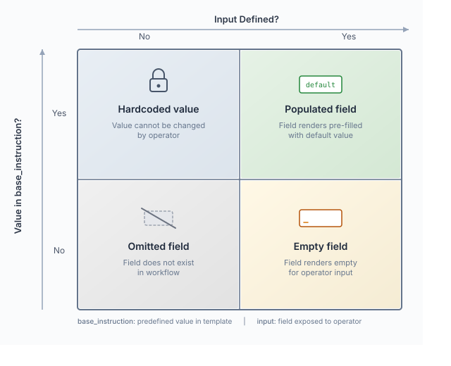
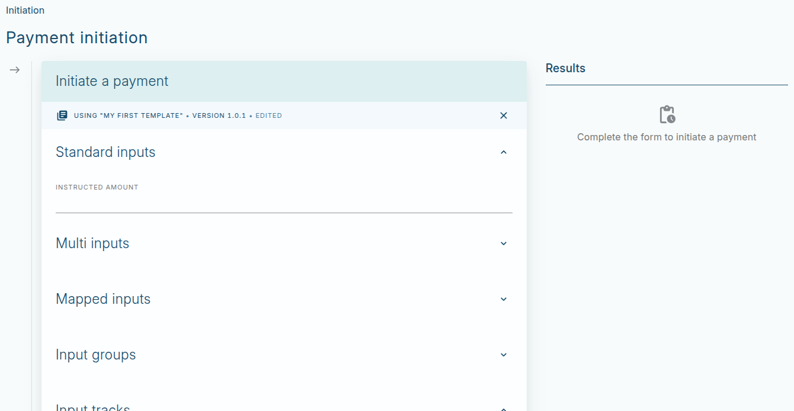
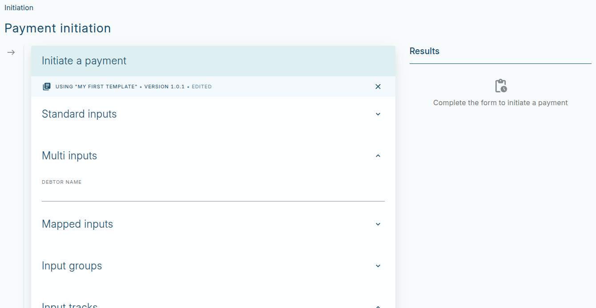
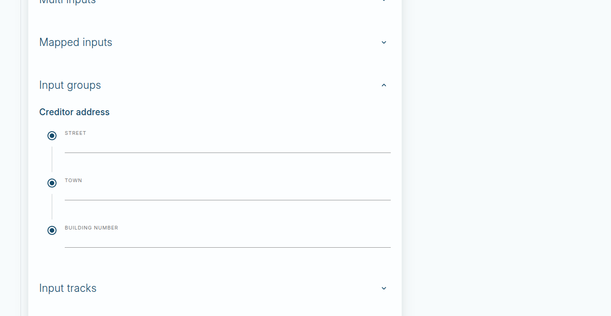
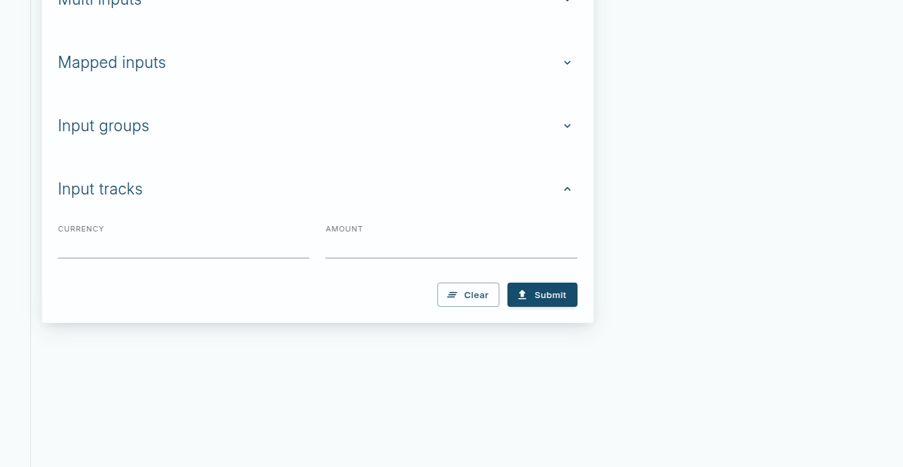
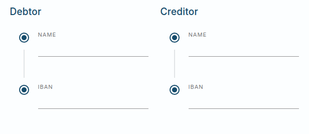
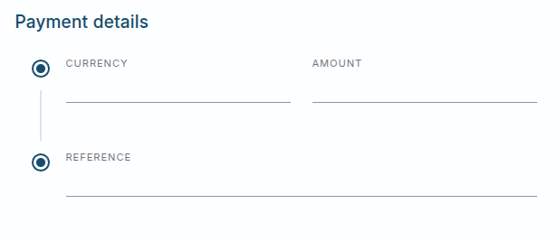

# Templates

`Templates` are client-facing configuration resources that enable manual payment initiation within the Vault Payments App. They provide a human-friendly interface for bank operators to submit ISO 20022 payment instructions without requiring direct API interaction or technical expertise.

The `Templates API` contains two resources:

-   `Template` - The parent resource representing a template with metadata, status, and lifecycle management
    
-   `TemplateVersion` - Immutable versions of a template containing the actual configuration: variables, base instruction structure, and input definitions
    

Templates transform complex API payloads into guided forms, allowing bank operators to initiate payments by filling in only the relevant fields while the system handles technical compliance and validation.

For information on using Templates in the Vault Payments App, see: [Payment Initiation documentation](/vault-payments/latest/EN/app/using_the_app#initiating_payments).

For API reference details, see: [Templates API](/vault-payments/latest/EN/api/payments_api#templates).

## Overview

### What is manual payment initiation?

Manual Payment Initiation is a common task for bank operators: the act of creating and sending a payment instruction to be processed by the bank’s payments infrastructure. In the context of Vault Payments, it refers specifically to submitting an ISO 20022 message to the Vault Payments Engine for processing.

Instead of requiring operators to work directly with complex API payloads, Vault Payments uses Templates: predefined configuration resources that absorb complexity by:

-   Providing pre-configured values for common fields
    
-   Surfacing only the fields relevant for the operator to fill or override
    
-   Enforcing validation rules to ensure submitted data is API-compliant
    

### Manual payment initiation via Templates

A typical workflow looks like this:

1.  The operator selects a Manual Payment Initiation Template in the Vault Payments App
    
2.  A form is displayed - some fields are pre-filled, others are empty
    
3.  The operator provides any context-specific values and overrides surfaced fields if necessary
    
4.  Once ready, the operator submits the form
    
5.  The form data is validated according to the Template’s rules
    
6.  If validation passes, the Vault Payments App calls the [`/v1/instructions:initiate`](/vault-payments/latest/EN/api/payments_api#_payments_v1_instructions_InitiateInstructionResponse_InitiateInstruction) API endpoint
    
7.  The instruction is processed asynchronously by Vault Payments
    

This approach ensures operators can focus on their operational processes while the system handles the technical details of creating and sending ISO 20022-compliant instructions.

## Template structure

Templates use a two-resource model: a mutable `Template` parent containing metadata, and immutable `TemplateVersion` children containing the actual configuration. For resource details, see the [Templates API](/vault-payments/latest/EN/api/payments_api#Templates).

### Anatomy of a manual payment initiation Template

A Manual Payment Initiation `TemplateVersion` contains three main sections:

#### Variables

User-defined static primitive values. These can reference built-in variables. The key difference is that built-ins are dynamic (e.g. `{{$randomUUID}}` resolves differently on each evaluation), while user-defined variables are static for the lifetime of that template execution.

chat\_bubble

To get multiple different random UUIDs, inline `{{$randomUUID}}` each time. To reuse the same value in multiple places, store it in a user variable or use `{{$fixedUUID(…​)}}`.

User variables can also store results from built-ins like `{{$currentDateTime}}` or `{{$randomChars(…​)}}`.

See [Variables and Built-ins](/vault-payments/latest/EN/using_vault_payments/templates#variables_and_built_ins) for detailed information.

#### Base Instruction

The ISO 20022-shaped structure that inputs bind to. This determines what is pre-populated vs empty in the operator’s form.

The `base_instruction` contains the complete structure of the instruction to be submitted, with values that can be:

-   **Hardcoded** - Fixed values that cannot be changed by the operator
    
-   **Pre-filled** - Default values that can be overridden via inputs
    
-   **Omitted** - Fields not included in the structure
    

#### Inputs

Field definitions binding user-entered values to specific leaf nodes in the base instruction. Inputs are organised into fieldsets for better UI presentation.

Each fieldset contains:

-   `id` - Unique identifier for the fieldset
    
-   `display_name` - Human-readable name shown in the UI
    
-   `description` - Optional description providing context
    
-   `inputs` - Array of input definitions
    

Inputs can be of type `Standard`, `Multi`, `Group`, or `Track`, each with different characteristics and use cases.

See [Input Types](/vault-payments/latest/EN/using_vault_payments/templates#input_types) for detailed information on each type.

### Configuration layer utility

Templates can be cumbersome to author manually. The [Configuration Layer Utility](/vault-core/latest/EN/environment_and_installation/infrastructure_docs/configuration_layer_utility_user_guide/) (CLU) allows authors to import pre-built templates.

Pre-built templates can:

-   Cover common payment journeys (e.g. Direct Debits, specific Credit Transfers)
    
-   Include pre-populated values to meet known scheme or business requirements
    
-   Model frequent operational flows such as repairs, reversals, and recalls
    

Templates can be packaged into config packs so they can be set up once and reused across environments.

For guidance on creating and managing templates, see: [Creating Templates tutorial](/vault-payments/latest/EN/introduction_to_vault_payments/tutorials/creating_templates).

## Authoring templates

### Authoring by example

When authoring Manual Payment Initiation Templates, start from the instruction outward. Consider the type of instruction - for example, a `customer_credit_transfer_initiation` - and shape the `base_instruction` to mirror the ISO 20022 message you intend to submit.

Each input then binds to that structure by referencing a leaf node with a dot path. Arrays are always indexed with dot syntax, for example:

chat\_bubble

Array indexing always uses dot notation (e.g., `.0`, `.1`); square brackets are not supported. Each path must resolve to a leaf node of the correct type declared in the input definition. Multi-input paths must all be of the same type, and groups inherit their parent path as a prefix. These rules are critical: misuse of indexing, mismatched types, or paths pointing to non-leaf nodes will cause template validation to fail.

### Four-quadrant mental model

Two axes describe the relationship between inputs and the `base_instruction`:

1.  Whether the `base_instruction` location is populated or absent
    
2.  Whether an input points to that location or not
    

From this you get four clear outcomes:

-   **Empty field** - Input points to an absent location; the field renders empty
    
-   **Populated field** - Input points to a populated location; the field renders pre-filled
    
-   **Hardcoded value** - Location populated but no input exists; value cannot be changed by the operator
    
-   **Omitted field** - Location absent and no input exists; field does not exist in the workflow
    

### Input types

#### Standard input

A `Standard` input maps a single field to a single leaf node in the base instruction. Adding options triggers a dropdown in the Vault Payments App. Decimal precision is enforced: if set to 2, values with 3 decimal places are invalid.

#### Multi input

`Multi` inputs are like `Standard` inputs but bind one operator-entered value to multiple leaf paths. All paths must resolve to the same type.

#### Input group

`Group` inputs set a common `path` and allow child inputs to use relative paths. The group maps to a single object. Groups can be nested within Tracks or other Groups - see [\[Composing Input Types\]](<#Composing Input Types>).

#### Input track

`Track` inputs group other inputs horizontally for a more compact layout. Use tracks for related fields that operators think about together, such as currency and amount pairs. Tracks can contain Groups for more complex compositions - see [\[Composing Input Types\]](<#Composing Input Types>).

### Composing input types

Track and Group are organisational types - they contain other inputs rather than binding directly to leaf nodes. These can be combined to create sophisticated form layouts:

-   A `Track` can contain any input type
    
-   A `Group` can contain any input type, including nested Groups and Tracks
    

#### Track containing groups

When related structures share similar fields, wrap Groups in a Track for horizontal layout. This is ideal for debtor/creditor pairs or any side-by-side comparison:

#### Group containing track

Groups can contain Tracks for compact sub-layouts within a logical grouping:

### Input data types

The `type` field in an input definition specifies what kind of data the input accepts. An input can have a single constraint which defines what values are valid for the input. There are several types of constraints and the `type` of the input will determine which are allowed.

#### Constraints

##### String

Constraints for single string values.

-   `min_length`: the minimum length the value can be.
    
-   `max_length`: the maximum length the value can be.
    
-   `pattern`: a regex pattern the value must match.
    

##### Decimal

Constraints for numeric values.

-   `min_value`: the minimum allowed value.
    
-   `max_value`: the maximum allowed value.
    
-   `precision`: the permitted number of decimal places that the number can have.
    

##### Date time

Constraints for dates.

-   `earliest`: the earliest permitted date-time in UTC, up to YYYY-MM-DD HH:mm can be specified. Formatted as an RFC3339 timestamp.
    
-   `latest`: the latest permitted date-time in UTC, up to YYYY-MM-DD HH:mm can be specified. Formatted as an RFC3339 timestamp.
    

##### Enumeration

Constraints for a fixed set of potential values.

-   `permitted_values`: values must specify one of the strings listed here, of which there must be at least one, and no value may be repeated.
    
-   `min_length`: the minimum number of values which can be chosen. Must be non-negative
    
-   `max_length`: the maximum number of values which can be chosen. Must be non-negative. Defaults to 1.
    

##### Reason code

Constraints for a fixed set of reason codes. You specify a reason code set and the input will be limited to reason codes from that set. You can find a [list of reason codes here](/vault-payments/latest/EN/using_vault_payments/manual_decisions#reason_code_sets).

-   `reason_code_set`: the reason code set to which the value belongs
    
-   `scheme_id`: the scheme to which the instruction belongs. An empty string indicates the value is constrained to the full reason code set.
    

#### String

`INPUT_TYPE_STRING` is used for free-text string values. String and enum constraints are available.

#### Decimal

`INPUT_TYPE_DECIMAL` is used for numeric values. Decimal constraints are available.

#### Boolean

`INPUT_TYPE_BOOLEAN` is used for true/false values.

#### Date

`INPUT_TYPE_DATE` is used for date values in ISO 8601 format (YYYY-MM-DD). The date-time constraint is available.

#### Date time

`INPUT_TYPE_DATE_TIME` is used for date-time values in ISO 8601 format. The date-time constraint is available.

#### Reason code

`INPUT_TYPE_REASON_CODE` is used for reason codes for payment operations (e.g., cancellation reasons). The reason code constraint is available.

### Authoring rules

When authoring templates, follow these rules to ensure validation passes:

-   **Path syntax** - Always use dot-indexing for arrays; avoid square brackets
    
-   **Input field configuration** - Paths must resolve to a terminal field in the schema and match the declared type
    
-   **Type consistency** - For multi-inputs, all paths must point to the same type
    
-   **Group path inheritance** - Children inherit the group’s `path`. Use `"."` for logical grouping without structural change
    
-   **Precision enforcement** - Decimal precision strictly limits allowed decimal places
    
-   **Constraint awareness** - Constraints like `min_length: 1` make a field required
    
-   **Validate before persisting** - Always call `POST /v1/app/template-versions:validate` to catch errors early
    
-   **Min/max entry behaviour** - Understand that `min_entries` will cause empty instances to render if fewer are present
    
-   **Reserved identifiers** - Never use built-in names for custom variables
    

### Best practices

When creating templates for production use:

-   Prefer semantic versioning per `Template`; the system rejects duplicates
    
-   Use `fields_to_include=[INCLUDE_FIELD_ACTIVE_VERSION]` when fetching a `Template` to render the current version in UIs
    
-   Employ input constraints to guide bank operators towards valid inputs
    
-   For manual operator UX, group inputs into clear fieldsets; use `Track` for horizontal compaction
    

For a step-by-step guide on creating templates, see: [Creating Templates tutorial](/vault-payments/latest/EN/introduction_to_vault_payments/tutorials/creating_templates).

## Variables and built-ins

### Overview

`manual_payment_initiation.variables` is a map of reusable values that can be referenced throughout the `base_instruction` using double curly brace syntax. Variables provide two key benefits:

-   **Code reuse** - Define a value once and reference it multiple times
    
-   **Dynamic values** - Use built-in functions to generate timestamps, UUIDs, and random strings
    

### Variable syntax

Variables are referenced in the `base_instruction` using `{{$…​}}` syntax. Whitespace is ignored inside expressions except where it would break the identifier.

### User-defined variables vs built-ins

-   **User-defined variables** - Static values that remain constant for the lifetime of template execution. Can contain strings, numbers, or references to built-ins
    
-   **Built-in variables** - Dynamic values that are evaluated each time they are referenced, providing different results on each evaluation
    

chat\_bubble

To get multiple different random UUIDs, inline `{{$randomUUID}}` each time. To reuse the same value in multiple places, store it in a user variable or use `{{$fixedUUID(…​)}}`.

### Built-in variables

#### Current date

`{{$currentDate}}` - Returns the current date in ISO 8601 format (YYYY-MM-DD).

Supports date arithmetic with the following syntax:

-   `{{$currentDate + 1d}}` - Add 1 day
    
-   `{{$currentDate - 4H2m}}` - Subtract 4 hours and 2 minutes
    
-   `{{$currentDate + 3M}}` - Add 3 months
    
-   `{{$currentDate - 1y}}` - Subtract 1 year
    

#### Current datetime

`{{$currentDatetime}}` - Returns the current date and time in ISO 8601 format with second precision by default.

Optional precision modifiers:

-   `{{$currentDatetime(seconds)}}` - Second precision (default when no modifier specified)
    
-   `{{$currentDatetime(millis)}}` - Millisecond precision
    
-   `{{$currentDatetime(micros)}}` - Microsecond precision
    
-   `{{$currentDatetime(nanos)}}` - Nanosecond precision
    

Supports date-time arithmetic like `currentDate`:

#### Random UUID

`{{$randomUUID}}` - Generates a random UUID (version 4).

Each evaluation produces a new, unique UUID.

chat\_bubble

If you need the same UUID value in multiple locations, store it in a user variable first.

#### Fixed UUID

`{{$fixedUUID(name)}}` - Generates a deterministic UUID (version 5) from a name. The same name always produces the same UUID.

Supports two variants:

-   `{{$fixedUUID(name)}}` - Uses the default URL v5 namespace
    
-   `{{$fixedUUID(namespace, name)}}` - Uses an explicit namespace (must be a valid UUID)
    

Use `fixedUUID` when you need reproducible, stable identifiers based on business entities.

#### Random characters

`{{$randomChars(length[, charset])}}` - Generates a random string of specified length.

-   `length` - Number of characters to generate (required)
    
-   `charset` - Character set to use (optional, defaults to `a-zA-Z`)
    

Supported character set ranges:

-   `a-zA-Z` - Upper and lowercase letters (default)
    
-   `a-z` - Lowercase letters only
    
-   `A-Z` - Uppercase letters only
    
-   `0-9` - Digits only
    
-   `a-f` - Lowercase hexadecimal letters
    
-   `A-F` - Uppercase hexadecimal letters
    

Character sets can be combined from these ranges (e.g., `A-Z0-9` for uppercase alphanumeric, `a-f0-9` for lowercase hexadecimal). Arbitrary custom character sets are not supported.

### Reserved identifiers

The following identifiers are reserved for built-in functions and cannot be used as user-defined variable names:

-   `currentDate`
    
-   `currentDatetime`
    
-   `randomUUID`
    
-   `fixedUUID`
    
-   `randomChars`
    

Attempting to use these names for user variables will result in validation errors.

### Examples

#### Combining user variables and built-ins

#### Dynamic references with date arithmetic