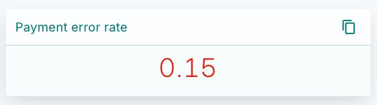
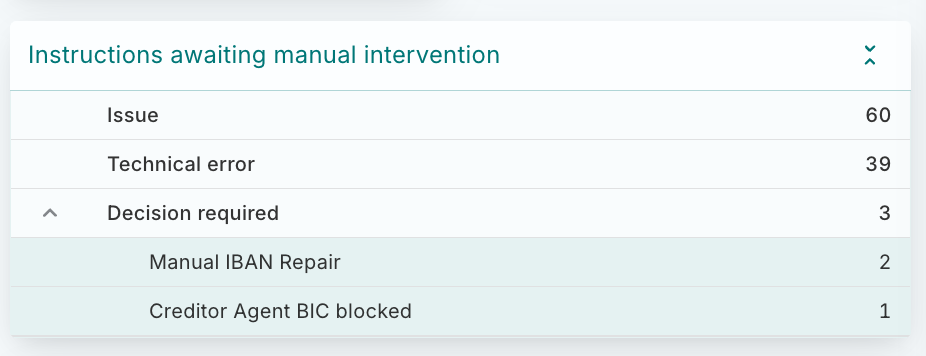
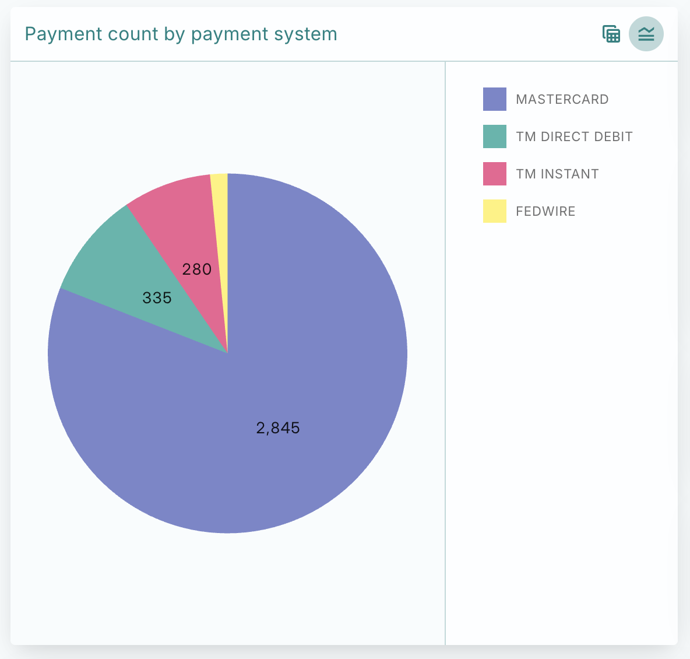
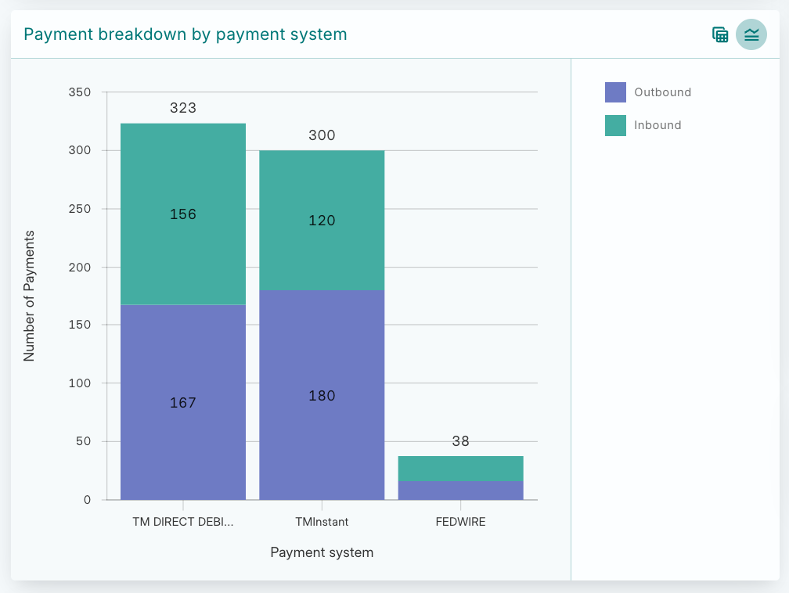
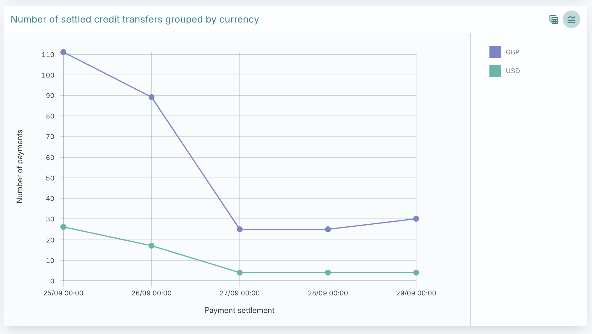

# Dashboards

`Dashboards` are application configuration resources which describe the layout and contents of aggregated metric dashboards surfaced in the Dashboards section of the Vault Payments app.

`Dashboards` configurations are used by the Vault Payments app to determine which aggregated metrics to fetch from the Aggregation API when viewing a Dashboard. The application first fetches the Dashboard configuration and based on the [Aggregations](/vault-payments/latest/EN/api/aggregations) it contains, it calls the [Aggregation API](/vault-payments/latest/EN/api/payments_api#aggregations) to fetch the aggregated data that should be shown.

The [Dashboards section](/vault-payments/latest/EN/app/using_the_app#updating_filters) in the Vault Payments App documentation details how these configuration resources are used in the app.

## Dashboard versions

`Dashboards` are a versioned resource, meaning the bulk of configuration is stored in a separate `Dashboard Version` resource. The `Dashboard` resource simply acts as a logical container for multiple `Dashboard Versions`.

chat\_bubble

List and Get Dashboard endpoints accept a `fields_to_include` property.

The Active Version of an Dashboard resource can be easily retrieved using `?fields_to_include=INCLUDE_FIELD_ACTIVE_VERSION` when retrieving the resource.

This will return the Dashboard alongside its latest Dashboard Version.

To update the configuration of an Dashboard, create a new Dashboard Version referencing that Dashboard’s ID with the desired configuration.

`Dashboards` are generic configuration resources so they support different types. At the moment, the only Dashboard type present in Vault Payments is the Payments Dashboard, which offers aggregated Payment data.

The layout and content information needed for determining what to show in a Payments Dashboard is contained in the `payments_dashboard` field of the `Dashboard Version`.

## Payments dashboards

Payments Dashboards have 3 top level fields:

-   the `default_filter_values` that will be applied to the dashboard by default when loading the app;
    
-   the `layout` configuration, containing the widget configuration in a nested array structure detailing the directions the widgets will be laid out in;
    
-   the `primary_widget_id` which is the ID of one of the widgets present in the `layout` structure, used to choose a thumbnail for the Dashboard to more easily be identified in the Dashboard Navigator.
    

### Default filter values

Some more details about how the default filters are shown and updated in the app can be found in the [Vault Payments App documentation](/vault-payments/latest/EN/app/using_the_app#updating_filters).

### Layout

The layout of a dashboard is made up of `Widget Tracks`. A widget track contains either a list of widgets or a list of widget tracks, enabling the creation of complex structures of widgets.

Each widget track also contains a `direction` which determines how the contents of the track will be laid out in the dashboard.

For example, the following combination of row and column `Widget Tracks` in the Code Panel on the right-hand side results in the Dashboard displayed on the left-hand side:

#### Widget

Each dashboard `Widget` has an ID and a display name descriptive of its purpose. It will also contain an `Aggregation` definition, which states how the data should be aggregated before being passed into the widget. To learn about what is possible in aggregation requests, please read the [Aggregations section](/vault-payments/latest/EN/api/aggregations) of the Payments API documentation.

Additionally, each widget has a configuration, depending on its type. There are currently 5 types of widgets supported in the Vault Payments App:

-   [Value](#value_widgets)
    
-   [Table](#table_widgets)
    
-   [Pie Chart](#pie_chart_widgets)
    
-   [Bar Chart](#bar_chart_widgets)
    
-   [Line Chart](#line_chart_widgets)
    

Different widget types apply different restrictions to the aggregation configuration of the widget. Additionally, each widget type has some configuration that can be applied to change its behaviour in the app.

##### Value widgets

Value widgets are the simplest widget type available. They display a single aggregation value.

The aggregation definition of a Value widget may not include any `grouping_levels` as aggregations with grouping levels return a list of values rather than a single value. This widget is only able to display a single value.

The optional `conditional_severities` configuration may be provided to highlighting it in a semantic colour depending on its value. The first value whose condition is met in the array will be used for applying semantic colouring to the widget value.

For example, the following definition may be used to create a Value widget for the error rate of the Payments processed by the system:

will result in a widget like this if 15% of the Payments in the chosen timeframe have status `PAYMENT_STATUS_ERRORED`:

##### Table widgets

Table widgets display grouped data in tabular format.

The aggregation definition of a Table widget must include at least one and up to five `grouping_levels`. In the case in which only a single value is returned, it will be styled differently to make more use of the space.

For example, the following definition may be used to create a Table widget showing the different states of Manual Intervention that Instructions are in:

The result will look like this:

##### Pie chart widgets

Pie chart widgets can be used to display grouped data in pie chart format.

The aggregation definition of a Pie Chart widget must include exactly one `grouping_level`. Pie Charts only support displaying a flat list of values at this time.

For example, the following definition may be used to create a Pie Chart widget showing the number of Payments made grouped by Payment System:

The result will look like this:

##### Bar chart widgets

Bar chart widgets can be used to compare values side-by-side in bar chart format.

The aggregation definition of a bar chart widget must include either one or two `grouping_levels`. If two levels are provided, you can pick between showing nested groups side by side or stacked by setting `grouping_type` in the `bar_chart` configuration.

For example, the following definition may be used to create a bar chart widget showing the number of credit transfers and direct debits made grouped by payment system and by direction:

The result will look like this:

##### Line chart widgets

Line chart widgets can be used to link values in chart format. This type of visualisation is particularly useful for displaying timelines.

The aggregation definition of a line chart widget must include either one or two `grouping_levels`. A single `grouping_level` will result in a single line, whereas two grouping levels will generate a collection of lines shown on the same canvas for comparison.

For example, the following definition may be used to create a line chart widget showing the number of card Payments settled in different currencies over time:

The result will look like this:

