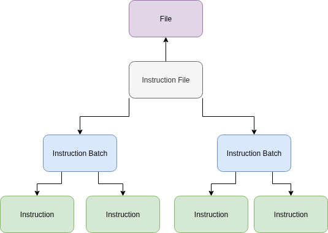
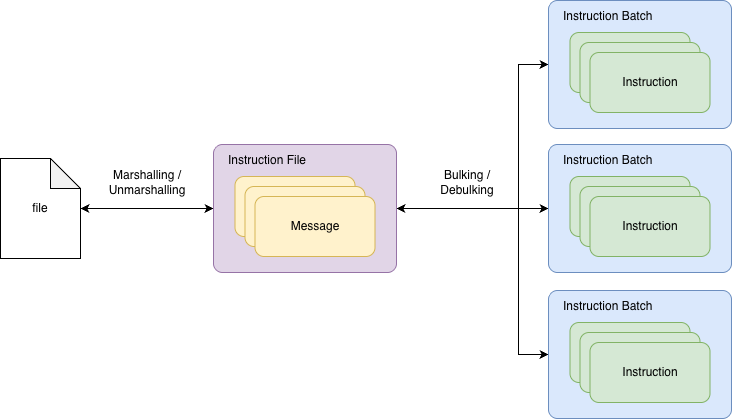
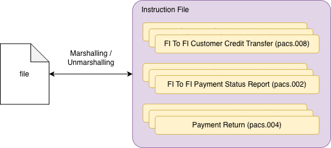
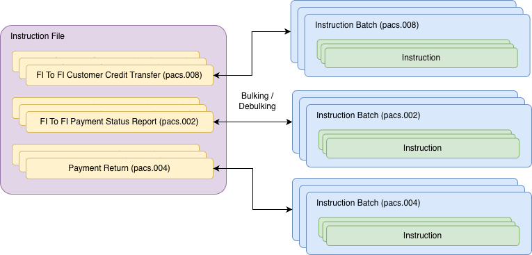
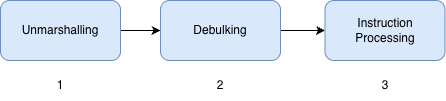
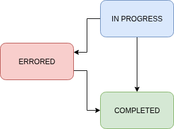
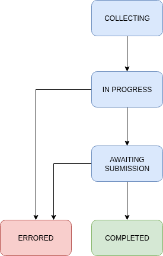

# File-based payment processing

chat\_bubble

This functionality is currently partially in BETA (`bulk` and `marshal` functions for Generated Files). Thought Machine may introduce breaking changes before it reaches a stable release and its interface is subject to change.

File-based payment processing is where payments are processed via batches of instructions contained in structured files.

In Vault Payments, File-based Payment processing involves 3 resources:

-   `InstructionFile` - represents a file to be processed or generated by Vault Payments. They include a reference to the underlying file data stored via the [Files API](/vault-payments/latest/EN/using_vault_payments/files) in the `file_id` field.
    
-   `InstructionBatch` - represents a group of `Instructions` which form a single ISO 20022 message.
    
-   `InstructionFileSpecification` - a resource which uses the Flows SDK to configure file processing behaviour.
    

The file processing journey is defined by the origin of the file:

-   Received - Files that are received by Vault Payments from an external entity (for example, a payment system). Files with this origin will be debulked into `InstructionBatches` and `Instructions` that can be processing by Vault Payments. For non ISO 20022 files, the content of the file can be unmarshalled via an optional `unmarshal` function defined in the `InstructionFileSpecification`.
    
-   Generated - Files that are created by Vault Payments to be sent to an external entity. Files with this origin are created via the `InstructionFileStep` during Instruction processing. These will be grouped and later bulked into a file ready to be sent out to an external entity or payment system. For non ISO 20022 files, conversion to other formats is possible via optional `marshal` function defined in the `InstructionFileSpecification`.
    

## File conversion

File conversion in Vault Payments follows the following steps according to the file origin.

Received Files:

1.  Unmarshalling: The file data is converted from the format specific to the scheme or payment system into Vault Payments ISO 20022 messages. If the file contains ISO 20022 data in XML format, the conversion will be done automatically by default. It is possible to unmarshal files in other formats by providing an optional `unmarshal` function in the `InstructionFileSpecification`.
    
2.  Debulking: ISO 20022 messages are converted into `Instructions` and `Instruction Batches` which represent units of processing within Vault Payments.
    

Generated Files:

1.  Grouping: Instructions using `InstructionFileStep` are grouped into batches according to the provided configuration.
    
2.  Bulking: `Instructions` and `Instruction Batches` are converted into one or more ISO 20022 messages.
    
3.  Marshalling: ISO 20022 messages are converted into the specific file format for the scheme or payment system. By default files are generated in the XML format, but it is possible to provide an optional `marshal` function in the `InstructionFileSpecification` which can convert the file to other formats.
    

The following resources are made available for file conversion and payment processing:

-   An `InstructionFile` represents a file and contains one or more `Messages` (which corresponds to an ISO 20022 message), each representing a batch of payments contained in the file. It also stores an underlying reference to the file data which is uploaded via the [Files API](/vault-payments/latest/EN/using_vault_payments/files).
    
-   An `InstructionFileSpecification` provides a way to orchestrate file conversion using code written in Python. It is associated with an `InstructionFile` (similarly to how an Instruction Flow is associated with an Instruction).
    
-   An `InstructionBatch` represents a group of related `Instructions` which all share the same ISO 20022 message type.
    

The image below illustrates the main components of the file conversion process. The direction is left to right for received files and right to left for generated files.

### Marshalling and unmarshalling

Vault Payments provides ISO 20022 APIs, in order to be able to process a received file, the file data is unmarshalled into a set of `Message` objects representing ISO 20022 messages. For example, a Credit Transfer file from an ACH scheme could be unmarshalled into an `Instruction File` which contains several ISO 20022 FI To FI Customer Credit Transfer (pacs.008), FI To FI Payment Status Report (pacs.002) and Payment Return (pacs.004) `Messages`.

For generated files, the same steps occur but in the opposite order: the `Messages` contained in the `Instruction File` are marshalled into a file.

When non ISO 20022 files are processed, `unmarshal` and `marshal` functions should be provided to convert the file from and to the ISO 20022 format.

### Bulking and debulking

The `InstructionFile` and `Message` resources represent the file and its contents respectively. In order to process the transactions in these messages, they must be converted into resources which represent units of processing in Vault Payments. These are `Instructions` and `Instruction Batches`.

When debulking an `InstructionFile`, each `Message` is converted into one or more `InstructionBatches` containing a set of `Instructions` corresponding to the transactions within the `Message`. In most cases, each `Message` is debulked into a single `InstructionBatch` containing `Instructions` for each transaction in the `Message`.

For generated files, the same steps occur but in the opposite order: the `Messages` contained in the `Instruction File` returned from the `Bulk` function are marshalled into a file.

Bulking and debulking logic is implemented in an `InstructionFileSpecification`.

## Received files

A received file processing journey starts by uploading the data of the file being processed to the [Files API](/vault-payments/latest/EN/using_vault_payments/files#http).

An example File API response is shown below:

Once the file is uploaded to the Files API, an `InstructionFile` can be initiated for processing by specifing the `File` in `file_id` and providing the `InstructionFileSpecification` that will be used to unmarshal and debulk the file contents:

This creates an `Instruction File` resource representing the file. Its status is `IN_PROGRESS` indicating that file processing has started.

### Processing lifecycle

1.  When a new `Instruction File` is created, the file data is unmarshalled into `Messages`.
    
2.  The `Messages` are then debulked into `Instruction Batches` and `Instructions` using the `debulk` method.
    
3.  The `Instructions` are initiated and `Instruction` processing begins.
    

When all Instructions from the file have been processed successfully, the `processing_status` for the Instruction File will be updated to `COMPLETED`. If an Instruction reaches the `ERRORED` state, the `Instruction File` and `Instruction Batch` will be moved to status `ERRORED`. This is a temporary status and, if the underlying `Instructions` are fixed, the `Instruction File` and `Instruction Batch` will move to status `COMPLETED`. An `Instruction File` can only reach a status of `COMPLETED` if all `Instructions` and `Instruction Batches` have reached a final, non-errored state.

## Generated files

A generated file processing journey begins with the processing of one of more `Instructions` using an `InstructionFileStep`. These `Instructions` are added to an `InstructionBatch` in an `InstructionFile`. During the file generation process, these are bulked and marshalled into a file.

### Instruction file step

An [Instruction File Step](/vault-payments/latest/EN/using_vault_payments/instructions_and_flows/steps#instruction_file_step) is used within an `Instruction Flow` when an `Instruction` is to be added to a file. The step defines how `Instructions` are grouped, as well as determining the `InstructionFileSpecification` that is used to generate the file.

The following 3 fields on the step determine how `Instructions` are grouped and processed:

-   `instruction_file_specification_id`: ID of the `Instruction File Specification` to use for file generation.
    
-   `instruction_batch_group_func`: Function which returns a string which is used to group an `Instruction` into an `InstructionBatch`. This group id is arbitrary. If an `InstructionBatch` with the `group_id` does not already exist, a new batch will be created. If the `InstructionBatch` has already reached capacity, then a new batch with the same group id will be created.
    
-   `instruction_file_group_func`: Function which returns a string which is used to group an `Instruction`, within an `InstructionBatch`, into an `InstructionFile`. This group id is arbitrary. If an `InstructionFile` with the group id does not already exist, a new file will be created. If the `InstructionFile` has already reached capacity, then a new file with the same group id will be created.
    

chat\_bubble

The batch group id and the file group id work together. An `Instruction` with batch group ID `A` and file group ID `B` will be in a different `InstructionBatch` and `InstructionFile` compared to an `Instruction` with a batch group ID `A` and file group ID `C`.

chat\_bubble

`Instructions` of a different type can not be in the same `InstructionBatch`, they are implicitly grouped by their type in addition to the group id.

chat\_bubble

`Instructions` are grouped by the active `InstructionFileSpecificationVersion`. If the active version changes, `Instructions` created after the change will be grouped in different `InstructionBatches` and `InstructionFiles` even if the batch group and file group IDs are the same.

Once this step is reached, the `Instruction` has been assigned to an `InstructionBatch` and an `InstructionFile`. It is paused and has `processing_status` set to `WAITING`. It remains in this state until the file generation process begins. Once file generation is complete and the `processing_status` of the `InstructionFile` is set to `COMPLETED` or `ERRORED`, the Instruction resumes processing.

### File generation

The file generation process starts when either of two events occur:

-   A CalendarPeriod corresponding to the `calendar_id` defined in the associated `InstructionFileSpecification` ends. This could, for example, correspond to a regular submission window for a payment scheme. When a corresponding period ends, all open `InstructionFiles` created for that period are sent for generation.
    
-   Either of the `batch_instruction_limit` or `file_batch_limit` limits defined in the associated `InstructionFileSpecification` are exeeded. In this case, the file is immediately sent for generation.
    

### Processing lifecycle

1.  `Instructions` are added to an `InstructionFile` using an Instruction File Step. Instructions are allocated to the appropriate Instruction Batches and Files as defined in the Flow. The `Instruction` is then paused until file generation and submission is completed.
    
2.  The newly-created `InstructionFile` remains in status `COLLECTING` until the corresponding active CalendarPeriod ends or the file reaches its capacity. When that happens, the resource is moved to status `IN_PROGRESS` and file generation begins.
    
3.  The `InstructionBatches` and `Instructions` contained in the `InstructionFile` are bulked into `Messages` by the `bulk_func` in the `InstructionFileSpecification`.
    
4.  The `Messages` are marshalled into file bytes according to the desired format of the file.
    
5.  Once file generation is complete, the `InstructionFile` is moved to status `AWAITING_SUBMISSION` and the file is uploaded to the [Files API](/vault-payments/latest/EN/using_vault_payments/files#retrieving_files). It can now be downloaded and submitted to a payment system or other entity.
    
6.  Once the file has been submitted, the [Instruction File must be updated](/vault-payments/latest/EN/api/payments_api#_payments_v1_instruction_files_InstructionFile_UpdateInstructionFile) to inform Vault Payments of the processing outcome. All paused `Instructions` are resumed and informed of the outcome of the file submission process.
    

The diagram below illustrates the possible status transitions for a generated `InstructionFile`:

### Viewing generated Instruction Files

You can retrieve the specific `InstructionFile` by its `id` through the GET endpoint:

Response:

The `batch_count` and `instruction_count` fields are only populated once the file generation process begins and the status moves to `IN_PROGRESS`.

The `file_id` contains the ID of the file that was generated by Vault Payments. Once the file reaches status `AWAITING_SUBMISSION` or `COMPLETED`, it can be downloaded via the [Files API](/vault-payments/latest/EN/using_vault_payments/files#retrieving_files).

### Updating an Instruction File

After the file is submitted, the `InstructionFile` needs to be updated to a terminal state (either `COMPLETED` or `ERRORED`) to indicate the outcome of the submission:

This will resume Instruction processing.

## Instruction File Specifications

An Instruction File Specification is used to configure and orchestrate file-based processing in Vault Payments.

Instruction File Specifications provide a way to implement the bulking and debulking in Python similarly to how an `Instruction Flow` is used to orchestrate processing logic for an `Instruction`. An `InstructionFileSpecification` is typically associated with a specific scheme file, for example an EBA Clearing STEP2 Input Credit File (ICF). The appropriate Specificiation type and functions should be implemented according to Instruction File type:

-   For files of origin `RECEIVED`, the InstructionFileSpecification must be of type `RECEIVED` and have a `debulk_func` implemented.
    
-   For files of origin `GENERATED`, the InstructionFileSpecification must be of type `GENERATED` and have a `bulk_func` implemented.
    

### Instruction File Specification Versions

Instruction File Specifications are similar to other version based resources in Vault Payments, such as Instruction Flows. A parent resource should be created first which will then be referenced within Instruction Flows or when creating Instructions Files.

Example `Instruction File Specification`:

After creating the `Instruction File Specification`, use the returned specification ID to make an API call to the `POST /v1/instruction-file-specification-versions` endpoint to create the `Instruction File Specification Version`.

Example `Instruction File Specification Version`:

### Representation in Python

`Instruction File Specification Versions` are represented by Python code, which contains a variable of type `FileSpecVersion` from the [Vault Payments SDK](/vault-payments/latest/EN/api/flows/flows_api). Below is a minimal example:

In the above code:

-   `id` - The ID of the specific resource defined in this file
    
-   `file_spec_id` - The ID of the `InstructionFileSpecification` parent resource
    
-   `version` - The [semantic version](https://semver.org) which this version should be identified with
    
-   `bulk_func` - The Python function used to bulk `Instructions` and `InstructionBatches` into `Messages`
    
-   `bulk_options` - Options relating to file bulking. These must be defined if the file spec is used for bulking.
    
-   `bulk_options.file_instruction_limit` - The maximum number of `Instructions` that can be contained in a single `InstructionFile`. If an `InstructionFile` reaches this limit, it is immediately moved to status `IN_PROGRESS`.
    
-   `bulk_options.file_batch_limit` - The maximum number of `InstructionBatches` that can be contained in a single `InstructionFile`. If an `InstructionFile` reaches this limit, it is immediately moved to status `IN_PROGRESS`.
    
-   `bulk_options.batch_instruction_limit` - The maximum number of `Instructions` that can be contained in a single `InstructionBatch`. If the `Instruction Batch` reaches this limit, it is moved to status `AWAITING_SUBMISSION` and no more `Instructions` can be added to it. Any new `Instructions` will be added to a new `InstructionBatch`. This may trigger the `file_batch_limit`.
    
-   `bulk_options.calendar_id` - The ID of the `Calendar` used to start file generation from related `InstructionBatches`. When an active CalendarPeriod ends file generation is started.
    

### Example for received files

To convert a received file for processing, the `Instruction File Specification Version` must have a `debulk_func` implemented. It may also have an optional `unmarshal` function, for files in formats different than ISO 20022 XML. The code below shows an example `Instruction File Specification Version`:

### Example for generated files

To convert a received file for processing, the `Instruction File Specification Version` must have a `bulk_func` implemented. It may also have an optional `marshal` function, to generate a file in a format different than ISO 20022 XML. The code below shows an example `Instruction File Specification Version`: