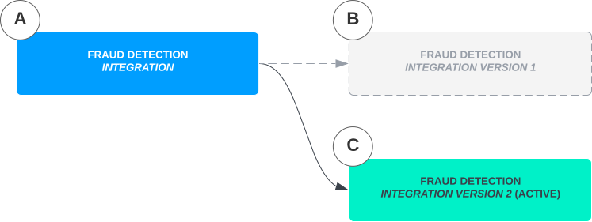

# Integrations

Vault Payments allows interacting with external systems during instruction processing. Such external systems are referred to as `Integrations`. The `Integration` and `Integration Version` resources allow representing these systems in Vault Payments and centrally managing any configuration needed to successfully interact with them.

`Integrations` can be referenced within [`Instruction Flows`](/vault-payments/latest/EN/using_vault_payments/instructions_and_flows#instruction_flows), where for example they may be used to update records kept in external systems, perform checks, or fetch additional data required during the processing of an instruction. Some types of `Integrations` may also be referenced in `Cores`.

In this example flow, steps (D) and (E) show Vault Payments communicating with an external fraud detection `Integration` and a core banking system `Integration` respectively, as part of processing a payment.

## Integration versions

`Integrations` are a versioned resource, meaning the bulk of configuration is stored in a separate `Integration Version` resource. The `Integration` resource simply acts as a logical container for multiple `Integration Versions` and is typically the one referenced in other resources such as [`Instruction Flows`](/vault-payments/latest/EN/using_vault_payments/instructions_and_flows#instruction_flows) and `Cores`.

To update the configuration of an `Integration`, create a new `Integration Version` referencing that `Integration`'s ID with the desired changes. A newly created `Integration Version` goes through a process before eventually becoming the active configuration for that `Integration` (see [`Integration Lifecycle`](/vault-payments/latest/EN/using_vault_payments/integrations#integration_lifecycle)).

chat\_bubble

List and Get Integration endpoints accept a `fields_to_include` property.

The Active Version of an Integration resource can be easily retrieved using `?fields_to_include=INCLUDE_FIELD_ACTIVE_VERSION` when retrieving the resource.

This will return the latest IntegrationVersion in the READY status.

For example: 1. An `Integration` (A) could represent an external Fraud Detection system 1. The first `Integration Version` (B) could be created, referencing the `Integration` and defining configuration for how to talk to that external Fraud Detection system 1. A second `Integration Version` (C) could be created with updated configuration for how to talk to that external Fraud Detection system. This new `Integration Version` would replace the first version.

chat\_bubble

-   New `Integration Versions` are not guaranteed to become active immediately and may take a moment for the new configuration to take effect.
    
-   The exact version of the configuration used to interact with an `Integration` is typically resolved just before an instruction is processed. It is not guaranteed that the same `Integration Version` is used again when retrying the processing, such as when an instruction is being re-processed or an instruction flow step is being retried. It is therefore important that new versions of the configuration are compatible with how the integration was used previously.
    

The configuration stored in an `Integration Version` covers three main areas:

-   [Type and protocol of the API](/vault-payments/latest/EN/using_vault_payments/integrations#integration_type)
    
-   [Network connectivity](/vault-payments/latest/EN/using_vault_payments/integrations#integration_connectivity)
    
-   [Authentication](/vault-payments/latest/EN/using_vault_payments/integrations#integration_authentication)
    

Unlike other Vault Payment configuration resources, `Integration Versions` have a [`Lifecycle`](/vault-payments/latest/EN/using_vault_payments/integrations#integration_lifecycle) and accompanying status.

## Integration lifecycle

When a new `Integration Version` is created, it is not automatically made active. Instead, each `Integration Version` has a status and is only available for use once that status has transitioned to `READY`. Depending on the nature of the changes made to the configuration, some `Integration Versions` require infrastructure to be automatically provisioned before they’re available for use. For example, creating an `Integration Version` with AWS PrivateLink `Connectivity` requires setting up AWS infrastructure. `Integration Versions` may have one of the following statuses:

-   `PENDING` means Vault Payments is in the process of applying the new configuration.
    
-   `READY` means the `Integration Version` is ready for use.
    
-   `ERRORED` means a persistent error has occurred when trying to apply the configuration and a new `Integration Version` must be created with corrected configuration. The previously active `Integration Version` will continue to be used.
    
-   `USER_ACTION_REQUIRED` means Vault Payments is waiting for a user to perform a particular action before the status can progress. It progresses automatically once that action has been taken. The action to be taken depends on the nature of the configuration.
    

Each `Integration Version` is created in status `PENDING`. Eventually the status should transition to either `READY` or `ERRORED`, at which point the status won’t change again. Some `Integration Versions` may transition to an intermediary status of `USER_ACTION_REQUIRED`, such as those which configure connectivity via AWS PrivateLink, where the endpoint connection needs to be accepted before the status can progress. An `Integration Version` can only be used once it has reached the `READY` status.

## Expected and provided guarantees

### Identity

Since Vault Payments resolves the newest active `Integration Version` at the point of use, it is essential that the behaviour of the `Integration` does not meaningfully change across `Integration Versions`. Deviations risk incompatibility with existing `Instruction Flows` or non-deterministic behaviour when re-processing instructions.

A given `Integration` resource should consistently represent the same external system, and must not be re-used for systems that are either not equivalent in purpose or behaviour, or which do not expose an API which is backwards-compatible with previous versions. For example, an `Integration` with a core banking system can’t have a new `Integration Version` which represents an entirerly new distinct core banking system with differing behaviour. In these cases, a new `Integration` resource should be created.

### Idempotency

Vault Payments may repeat previously made calls to `Integrations`, typically when a previous attempt has failed and may succeed if retried. `Integrations` must therefore always act idempotently.

All calls to `Integrations` should include an idempotency key. If an `Integration` receives a request with an idempotency key it has previously seen, it must ensure it does not repeat previous side-effects and return the same response again on success. If the `Integration` previously returned an error however, it may return either a different error, or preferably a successful response.

chat\_bubble

If an `Integration` does not act idempotently, Vault Payments will, as a consequence, not be idempotent and instruction processing may result in unintended behaviour and side-effects.

### Error handling

Vault Payments is guaranteed to retry calls to `Integrations` until either:

-   they succeed
    
-   a non-transient error is returned
    
-   a transient error is returned repeatedly for an extended period of time
    

During instruction processing, the latter two cases would cause the instruction to stop processing and be marked as `ERRORED` or proceed down an `on_error_func`. See [`Integration Retries`](/vault-payments/latest/EN/using_vault_payments/integrations#integration_retries) for the default retry behaviour of Vault Payments and how Integrations can customise this.

The `Integration Type` determines what responses are considered successful, transient and non-transient.

## Integration type

`Integrations` are differentiated by type. The type dictates the protocol and API used to interact with the external system the `Integration` represents. `Integration Versions` contain type-specific configuration options. The type of an `Integration` also determines where it can be referenced, e.g. which types of `Instruction Flow` steps it is compatible with.

chat\_bubble

The type of an `Integration` is immutable. All `Integration Versions` must specify configuration options matching the type of the `Integration` they’re associated with.

Below types of `Integration` are currently supported:

-   HTTP
    
-   HTTP Async
    
-   Vault Core Postings
    
-   Scheme Submission
    
-   SWIFT AGI
    

### HTTP

The HTTP type enables interacting with systems which accept and return JSON over HTTP(S). It is compatible with the [`HTTPStep`](/vault-payments/latest/EN/using_vault_payments/instructions_and_flows/steps#http_step) within an `Instruction Flow`.

The HTTP Integration type supports the following configuration options:

 
| Option | Description |
| --- | --- |
| 
URL

 | 

The base URL to be called. Must include protocol. HTTPS is recommended.

 |
| 

HealthCheck

 | 

Configuration for overriding the healthcheck. See [`Healthcheck`](/vault-payments/latest/EN/using_vault_payments/integrations#integration_healthchecks). Optional.

 |
| 

StatusCodePolicy

 | 

Configuration for overriding the status code policy. Optional.

 |

Extra configuration for calls made to your HTTP integration (including method, payload, headers, additional paths and query parameters) can be defined in the `HTTPStep` of an `Instruction Flow`.

When an `HTTPStep` is encountered in an `Instruction Flow`, Vault Payments will execute the associated `request_func` to obtain the [`HTTPRequest`](/vault-payments/latest/EN/api/flows/flows_api/http#HTTPRequest) object. An HTTP request to the provided integration will be made with the configuration defined in the `HTTPRequest`. The HTTP response is made available to the resolve and on\_error function of the `HTTPStep` through the [`HTTPResponse`](/vault-payments/latest/EN/api/flows/flows_api/http#HTTPResponse) object.

By default, Vault Payments considers all 2xx response status codes to be successful and the following codes as transient:

-   `408 Request Timeout`
    
-   `429 Too Many Requests`
    
-   `499 Client Closed Request` (nginx)
    
-   `502 Bad Gateway`
    
-   `503 Service Unavailable`
    
-   `504 Gateway Timeout`
    
-   `507 Insufficient Storage`
    

Transient codes will cause Vault Payments to retry requests. By default, all other status codes are considered to indicate non-retryable errors. This default behaviour can be overridden by providing a `StatusCodePolicy` when creating an HTTP IntegrationVersion, allowing full customisation of what status codes Vault Payments will consider successful, transient and non-transient. Note, by providing an `StatusCodePolicy`, no defaults will be used and all desired behaviour must be configured within the provided object. Status code ranges can be captured using `2xx` notation to aid in capturing this behaviour.

It is possible to handle errors from integrations by providing an `on_error_func` in the `HTTPStep`. This function will be run if the integration responds with a non-retryable error or if Vault Payments has exhausted all retries for retryable errors. Vault Payments will, by default, retry requests to `HTTP` integrations for up to 30 minutes with exponential backoff. This behaviour can be customised by providing a `RetryPolicy` on a per-integration or per-step basis. Note that a [`RetryPolicy`](/vault-payments/latest/EN/api/flows/flows_api/retry#RetryPolicy) provided on the step-level will take priority over Integration-level retry policies.

If the HTTP response body is larger than 2KB it will be truncated. Note that the full response will still be available to the relevant steps resolve function before being truncated. The response size and whether it has been truncated are present in the Instruction’s step history.

### HTTP async

The HTTP Async type enables interacting with systems which accept JSON over HTTP(S) and are designed to call Vault Payments back asynchronously. It is compatible with the [`HTTPAsyncStep`](/vault-payments/latest/EN/using_vault_payments/instructions_and_flows/steps#http_async_step) within an `Instruction Flow`.

The HTTP Async Integration type supports the following configuration options:

 
| Option | Description |
| --- | --- |
| 
URL

 | 

The base URL to be called. Must include protocol. HTTPS is recommended.

 |
| 

HealthCheck

 | 

Configuration for overriding the healthcheck. See [`Healthcheck`](/vault-payments/latest/EN/using_vault_payments/integrations#integration_healthchecks). Optional.

 |
| 

StatusCodePolicy

 | 

Configuration for overriding the status code policy. Optional.

 |

Extra configuration for calls made to your HTTP Async integration (including method, payload, headers, additional paths and query parameters) can be defined in the `HTTPAsyncStep` of an `Instruction Flow`.

When an `HTTPAsyncStep` is encountered in an `Instruction Flow`, Vault Payments will execute the associated `request_func` to obtain the [`HTTPRequest`](/vault-payments/latest/EN/api/flows/flows_api/http#HTTPRequest) object. The function will be provided with a callback `token`, which should be passed to the integration. An HTTP request to the provided integration will be made with the configuration defined in the `HTTPRequest`. A response with HTTP 200 OK code is expected, returned body will be ignored. When the integration is ready, it is expected to call Vault Payments back via the `/api/v1/integrations:callback/{token}` [endpoint](/vault-payments/latest/EN/api/payments_api#callback). The HTTP response delivered asynchronously from the integration is made available to the resolve function of the `HTTPAsyncStep` through the [`HTTPResponse`](/vault-payments/latest/EN/api/flows/flows_api/http#HTTPResponse) object. Please note that the callback `token` can be used only once and it will match a specific `Instruction` and a specific `HTTPAsync` step.

Handling of the error codes, retries and truncation of large responses is the same as for HTTP integrations.

### Vault Core postings

The Vault Core Postings type enables interacting with Vault Core to create postings. It is compatible with the [`VaultCorePostings`](/vault-payments/latest/EN/using_vault_payments/instructions_and_flows/steps#vault_core_postings_step) step within an `Instruction Flow`.

The Vault Core Postings Integration type requires a URL to a Vault Core Instance. Vault Payments will set up all other necessary configuration to enable communication between itself and the provided Vault Core instance.

On success the [`Posting Instruction Batch`](/vault-payments/latest/EN/api/flows/flows_api/postinginstruction#PostingInstructionBatch) created in Vault Core is passed to the `VaultCorePostings` step in the `Instruction Flow`.

Vault Payments will retry any transient errors returned by Vault Core appropriately. You can handle errors from Vault Core by optionally providing an `on_error_func` in the `VaultCorePostings` step. This will be run if Vault Core returns a non-retryable error or if Vault Payments has exhausted all retries for retryable errors. Vault Payments handles errors returned by Vault Core automatically and will retry for up to 30 minutes with exponential backoff. This behaviour can be customised by providing a `RetryPolicy` on a per-integration or per-step basis. Note that a [`RetryPolicy`](/vault-payments/latest/EN/api/flows/flows_api/retry#RetryPolicy) provided on the step-level will take priority over Integration-level retry policies.

The Vault Core Postings Integration supports both asynchronous (`POST /v1/posting-instruction-batches:asyncCreate`) and synchronous (`POST /v1/posting-instruction-batches`) postings endpoints. The minimum supported Vault Core release is 5.2. The synchronous endpoint is available from version 5.4. Access permissions for each endpoint need to be set on the Integration authentication. The Integration will determine which endpoint to use based on the Vault Core version and permissions.

### Scheme submission

The Scheme Submission type enables interacting with payment schemes which accept ISO 20022 messages over HTTP(S). It is compatible with the [`SchemeSubmissionStep`](/vault-payments/latest/EN/using_vault_payments/instructions_and_flows/steps#scheme_submission_step) within an `Instruction Flow`.

The Scheme Submission Integration type supports the following configuration options:

 
| Option | Description |
| --- | --- |
| 
Content Type

 | 

The content type accepted by the payment scheme.

 |
| 

URL

 | 

The base URL to be called. Must include protocol. HTTPS is recommended.

 |
| 

Paths

 | 

An optional mapping between `Instruction` types and URL paths.

 |
| 

HealthCheck

 | 

Configuration for overriding the healthcheck. See [`Healthcheck`](/vault-payments/latest/EN/using_vault_payments/integrations#integration_healthchecks). Optional.

 |

When a `SchemeSubmissionStep` is encountered in an `Instruction Flow`, Vault Payments encodes the ISO 20022 message of the `Instruction` into the content type defined by the integration. An HTTP request is then made to payment scheme, using the encoded message as the body, and the configuration defined in the rest of the integration.

Errors and retries for integrations of this type are handled in the same way as the HTTP type, including support for an `on_error_func` and `retry_policy`, but response bodies are discarded regardless of status code.

### Swift agi

The SWIFT Alliance Gateway Instant (AGI) type enables interacting with a SWIFT AGI to send and receive messages. It is compatible with the [`SchemeSubmissionStep`](/vault-payments/latest/EN/using_vault_payments/instructions_and_flows/steps#scheme_submission_step) within an `Instruction Flow`.

The SWIFT AGI Integration type supports the following configuration options:

 
| Option | Description |
| --- | --- |
| 
Service

 | 

The service the SWIFT AGI is connected to.

 |
| 

Distinguished Name

 | 

The distinguished name (DN) to be used as the sender, when sending messages to the SWIFT AGI.

 |

Upon the creation of a SWIFT AGI `Integration Version`, Vault Payments will connect to the SWIFT AGI using the details specified in it. Any messages received by the SWIFT AGI will be converted to an `Instruction`, and processed by Vault Payments.

When a `SchemeSubmissionStep` specifies a SWIFT AGI Integration type, Vault Payments encodes the ISO 20022 message of the `Instruction` into the format recognised by the SWIFT AGI, and submits it to the SWIFT AGI.

Errors and retries for integrations of this type are handled in the same way as the Scheme Submission type.

## Integration connectivity

The following connectivity options are available to `Integrations`:

-   AWS PrivateLink
    
-   Public Internet
    

### AWS PrivateLink

[AWS PrivateLink](https://docs.aws.amazon.com/vpc/latest/privatelink/what-is-privatelink.html) offers private connectivity between [AWS VPCs](https://docs.aws.amazon.com/vpc/latest/userguide/what-is-amazon-vpc.html), eliminating the need to route traffic over the public internet, allowing for improved security as well as lower, more consistent latency. It is the preferred connectivity option for production deployments.

AWS PrivateLink connectivity is currently available in a select number of AWS regions:

-   `eu-west-1` (Europe, Ireland)
    
-   `eu-west-2` (Europe, London)
    

Support for additional regions is available on request.

#### Requirements

-   A VPC endpoint service associated with a verified [private DNS name](https://docs.aws.amazon.com/vpc/latest/privatelink/manage-dns-names.html) with an allow principle from Thought Machine’s AWS account (please contact us for the ARN per environment)
    
-   A valid TLS certificate from a trusted Certificate Authority
    

#### Lifecycle

An `Integration Version` specifying `aws_privatelink_connectivity` goes through a multi-step process before it is available for use. It is created in status `PENDING`, and will eventually automatically transition to status `USER_ACTION_REQUIRED`, at which point the VPC endpoint service specified at creation should have received an endpoint connection request. Please accept this request. Once the request has been accepted, the status of the `Integration Version` should transition to `READY` automatically.

If the status instead transitions to `ERRORED` or you do not receive the expected endpoint connection request, please ensure the supplied details are correct and the requirements above are met. Should you continue to see issues, please contact us.

### Public internet

This connectivity option provides a way to connect Vault Payments to an external system over the public internet without requiring any special setup.

#### Requirements

-   A public domain
    
-   A valid TLS certificate from a trusted Certificate Authority for the domain above
    

#### Lifecycle

An `Integration Version` specifying `public_internet_connectivity` is created in status `PENDING` and will transition to status `READY` automatically. If it instead transitions to `ERRORED` please ensure the supplied details are correct and the requirements above are met.

## Integration authentication

Vault Payments aims to support a number of authentication mechanisms to secure communication with `Integrations`. Using OAuth client credentials is the recommended mechanism.

### Static token

Vault Payments supports authenticating to `Integrations` using a static token which will be included, by default, as a `Bearer` token in all requests. This behaviour can be overriden by providing a custom header, making this authentication option suitable for bespoke authentications methods such as API keys.

### OAuth client credentials grant

OAuth client credentials grant (defined in [OAuth 2.0](https://datatracker.ietf.org/doc/html/rfc6749#section-4.4)) describes a mechanism for machine-to-machine applications to obtain short-lived access tokens from an authentication server.

For `Integrations` configured to use this mechanism, Vault Payments will automatically fetch and refresh access tokens using a given OAuth 2.0 compliant `/token` endpoint. A valid access token will be included as a `Bearer` token in all requests made to this `Integration`.

#### Requirements

-   URL of an OAuth 2.0 compliant `/token` endpoint,
    
-   The client ID and client secret for this `Integration`
    
-   Optionally, scopes to be included in the requested access tokens
    

#### Security considerations

To reduce the impact of potentially compromised client credentials it is strongly recommended to use a different set of client credentials per `Integration`.

Token lifetime must also be carefully chosen. Shorter token lifetimes generally improve security, but also shorten the amount of time for which the `Integration` can continue to function in the case where the authentication server becomes temporarily unavailable. For `Integrations` where availability is critical, it is recommended to ensure tokens are valid for at least as long as it would take to notice and remedy an issue with the authentication server. Vault Payments allows configuring the duration for which an access token will be used after creation independently of the token’s expiry time, meaning limited temporary issues with the authentication server can be tolerated without impact.

### OAuth password grant

OAuth password grant (defined in [OAuth 2.0](https://datatracker.ietf.org/doc/html/rfc6749#section-4.3)) describes a mechanism for machine-to-machine applications to obtain short-lived access tokens from an authentication server.

For `Integrations` configured to use this mechanism, Vault Payments will automatically fetch and refresh access tokens using a given OAuth 2.0 compliant `/token` endpoint. A valid access token will be included as a `Bearer` token in all requests made to this `Integration`.

#### Requirements

-   URL of an OAuth 2.0 compliant `/token` endpoint,
    
-   The username and password for this `Integration`
    
-   The client ID and client secret for this `Integration` (used for the Authorization header)
    

#### Security considerations

The Password grant type is a legacy OAuth method and is not recommended under the lastest OAuth 2.0 Security Best Practices. This method MUST ONLY be used when the external system that you wish to connect to offers no alternative authentication method.

## Integration healthchecks

Vault Payments will, by default, perform an initial healthcheck for `HTTP`, `HTTPAsync` and `SchemeSubmission` Integrations before they are moved to a `READY` status. This healthcheck is performed after any connectivity setup is completed. Vault Payments will attempt to retrieve a token if OAuth is configured as part of this healthcheck. An HTTP request will then be made to the Integration with all auth tokens attached. If this check fails, the Integration will be moved to an `ERRORED` status. All `2xx` responses are considered successful.

The healthcheck of these integrations can be customised with the following options:

 
| Option | Description |
| --- | --- |
| 
URL

 | 

The URL to be used in the healthcheck. Defaults to the integrations URL if not provided

 |
| 

method

 | 

The method to be used when healthchecking the integration. Defaults to OPTIONS if not provided

 |
| 

disabled

 | 

Allows the healthcheck to be skipped

 |

## Integration retries

Vault Payments will retry requests to Integrations for a default duration of 30 minutes using an exponential backoff strategy. Please refer to [`Integration Types`](/vault-payments/latest/EN/using_vault_payments/integrations#integration_type) to see which errors are considered transient for each integration type. If the retry period expires, or if a non-retryable error is encountered during processing, the Instruction will either transition to an `ERRORED` status or proceed via the defined `on_error_func` method.

Since the default retry behaviour may not be appropriate for every Instruction Flow, Vault Payments supports per-integration and per-step retry customisation via the `retry_policy` field and the [`RetryPolicy`](/vault-payments/latest/EN/api/flows/flows_api/retry#RetryPolicy) object. Note that if a `RetryPolicy` is provided on the step-level it will take priority over Integration-level retry policies. This configuration is available on all steps that use Integrations and allows you to specify:

-   `retry_timeout` The maximum total time Vault Payments will continue retrying requests to the Integration for a given step.
    
-   `request_timeout` The maximum duration for each individual request sent to the Integration.
    

If these parameters are omitted or set to 0 at the step-level, Vault Payments attempts to use the parameter set at the Integration-level. Similarly, if the parameters are omitted or set to 0 at the Integration-level, Vault Payments uses default values of 30 minutes for `retry_timeout` and 10 seconds for `request_timeout`.