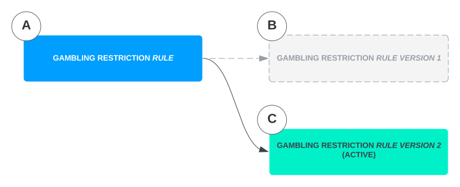
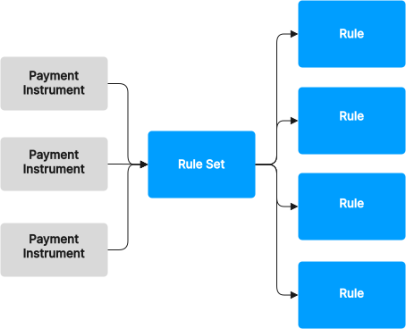

# Rules

The `Rules API` lets you create dynamic behaviours that impact the processing of `Instructions`. Using the `Rules API` you can block specific countries, limit spending amount and much more.

The `Rules API` contains 3 configuration resources:

-   `Rules` - The behaviour that should be run when processing an Instruction, defined using Python. Examples: Authorisation Limit, Block ATM, Allowed Countries
    
-   `RuleSets` - A grouping of common behaviours that can be reused across different use cases. Examples: Card Programme, Account to Account Controls
    

`Rules` and `RuleSets` can be applied to [`PaymentInstruments`](/vault-payments/latest/EN/using_vault_payments/routing#payment_instruments) to impact the processing of `Instructions` targeting that `Payment Instrument`.

## Rules

`Rules` are low level resources that enable you to create custom behaviour that can be applied to Payment Instruments. When Vault Payments processes an Instruction that is directed to the Payment Instrument the specified Rules will be evaluated which can then impact the Payment Processing.

Examples:

-   Country Allow/Deny Lists
    
-   Merchant Category Blocks/Limits
    
-   Authorisation Limits
    
-   Contactless Limit
    
-   Debit/Credit Only
    
-   FX Fees
    

### Rule types

There are two types of `Rules` in Vault Payments:

-   **Basic**
    
    -   Custom behaviour that is run during Payment Processing based on the incoming Instruction that can result in changes of the Instruction or the setting of restrictions. Rule Code returns a list of restrictions and can edit the Instruction.
        
    -   Can be used in RuleSets and attached directly to Payment Instruments.
        
    -   Example: Return a restriction if the amount of the Instruction exceeds the provided value.
        
    
-   **Account Link selection**
    
    -   Decides which Account Link to use during Payment Processing based on the incoming Instruction.
        
    -   Rule Code returns true/false. When true is returned the provided Account Link is selected over the default.
        
    -   Can be attached directly to Payment Instruments along with the ID of the Account Link for the selection.
        
    -   Example: Select EUR account if the incoming instruction currency is EUR.
        
    

### Rule versions

Rules are versioned similarly to other Configuration resources, the `Rule Version` represents the current implementation of the `Rule`'s logic.

The `Rule` resource can be thought of as a logical container that can contain many `Rule Versions`. Each time you want to change the behaviour of a `Rule` this is done by creating a new `Rule Version`.

chat\_bubble

Any references to a Rule ID will resolve to the currently active `Rule Version` of that `Rule`. For example, if a new `Rule Version` of a `Rule` becomes active, this new `Rule Version` will be used during processing anywhere that the Rule ID is referenced.

chat\_bubble

List and Get Rule endpoints accept a `fields_to_include` property.

The Active Version of a Rule resource can be easily retrieved using `?fields_to_include=INCLUDE_FIELD_ACTIVE_VERSION` when retrieving the resource.

Rulesets also have this function.

1.  A `Rule` (A) could represent a restriction on gambling Instructions.
    
2.  The first `Rule Version` (B) could be created, referencing the `Rule` and defining the logic.
    
3.  A second `Rule Version` (C) could be added that contains different logic. This new `Rule Version` would replace the first version (B).
    

### Parameters in Rules

Rules can make use of [Parameters](/vault-payments/latest/EN/using_vault_payments/parameters) allowing Rules to be configured at a global or Payment Instrument level without needing code changes.

## Rule management

The `Rules API` provides flexibility to manage Rules at scale across many Payment Instruments while also allowing individual Payment Instruments to override these Rules.

### RuleSets

`RuleSets` provide an abstraction level above the low level `Rule` resource by providing a way to group individual Rules so they can be managed, applied and evaluated together.

Examples:

-   Authorisation Controls
    
-   Merchant Controls
    
-   Account Access Restrictions
    
-   Base Cards Programme
    

`RuleSets` can reference multiple Rules, and the Rules must be of type `RULE_TYPE_BASIC`.

RuleSets are versioned similarly to other Configuration resources.

chat\_bubble

When a `RuleSet` is evaluated during Instruction processing the `Rules` will be evaluated in the order specified.

Below is an example of a "Card Controls" `RuleSet`

This `RuleSet` groups together 3 `Rules`:

-   `max-authorisation-amount` - This Rule provides the ability to limit card authorisation amounts.
    
-   `atm-withdrawal` - This Rule provides the ability to prevent ATM withdraws.
    
-   `contactless-controls` - This Rule provides the ability to restrict spending on a contactless card.
    

## Using Rules

### RuleSets on Payment Instruments

`RuleSets` can be set on Payment Instruments on creation and can also be changed with an update. `RuleSets` are the recommended way to manage Rules on Payment Instruments at scale as it allows you to manage what Rules are run in one place. If a change is needed across a product line this can be done at the `RuleSet` level and these new Rule behaviours will be applied to all associated Payment Instruments automatically. For example you can add a `country-restriction` rule to prevent transactions in a country across all associated Payment Instruments to prevent fraud.

### Individual Rules on Payment Instruments

Basic Rules can also be set on individual Payment Instruments. This is useful when you need to add Rules or overrides to a single Payment Instrument.

Any `Parameters` used within the Rule can also be overridden to apply to single Payment Instrument by creating a [Payment Instrument level ParameterValue](/vault-payments/latest/EN/using_vault_payments/parameters#setting_parameter_values).

## Writing Rule

A `Rule`'s behaviour is defined via custom Python code which is evaluated when run during the processing of `Instructions`.

When the Python code is evaluated it is provided with the incoming `Instruction`, any value on the Instruction can be used to determine what the Rule should do.

### Basic Rules

The Python code must implement the `def rule(instr : Instruction, matched_instr : list[Instruction], params : dict)` function. This takes the Instruction object and a list of matched Instruction objects, and returns a list of strings. These strings are the restrictions that you wish to raise. The Instruction object is mutable, any changes made to the Instruction object in Python will change the Resource accordingly. Restrictions are accessible for use in flows in the `target_account.restrictions` field of the `Instruction`. In the below example, if the instruction has an amount above the limit of `100`, it will return a restriction.

We also need to specify the major version of the `flows_api` package we intend to use by declaring the global variable `flows_api_version`.

Basic Rules can be used on individual Payment Instruments.

Rules can also be used in `RuleSets`. For more information see [Rule Management](/vault-payments/latest/EN/using_vault_payments/rules#rule_management).

### Account Link selection Rules

The Python code must implement the `def account_link_selection(instr : Instruction, matched_instr : list[Instruction], params : dict)` function. This takes the Instruction object and list of matched Instruction objects as input and expects a boolean true/false return value. In the below example if the instruction has currency EUR it will return true, which would result in the Account Link being selected.

We also need to specify the major version of the `flows_api` package we intend to use by declaring the global variable `flows_api_version`.

Account Link Selection Rules are used on Payment Instruments using the `account_links` field, with the Account Link ID they select.

When a True value is returned the Account Link is selected, if a False is returned it is not selected and the next Account Link is considered.

chat\_bubble

An Account Link can be specified without a `Rule`, in which case it will be selected if it is next in consideration.

If all of the Account Links specify a rule, and none of them evaluate to True, then the Account ID present in `default_account_link_id` will be used. We strongly recommend that a default Account ID is always present on a `Payment Instrument`.

### Rules with Parameters

Basic and Account Link selection Rules can also be used with [Parameters](/vault-payments/latest/EN/using_vault_payments/parameters). To use a Parameter in a Rule the Parameter needs to be specified as an `ExpectedParameter` and assigned to the `expected_parameters` variable.

In the below example, we have the same amount limit rule but instead of the static limit of `100`, we reference a Parameter that can be changed independently of the code.